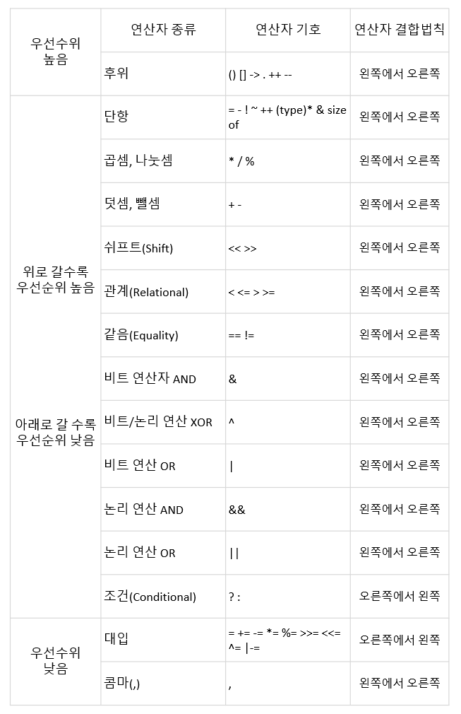

연산자
===============
연산자란 연산을 수행하기 위한 기호을 의미하고, 피연산자는 연산을 행해지는 대상을 의미한다.

  * 산술 연산자  
    * &#43; : 왼쪽항에 오른쪽항을 더한다    
    * &#45; : 왼쪽항에 오른쪽항을 뺀다    
    * &#42; : 왼쪽항에 오른쪽항을 곱한다    
    *	&#47; : 왼쪽항에 오른쪽항을 나눈다    
    * &#37; : 왼쪽항에 오른쪽항을 나눈 나머지   
      
  * 대입 연산자    
    * = : 왼쪽항에 오른쪽항을 대입    
    * += : 왼쪽항과 오른쪽항을 더한 값을 왼쪽항에 대입    
    * -= : 왼쪽항과 오른쪽항의 뺀 값을 왼쪽항에 대입    
    * &#42;= : 왼쪽항과 오른쪽항의 값을 곱한 값을 왼쪽항에 대입    
    * /= : 왼쪽항에 오른쪽항을 나눈 값을 왼쪽항에 대입    
    * %= : 왼쪽항에 오른쪽항을 나누고 난후의 나머지를 왼쪽항에 대입   
      
  * 증감 연산자  
    * x++ : 연산을 진행한 후에 x의 값에 1을 더한다    
    * ++x : x의 값에 1을 더한 후에 연산을 진행한다    
    * x-- : 연산을 진행한 후에 x의 값에 1을 뺀다    
    * --x : x의 값에 1을 뺀 후에 연산을 진행한다    

연산자 우선순위
==============
연산자에서도 수학에서 +보다 &#42;가 먼저 계산하듯이 우선순위가 있다.
 
  * 연산자의 우선순위  

 
  

출처: https://blcan.tistory.com/16  
   
여기서 말하는 연산자 결합법칙의 의미는 연산자의 우선순위가 같을 때 연산자의 진행방향을 뜻한다  
