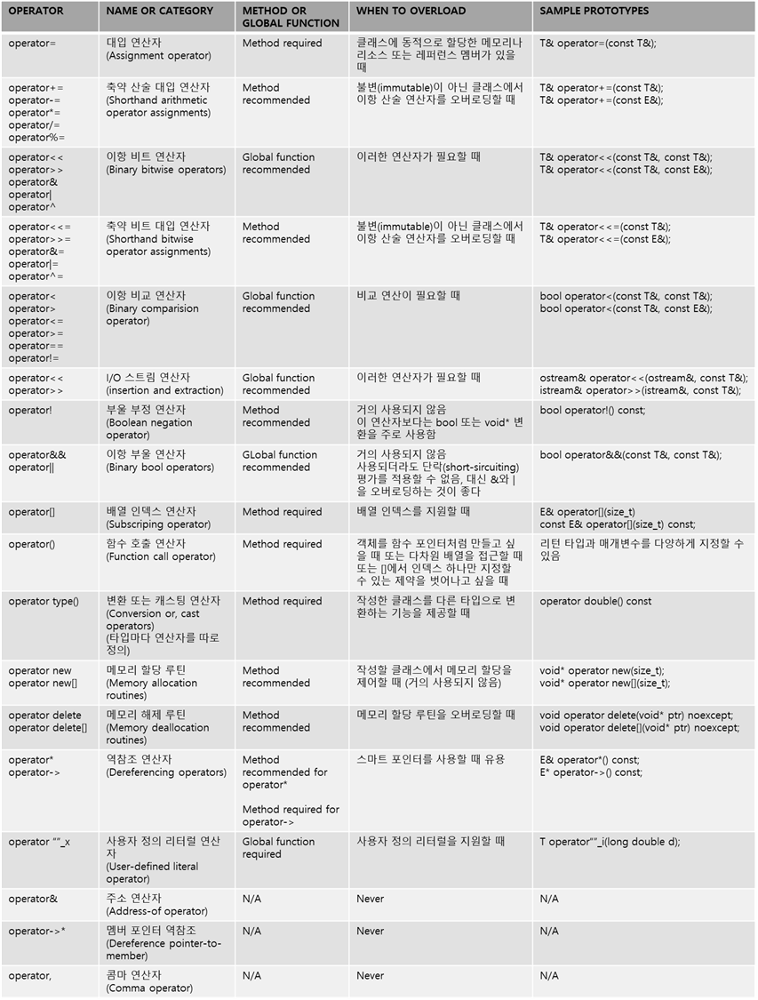

연산자 오버로딩
==================

* 객체에 대한 연산을 위해 연산자를 오버로딩하여 사용한다.

* 기본적으로 operator연산자 형식

  * ex) operator+, operator* ,operator-= 등등

<br>

* 예시

```c++
// 클래스
class A
{
private:
    int intValue = 5;

public:
    int GetInt() { return intValue; }

    A() = default;
    A(int i) : intValue(i) {}
        
    A operator+(A& _other)  // +연산자 오버로딩
    {
        return A(GetInt() + _other.GetInt());
    }
    
};


int main()
{
    A a(5);
    A b(10);

    A C(a + b); // 객체 a와 b의 intValue값을 더해서 C의 intValue값에 전달
    // A C(a.operator+(b)); 와 동일

    cout << C.GetInt(); // 15 출력
}
```

<br><br>

전역 함수 연산자 오버로딩
==================
* 묵시적 변환을 활용하면 opeartor+를 정의할 수 있지만 교환법칙이 성립하지 않는다.

    * 묵시적 변환은 객체가 연산자의 좌변에 있을 때 적용되기 때문

```c++
class A
{
private:
    int intValue = 5;

public:
    int GetInt() { return intValue; }

    A() = default;
    A(int i) : intValue(i) {}

    A operator+(int num)
    {
        return this->GetInt() + num;
    }
};

int main()
{
    A a(5);
    A b(10);
    A C(a + 10);

    // A D(10 + a);    객체가 우측에 있어 operator+가 적용되지 않음.
}
```

<br><br>

* 클래스에 정의한 operator+를 전역 함수로 만들면 교환법칙이 성립하게 만들 수 있다.

  * 전역 함수는 특정 객체에 종속되지 않기 때문

<br>

* operator 함수에 friend를 선언해서 멤버 변수에 접근할수 있다.

```c++
class A
{
private:
    int intValue = 5;

public:
    int GetInt() const{ return intValue; }
    void SetInt(int addValue) { intValue += addValue; }

    A() = default;
    A(int i) : intValue(i) {}
        
    friend A operator+(const A& lhs, const A& rhs);
};

A operator+(const A& lhs, const A& rhs)
{
    return A(lhs.GetInt() + rhs.GetInt());
}

int main()
{
    A a(5);
    A b(10);

    A C(a + 10);
    A D(10 + a);

    cout << C.GetInt() << endl;
    cout << D.GetInt();
}
```

<br><br>

연산자 오버로딩을 하는 이유
=====================
* 자신이 정의할 클래스를 기본 타입처럼 다루기 위해서

    * 정의한 클래스를 기본 타입에 가까울수록 클라이언트 입장에서는 사용하기 쉽다.

<br>

* 프로그램을 좀 더 세밀하게 제어하기 위해서

  * 직접 정의한 클래스의 객체를 새로 만들어서 분배하고 수거하는 과정을 원하는 방식으로 정의할 때 <br>메모리 할당과 해제 연산자를 오버로딩할 수 있다.


<br><br><br>

연산자 오버로딩의 한계
====================
1. 연산자 기호를 새로 만들수는 없다.
     * 언어에 정의돼 있는 연산자만 의미를 변경할 수 있다.

<br>

2. 다음 연산자는 오버로딩할 수 없다.

     * . (객체의 멤버에 접근하는 연산자)
  
     * :: (스코프 지정 연산자)
  
     * sizeof
  
     * ? : (조건연산자)

3. 에리티를 변경할 수 있는 곳은 함수 호출, new , delete뿐이다.
     * 에리티(arity)는 연산자의 인수 또는 피연산자(operand)의 개수이다.

     * 연산자의 우선순위와 결합순위는 바꿀 수 없다.

<br>

4. 기본 타입 연산자의 의미는 바꿀 수 없다.

<br>

5. 오버로딩할 수 있는 연산자는 클래스의 메서드이거나, 오버로딩하려는 전역 함수의 인수중 최소 하나가 사용자 정의 타입이어야 한다.

    * 클래스를 직접 정의할 때는 가능
    
    * 단, 메모리 할당과 해제 연산자는 예외

<br><br><br><br>

연산자 오버로딩 선택
=====================

 * 연산자를 오버로딩하는 함수나 메서드를 작성할 때 몇가지 결정할 사항이  있다.

<br>

1 - 메서드와 전역함수 
------------------
오버로딩할 연산자를 클래스의 메서드로 정의할지, 전역함수(주로 클래스의 friend)로 정의할지 선택해야 한다.<br>
아래와 같이 세 종류가 있다.

<br>

* 메서드로 정의해야 하는 연산자

    * 어떤 연산자는 클래스 문맥을 벗어나면 의미가 없기 때문에 반드시 클래스에 속한 메서드여야 한다.
    
    * ex) operator=은 소속 클래스와 밀접한 관계에 있어 클래스와 별도로 존재할 수 없다.

<br>

* 전역함수로 정의해야 하는 연산자

    * 연산자의 좌변에 소속 클래스가 아닌 다른 타입의 변수도 나와야 한다면 연산자를 전역 함수로 만든다.

    * ex) iostream 객체가 나와야하는 operator<<와 operator>>가 있다.

<br>

* 메서드와 전역 함수 둘 다 가능한 연산자

    * 특별히 전역 함수로 만들어야할 이유가 없다면 메서드로 만드는 것이 좋다

    * 이유는 메서드로 만들면 virtual로 선언할 수 있지만 전역 함수는 그럴 수 없기 때문이다.

<br><br>

2 - 인수 타입에 대한 결정사항
------------------
인수 타입에 대해서는 인수 개수를 변경할 일이 별로 없어 선택할 사항이 많지 않다.<br>
예를 들어 operator/는 전역 함수로 만들면 인수가 두개, 메서드로 만들면 인수가 한개만 받을 수 있다.<br>


<br><br><br>

3 - 리턴 타입에 대한 결정사항
------------------------
C++는 적합한 오버로딩 연산자를 찾을 때 리턴타입을 고려하지 않지만, 마음대로 하는게 바람직하지는 않다.<br>
그보다는 오버 로딩 연산자도 기본 타입 연산자와 동일한 타입을 리턴해야 한다.
<br>

레퍼런스와 const에 대한 결정 원칙은 리턴 타입에도 똑같이 적용된다.<br>
일반적으로 레퍼런스로 리턴할 수 있으면 레퍼런스로 리턴하고, 그렇지 않으면 값으로 리턴한다.
<br>

연산자에서 객체를 새로 생성한다면 값으로 리턴하고 그렇지 않으면 연산자를 호출한 객체나 연산자의 인수에 대한 레퍼런스를 리턴한다.

<br><br><br><br>

오버로딩하면 안되는 연산자
========================

* C++에서 허용하더라도 오버로딩하면 안 되는 연산자가 있다.

* 주소연산자(operator&) , 이항 부울 연산자 (operator&& 와 operator\||) , 콤마 연산자(operator,)등이 있다.

  * 주소 연산자는 오버로딩해서 좋은 점이 없을 뿐더러 주소를 가져온다는 C++의 기본 동작을 상식과 다르게 해버리면 헷갈리게 된다.

  * 이항 부울 연산자는 C++의 단락 평가 규칙을 적용할 수 없기 때문.
  
    * 단락 평가는 첫 번째 값만으로 결과가 확실할 때 두 번째 값은 확인(평가)하지 않는 방법을 말한다

<br><br><br>

오버로딩할 수 있는 연산자
===============================

<p align="center"></p>


<br><br><br>


우측값 레퍼런스 
=============
* 우측값 레퍼런스는 좌측값 레퍼런스에서 쓰는 & 대신 &&를 사용한다.

<br>

    // 일반 대입연산자의 포로토타입
    T& operator=(const T&);

    // 이동 대입 연산자의 프로토타입
    T& operator=(T&&);

<br>


* 위의 표에서는 우측값 레퍼런스를 적용한 프로토타입은 없지만 대부분의 연산자는 기존 좌측값 레퍼런스 버전과 <br> 우측값 레퍼런스 버전이 함께 있어도 상관없다.

<br><br><br>

예시
-------

* 라이브러리에서 제공하는 std::string 클래스의 operator+는 우측값 레퍼런스로 구현했다.

```c++
string  operator+(string&& lhs, string&& rhs);
```
<br>

* 두 인수가 레퍼런스 우측값으로 전달됐기 때문에 둘 중 하나에 대한 메모리를 재사용할 수 있다.

  * 참고로 인수가 우측값 레퍼런스라는 말은 연산이 끝나면 삭제되는 임시 객체라는 뜻

<br>

* 이렇게 구현된 operator+는 두 인수의 크기와 용량에 따라 다음 두가지 동작 중 하나를 수행한다.

```c++
1. return std::move(lhs.append(rhs));

2. return std::move(rhs.insert(0,lhs));
```

<br>

* 실제로 std::string operator+의 오버로딩 버전을 보면 좌측값 레퍼런스와 우측값 레퍼런스 다양하게 조합해서 사용한다.

<br><br><br>

관계 연산자
====================
* C++ 표준 라이브러리는 \<utility>라는 헤더 파일을 제공하는데 여기서 다양한 헬퍼 함수와 클래스를 제공한다.

* 다음과 같은 관계 연산자에 대한 함수 템플릿도 std::rel_ops 네임 스페이스에서 제공한다.

```c++
template<class T> bool operator!=(const T& a, const T& b);  // operator== 정의 필요
template<class T> bool operator> (const T& a, const T& b);  // operator<  정의 필요
template<class T> bool operator<=(const T& a, const T& b);  // operator<  정의 필요
template<class T> bool operator>=(const T& a, const T& b);  // operator<  정의 필요
```

<br>

* 이런 함수 템플릿은 다른 클래스에 있는 ==, < 연산자로 !=, >, <=, >=와 같은 연산자를 정의한다.

* 코드에서 #include\<utility>문과 using문만 추가한다면 이 템플릿을 사용할 수 있다.

```c++
using namespace std::rel_ops;
```

<br>

* 하지만 현재 정의한 클래스뿐만 아니라 관계 연산에 관련된 모든 클래스에 대해 이 연산자가 생성되는 문제가 있다.

* 또한 이렇게 자동 생성된 관계 연산자는 std::greater\<T>와 같은 유틸리티 템플릿과 함께 작동하지 않는다.

* 암묵적 변환도 적용되지 않는다.

* 작성할 클래스에서 std::rel_ops를  사용하는것보단 관계 연산자를 구현하는 것이 좋다.