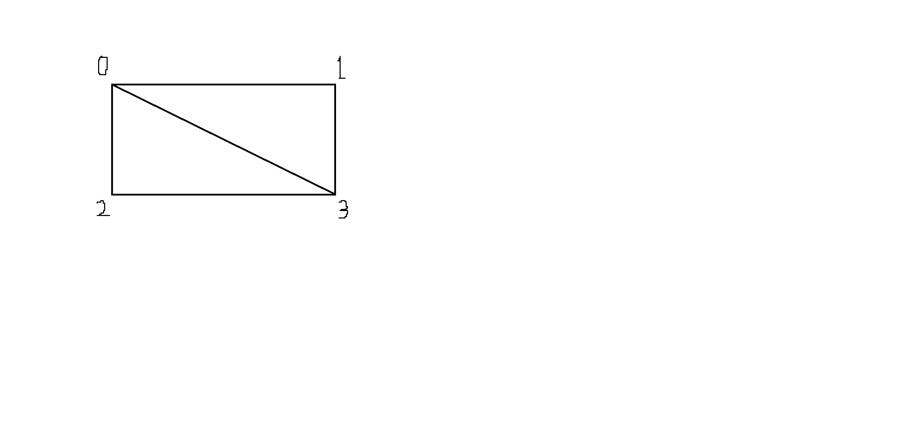

IndexBuffer
=======================
사각형(물체,도형)를 만들 때 버텍스 버퍼만을 가지고 만든다면 정점의 구조가 삼각형일 때는
두 삼각형을 붙여서 사각형으로 만들 수 있다.   
 
하지만 그렇게 한다면 두 삼각형의 빗변이 만나게 되면서 같은 위치값을 가진 두 점이 생기게 된다.(빗변의 두 점)  
만약 사각형이 아니라 더 큰 물체나 도형을 만든다고 한다면 같은 정점을 가지게 되는 삼각형이 많아지면서  
더욱 많은 메모리가 낭비된다.  
 
그래서 인덱스 버퍼를 하나 따로 만들고 버텍스 버퍼에 있는 정점의 개수와 맞게 인덱스를 설정해서 
사용한다.

Code
=============
    
    변수 선언
    ComPtr<ID3D11Buffer>			g_pIB; // 인덱스 버퍼
    
      
  	//인덱스 버퍼
    
  
  	UINT arrIDx[6] = { 0,2,3,0,1,2 }; //정점의 인덱스 (0,2,3) 삼각형과 (0,1,2) 삼각형 밑에는 예시
    
    //버텍스 버퍼와 마찬가지로 초기화
  	tBufferDesc = {};
  	tBufferDesc.ByteWidth = sizeof(UINT) * 6;
  
  
     //값 수정 x
  	tBufferDesc.CPUAccessFlags = 0;      
  	tBufferDesc.Usage = D3D11_USAGE::D3D11_USAGE_DEFAULT;
  
  
  	tBufferDesc.BindFlags = D3D11_BIND_FLAG::D3D11_BIND_INDEX_BUFFER; //인덱스 버퍼임을 알림
  	tBufferDesc.MiscFlags = 0;
  	tBufferDesc.StructureByteStride = 0;
  
  	
  	tSubDesc = {};
  	tSubDesc.pSysMem = arrIDx;
  
    //생성
  	DEVICE->CreateBuffer(&tBufferDesc, &tSubDesc, g_pIB.GetAddressOf()); 
    
    
    
    //ID3D11DeviceContext Com 객체에 버퍼설정
    
    //인덱스 버퍼 주소, 단위가 4byte UINT , 오프셋
	  CONTEXT->IASetIndexBuffer(g_pIB.Get(), DXGI_FORMAT_R32_UINT, 0);

  
