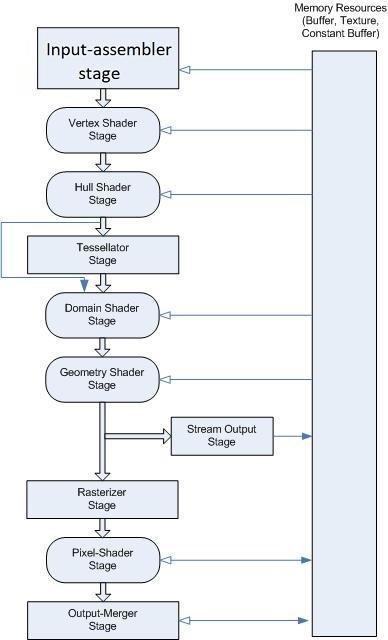

Rendering PipeLine
========================
DirectX에서 물체가 그려지는 과정이다 (3차원 정보가 2차원으로 그려지는 과정)  
  
* IA(Input Assembler) --> 그려질 물체의 정보, 렌더링 관련 정보가 입력되는 단계  
  
* VertexShader		--> 정점 하나당 실행되는 함수, 정점을 NDC(투영 좌표계)로 이동 시키는 역할  
  
* HullShader ,DomainShader (Tesselation) --> 정점을 파이프라인 도중에 대량 생성시킴. (Dx11에서 처음나옴)    
    
* GeometryShader --> 정점을 파이프라인 도중에 조금 생성시킴. (Dx10에서 처음나옴)  
  
* Rasterizer --> Culling (폴리곤을 이루는 정점의 접근 순서에 따른 Culling)  
			   폴리곤 내부 픽셀을 검출 (픽셀 쉐이더가 호출될 후보를 수색)  

  
* PixelShader	--> Pixel 마다 호출 될 함수  
  
* OM 단계 (OutPut Merge)  
    * Depth Stencil State Test  
    픽셀의 깊이값을 깊이텍스쳐와 비교해서 가려지는지 판정  
  
    * Blend State Test
    혼합 공식에 따른 블렌딩 --> 렌더타겟에 출력

  
      
  
    
그림
================
출처:https://docs.microsoft.com/ko-kr/windows/win32/direct3d11/overviews-direct3d-11-graphics-pipeline

