* 이번 장은 Root bone은 한 곳에 고정된 채 다른데에서 움직이는 애니메이션을 Root bone의 중심으로 이동시키기 위한 장

# 1. 컨트롤 릭 굽기

* 먼저 사용할 애니메이션을 클릭한다

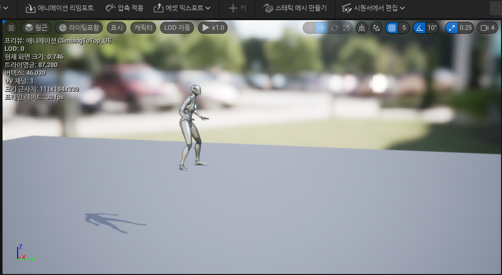

 

* 그 다음 우측 상단 `시퀀스에서 편집`을 클릭한 다음 `컨트롤 릭에 굽기`를 누른 다음 `CR_Mannequin_Body`를 클릭한다

  * `CR_Mannequin_Body`는 프로젝트를 만들 때 자동으로 제공해줌
  * 아무래도 스켈레톤 메쉬가 다르면 해당 스켈레톤 매쉬의 CR이 필요함.
  * 때문에 기본 스켈레톤 메쉬로 애니메이션을 제작한 후, 컨트롤 릭을 통해 다른 스켈레톤 메쉬로 옮기는 것이 좋아보임

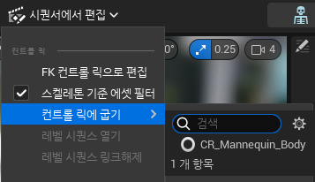

* 그 후에 `컨트롤릭에 굽기`를 클릭하면 `레벨 시퀀스`가 생성된다

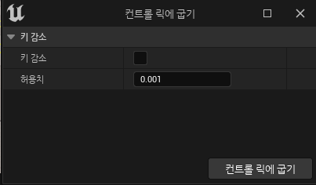

 

# 2. 레벨 시퀀스 설정

* 생성하면 다음과 같이 생성된 시퀀스가 보이는데 아래에 있는 2개의 트랙 `CR_Mannequin_Body` 중 Key(동그라미)가 없는 트랙을 삭제해준다.
  * 그래야 애니메이션이 움직임

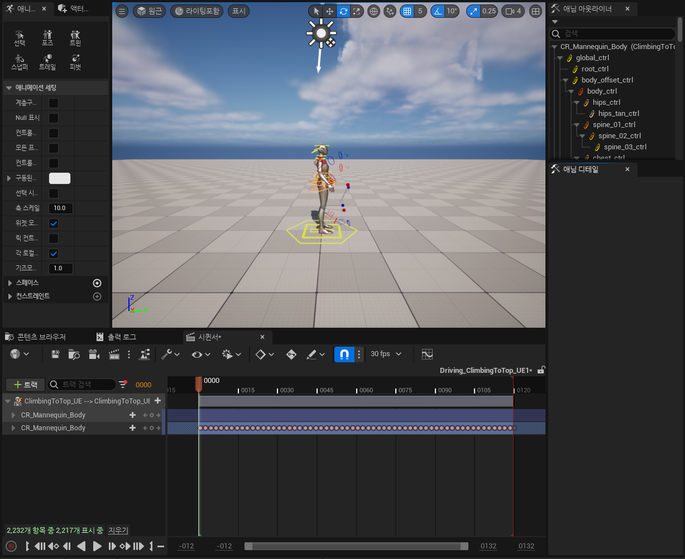

 

* 삭제하고 나서 Key가 존재하는 트랙에서 `root_ctrl`을 찾은 다음 아래와 같이 드래그해서 파란색인 곳의 Key들을 전부 삭제한다
  * 내가 지정하는 프레임에 Key를 넣어서 내가 원하는 위치와 회전을 root bone에 적용시키기 위함

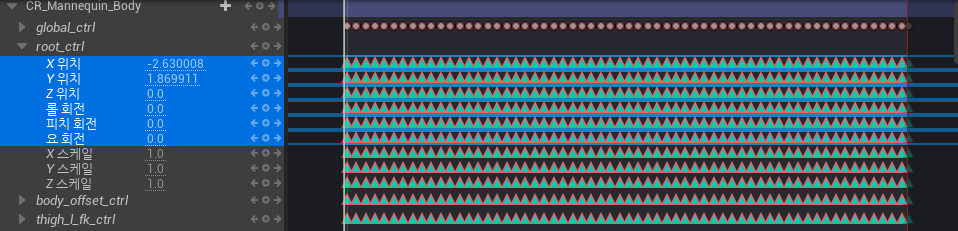

 

* 그 이후에 `root_ctrl`의 오른쪽에 있는 `+버튼`으로 root bone의 위치를 정해줄 수 있다.

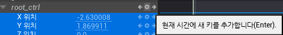

 

# 3. root bone 위치 정하기

* 이 애니메이션은 root_ctrl의 위치가 처음에는 바닥에 있는 형태이다

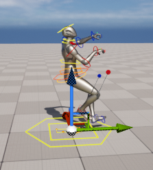

* root_ctrl의 Key를 넣어줄 특정 프레임에서 `root_ctrl`을 움직이고 난 후 아까 위에서 보았던 `+버튼`키를 눌러주면 된다

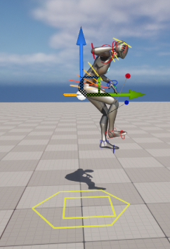

* 그러면 아래와 같이 `빨간색 원`으로 해당 프레임의 `root_ctrl`의 회전과 위치값을 설정해줄 수 있다.

* 채워지지 않는 프레임들은 `가장 가까운 2개의 키 root_ctrl값들에 의해 보간되어 자연스럽게 움직인다`

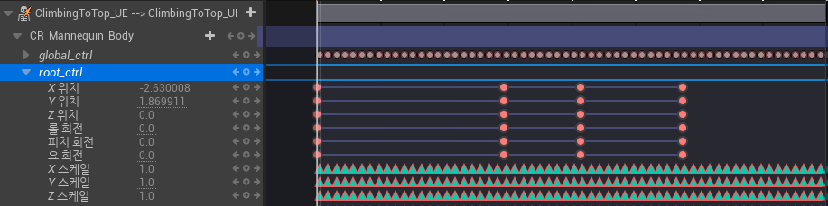

 

# 4.링크된 애니메이션 시퀀스 생성

* 그러고 나서 다음과 같이 우클릭하고 나서 `링크된 애니메이션 시퀀스 생성`을 클릭한다

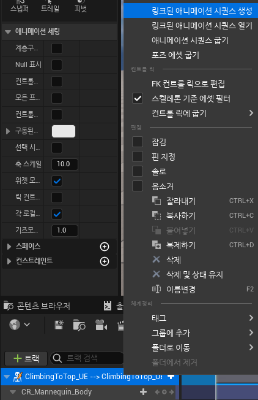

* 그러면 애니메이션을 저장할 폴더와 이름이 나오는데 원하는대로 설정하고 그 이후에 아래와 같이 옵션이 뜨는데 이 역시 그냥 `애니메이션 시퀀스 익스포트`를 눌러도 무방하다

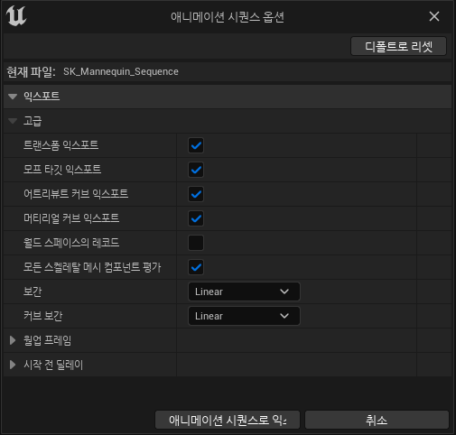

* 그러면 루트본이 움직이는 형태의 애니메이션이 생성되는데 이 루트본의 위치를 중심으로 하는 제자리 애니메이션으로 바꾸기 위해서는 해당 애니메이션의 디테일창으로 들어가 `루트 모션 활성화`를 `True`로 바꿔주면 된다.

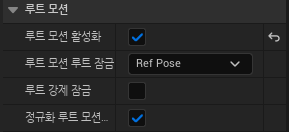
