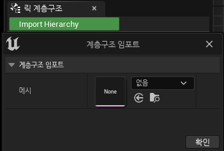
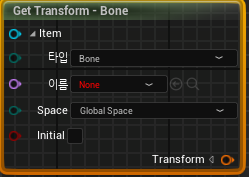
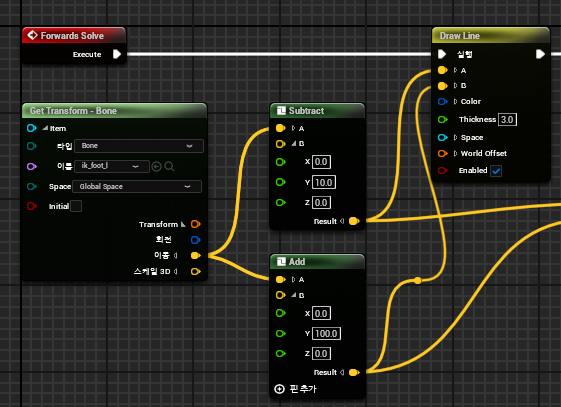
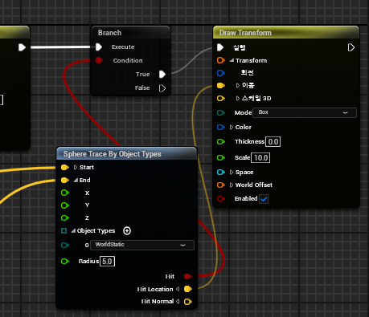
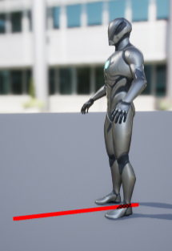
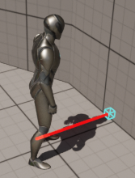

# 컨트롤릭 

* `엔진에서 바로 캐릭터를 애니메이팅하는 언리얼 엔진의 솔루션`

* Mesh에 있는 Bone을 움직이거나 Bone의 위치,회전 정보등으로 LineTrace하는 데에 사용한다

# 컨트롤 릭 생성

* 우클릭->애니메이션->컨트롤릭으로 생성할 수 있다

* 만약 이전에 생성해둔 다른 컨트롤릭이 없다면 기존의 블루프린트 컨트롤릭이 하나 있는데 그것을 base로 생성하면 된다

 

# 컨트롤 릭 초기화

* 처음 만들고 나서 왼쪽 아래에 `릭 계층구조`에 있는 `Import Hierarchy`를 누르면 Mesh를 누르는 창이 뜨는데 사용할 Mesh를 넣어주면 된다.

 

# 컨트롤 릭 사용

* Foot Bone에 다가가서 그 값으로 Line Trace를 해보겠다.

* 먼저 `우클릭 -> Get Transform`으로 Bone에 다가가기 위한 함수를 호출한다.

* 그 안에 이름이 있는데 사용할 Bone의 이름을 찾아준다.

  * 이 때 실제 bone이 아닌 `ik(가상) bone`을 사용해서 실제 Bone은 수정되지 않고 ik bone에 의해서 수정되게끔 하는 것이 좋다
  * 나중에 실제 bone을 움직이고 난다면 나중에 수정할 때 어려워질 수도 있기 때문

* 그래서 ik Foot Bone에 넣어서 위치값을 구하고 그 위치값에서 빼기,더하기로 LineTrace의 Start,End 위치를 구한 다음 DrawLine 함수로 그려준다.

* 부딪히는 위치를 그리고 싶다면 다음과 같이 Trace로 Hit Location을 구하고 Draw Transform으로 그려주면 된다

# 결과

* Draw Line

* Draw Transform

# 공식 문서

* <https://dev.epicgames.com/documentation/ko-kr/unreal-engine/control-rig-in-unreal-engine>