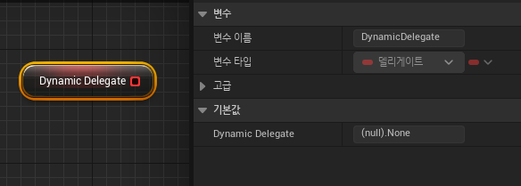

**다이나믹 델리게이트**
==============

* 다이내믹 델리게이트는 싱글 델리게이트의 기능과 비슷하고 `직렬화(Serialize)`와 `리플렉션(Reflection)` 가능하다.

* 다이나믹 델리게이트는 싱글 델리게이트와 달리 `블루프린트 객체와 연동이 가능하다`

  * 블루프린트 함수와 연동하기 위한 `UFUCNTION 매크로`가 있어야 바인딩이 가능하고 없으면 에러가 발생한다.

  * 블루프린트와 연동하기 위해 `직렬화(serialize)`를 해야하기 때문에 싱글 델리게이트보다 속도는 느리다.

  * 여기서 직렬화라는 의미는 `다이나믹 델리게이트는 함수 포인터가 아닌 함수 이름을 기반으로 등록해서 호출한다`라는 뜻이다.

```c++
// 다이내믹 델리게이트 선언
DECLARE_DYNAMIC_DELEGATE();

// RetVal과 <Num>Param은 싱글 델리게이트와 사용 방법은 동일하지만
// <Num>Param의 경우 인자의 이름도 뒤에 적어줘야 한다.
DECLARE_DYNAMIC_DELEGATE_OneParam(FDynamicOneParam, int, num);
DECLARE_DYNAMIC_DELEGATE_RetVal(FString, FDynamicRetVal);
```

<br>

## **다이나믹 바인딩**

```c++
// Dynamic Delegate 전용 바인딩 함수
BindDynamic(ObjectPointer, FuncName);

// 바인딩된 Delegate를 삭제
RemoveDynamic(ObjectPointer, FuncName);
```


<br>

## **다이나믹 실행**

* 싱글 델리게이트와 동일하게 구성되어 있다.

```c++
Execute()

ExecuteIfBound()

IsBound()
```

* Execute()는 바인딩된 함수를 실행, 바인딩된 함수가 없다면 에러 발생

* ExecuteIfBound()는 바인딩이 되어있는지 확인하고 true면 함수를 실행하고, 아니면 아무일도 일어나지 않음

* IsBound()는 델리게이트 변수가 바인딩이 되어있는지 확인하는 함수로 바인딩 돼 있으면 true, 아니면 false 반환

<br>

## 예시

* 다이나믹 델리게이트 선언
```c++
// MainCharacter.h, 델리게이트 선언
DECLARE_DYNAMIC_DELEGATE(FDynamicDelegate);

UPROPERTY(BlueprintReadOnly)
FDynamicDelegate DynamicDelegate;

// MainCharacter.cpp, 바인딩한 델리게이트 실행
void AMainCharacter::PrintBindFunc()
{
	if(DynamicDelegate.IsBound()) 	{ DynamicDelegate.Execute(); }
	else { UE_LOG(LogTemp,Warning,TEXT("DynamicDelegate is not bound"));	}
}
```

* 다른 클래스에서 바인딩

```c++
// TestActor.cpp
void ATestActor::DynamicFunc()
{
	UE_LOG(LogTemp,Warning,TEXT("Dynamic Delegate Execute"));
}

MainCharacter->DynamicDelegate.BindDynamic(this,&ATestActor::DynamicFunc);
```

* 함수 호출

<center></center>

<br>

* C++에서 선언한 Dynamic Delegate를 블루프린트에서 호출 (BlueprintReadOnly)

<center></center>


<br>

**멀티캐스트 델리게이트**
===========


* 멀티캐스트 델리게이트는 여러 개의 함수를 바인딩할 수 있다.

```c++
// 멀티캐스트 델리게이트 선언
DECLARE_MULTICAST_DELEGATE();
```

* 멀티캐스트에도 다이나믹 델리게이트가 있다.

  * 즉, 여러 개의 함수를 바인딩하면서 블루프린트 객체와 연동이 가능

```c++
// 다이나믹 멀티캐스트 델리게이트 선언
DECLARE_DYNAMIC_MULTICAST_DELEGATE()
DECLARE_DYNAMIC_MULTICAST_DELEGATE_OneParam()
```

<br>

## 멀티캐스트 바인딩

* 멀티캐스트는 여러 함수를 바인딩하기 때문에 바인딩을 해제하는 함수를 제외하고 싱글 델리게이트의 바인딩과 매우 유사하다.

<center></center>


<br>

## 멀티캐스트 실행

* 델리게이트에 바인딩한 오브젝트에게 알림을 보내서 바인딩한 모든 함수를 호출한다.

```c++
Broadcast();
```

<br>

## 예시

* 멀티캐스트 델리게이트 선언
```c++
// MainCharacter.h, 델리게이트 선언
DECLARE_MULTICAST_DELEGATE(FMultiDelegate);

FMultiDelegate MultiDelegate;

// MainCharacter.cpp, 바인딩한 델리게이트 실행
void AMainCharacter::PrintBindFunc()
{
	if(MultiDelegate.IsBound()) { MultiDelegate.Broadcast(); } // 바인딩된 모든 함수 호출
	else { UE_LOG(LogTemp,Warning,TEXT("Multi Delegate is not bound"));	}
}
```

* 다른 클래스에서 바인딩

```c++
// TestActor.cpp
void ATestActor::MultiFunc()
{
	UE_LOG(LogTemp,Warning,TEXT("Multi Func Execute"));
}

void GlobalFunc()
{
	UE_LOG(LogTemp,Warning,TEXT("GlobalFunc Execute"));
}

// 클래스 함수
MainCharacter->MultiDelegate.AddUObject(this,&ATestActor::MultiFunc);
// 전역 함수
MainCharacter->MultiDelegate.AddStatic(GlobalFunc);
// 람다 함수
MainCharacter->MultiDelegate.AddLambda([](){UE_LOG(LogTemp,Warning,TEXT("Lambda Execute"))}); 
```

<center></center>


