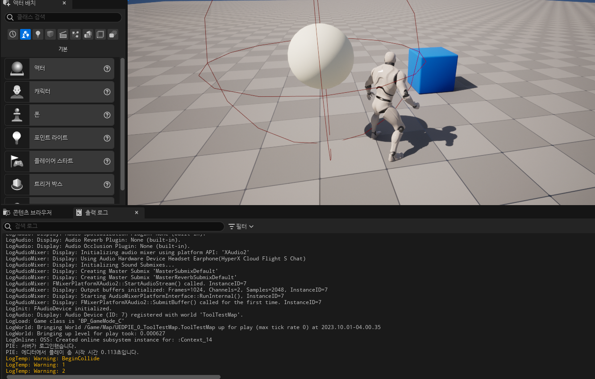
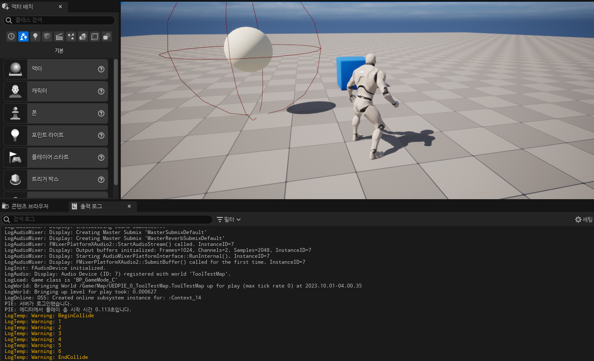

**Timer**
=============

* 어떠한 함수를 일정 시간마다 호출 하기 위한 기능이다.

  * ex) 마우스 왼클릭을 누르고 있으면 총에서 총알이 0.3초 간격으로 계속 발사되는 등..

* Timer는 `FTimerManager 타입`인 `Timer Manager`에서 관리한다.

* `FTimerManager`는 `GameInstance`와 `World`에 존재한다.

* Timer는 `C++ 함수 포인터, TFunction Objects, Delegate`와 함께 사용할 수 있다.

<br>

**사용할 함수**
=========

### SetTimer

* `World`나 `GameInstance`를 통해 `FTimerManager`를 호출하고 `FTimerManager`에서 `SetTimer`란 함수를 통해 타이머를 설정할 수 있다.


* 오버로딩으로 여러 인자가 있지만 대표적으로 사용하는 함수 인자는 다음과 같다.


#### 함수 포인터 버전 타이머

```c++
// TimerManager.h
template< class UserClass >
FORCEINLINE void SetTimer(  
FTimerHandle& InOutHandle,          // 타이머 핸들
UserClass* InObj,                   // 함수 포인터의 객체
typename FTimerDelegate::TMethodPtr< UserClass > InTimerMethod, // 함수 포인터
float InRate,                       // 타이머 주기
bool InbLoop = false,               // 루프 설정
float InFirstDelay = -1.f)          // 타이머 시작 시간
{
    InternalSetTimer(
        InOutHandle,
        FTimerUnifiedDelegate( FTimerDelegate::CreateUObject(InObj, InTimerMethod) ),
        InRate,
        InbLoop,
        InFirstDelay);
}          
```

#### 델리게이트 버전 타이머

```c++
FORCEINLINE void SetTimer(
FTimerHandle& InOutHandle,          // 타이머 핸들
FTimerDelegate const& InDelegate,   // 델리게이트
float InRate,                       // 타이머 주기
bool InbLoop,                       // 루프 설정
float InFirstDelay = -1.f)          // 타이머 시작 시간
{
    InternalSetTimer(
        InOutHandle,
        FTimerUnifiedDelegate(InDelegate),
        InRate,
        InbLoop,
        InFirstDelay);
}
```


### ClearTimer

* 타이머를 종료시키기 위해선 다음 함수를 호출해야 한다.
* ID 역할을 하는 FTimerHandle을 인자로 사용해야 한다.

```c++
FORCEINLINE void ClearTimer(FTimerHandle& InHandle)
{
    if (const FTimerData* TimerData = FindTimer(InHandle))
    {
        InternalClearTimer(InHandle);
    }
    InHandle.Invalidate();
}
```

<br>

**예시**
============

* USphereComponent의 충돌 델리게이트를 이용해서 타이머를 설정해보려 한다.


### 헤더파일

```c++
public:
    // 타이머에 사용할 변수들
    FTimerHandle TimerHandle;
    float TimerDelay = 1.f;
    int Minute = 0;
    void TimerFunc();

protected:
    virtual void BeginPlay() override;

private:
    USphereComponent* SphereComponent;
```

### 소스파일

```c++
void ATestActor::BeginPlay()
{
	Super::BeginPlay();
	
    // 충돌 설정
	SphereComponent->OnComponentBeginOverlap.AddDynamic(this, &ATestActor::BeginCollide);
	SphereComponent->OnComponentEndOverlap.AddDynamic(this, &ATestActor::EndCollide);
}

// 타이머 함수
void ATestActor::TimerFunc()
{
	++Minute;
	UE_LOG(LogTemp, Warning, TEXT("%d"), Minute);
}


void ATestActor::BeginCollide(...) // 매개변수는 길어서 적지 않음.
{
	if(AMainCharacter* MainCharacter = Cast<AMainCharacter>(OtherActor))
	{
		UE_LOG(LogTemp,Warning,TEXT("BeginCollide"));

		GetWorld()->GetTimerManager().SetTimer(
			TimerHandle,                            // 핸들
			this,                                   // 함수(델리게이트)의 객체
			&ATestActor::TimerFunc,                 // 타이머에 사용할 함수(델리게이트)
			TimerDelay);                            // 딜레이
	}
}


void ATestActor::EndCollide(...) // 매개변수는 길어서 적지 않음.
{
	if(AMainCharacter* MainCharacter = Cast<AMainCharacter>(OtherActor))
	{
		if(TimerHandle.IsValid())
		{
			UE_LOG(LogTemp,Warning,TEXT("EndCollide"));

            // TimerHandle에 저장되어 있는 타이머 종료
			GetWorld()->GetTimerManager().ClearTimer(TimerHandle);
			Minute = 0;
		}
	}
}
```

<br>

## 사진

* TestActor와 충돌을 시작하면 다음과 같이 주기(TimerDelay초) 마다 아래에 텍스트가 뜬다.

<center></center>


<br>

* TestActor와 충돌을 끝내면 EndCollide가 호출되면서 더 이상 텍스트가 뜨지 않는다.

<center></center>