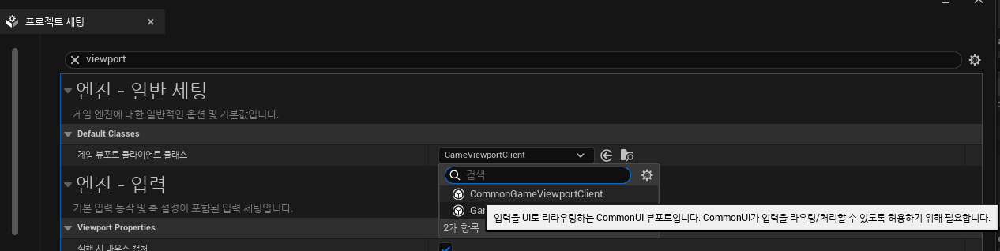

# Common UI

* `게임의 메뉴, 버튼, 창 같은 사용자 인터페이스(UI)를 다양한 플랫폼(PC, 콘솔, 모바일 등)과 여러 입력 방식(키보드, 마우스, 게임패드, 터치)에서 일관되고 편리하게 만들 수 있도록 언리얼 엔진이 제공하는 고급 UI 개발 도구 세트`

 

# Frontend 구조

### 1단계 : 커스텀 플레이어 컨트롤러 

* 모든 UI 표시는 직접 만든 플레이어 컨트롤러 클래스에서 시작

* `카메라 고정` : 플레이어 컨트롤러는 게임 레벨에 미리 배치된 특정 카메라를 찾아 화면을 그 카메라의 시점으로 고정

* `핵심 UI 레이아웃 생성` : 그 다음, "Primary Layout Widget" (주요 레이아웃 위젯)이라는 특별한 UI 요소를 생성

### 2단계 :  주요 레이아웃 위젯 (Primary Layout Widget) 

* 이 위젯은 Common UI의 핵심 기능인 `위젯 스택(Widget Stacks)`을 등록하고 관리하는 중앙 허브 역할

* Common UI에서는 UI 위젯(버튼, 창 등)을 직접 화면에 바로 생성하는 대신, 이 `스택`에 쌓아 올리거나(push) 제거하는(pop) 방식으로 관리

* 이 주요 레이아웃 위젯이 바로 그 스택들을 담는 컨테이너

### 3단계 : 프론트엔드 UI 서브시스템 (Frontend UI Subsystem) 

* 블루프린트와 C++ 양쪽에서 쉽게 접근할 수 있는 전역 시스템 역할

* `레이아웃 위젯 저장`: 앞에서 만든 "Primary Layout Widget"을 이 서브시스템에 저장
  * 이렇게 하면 게임 내 어디서든 이 핵심 레이아웃 위젯에 쉽게 접근하고 사용 가능

* `헬퍼 함수(Helper Functions) 제공`: 위젯 스택에 새로운 UI를 쉽게 추가(push)할 수 있도록 도와주는 여러 편의 기능(함수)들을 이 서브시스템 안에 생성

### 4단계 : 첫 UI 화면 표시 

* UI 서브시스템 준비가 끝나면, 다시 플레이어 컨트롤러로 돌아와서 서브시스템의 헬퍼 함수를 사용해 `첫 번째 UI 화면(예: "Press Any Key" 화면)을 위젯 스택에 추가(push)`

* 이로써 사용자에게 첫 UI를 보여줌

 

# 사전 작업

* 먼저, Unreal Plugin에서 Common UI Plugin을 추가

 

* 그 다음에는 `프로젝트 세팅`에 들어가서 `게임 뷰포트 클라이언트 클래스`에서 `CommonGameViewportClient`로 변경

* 그리고 Custom GameMode에 Custom PlayerController를 설정하고 그 게임모드 사용