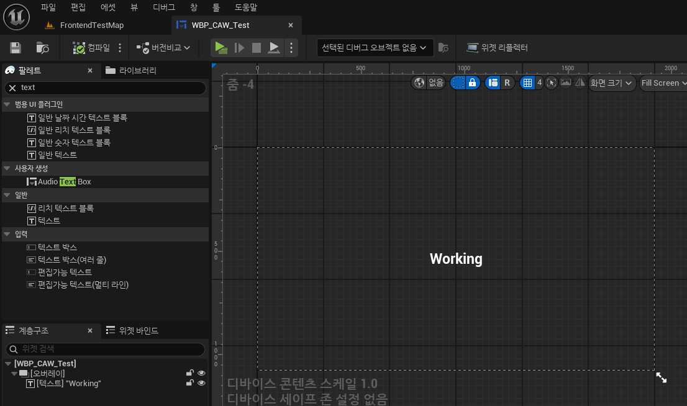
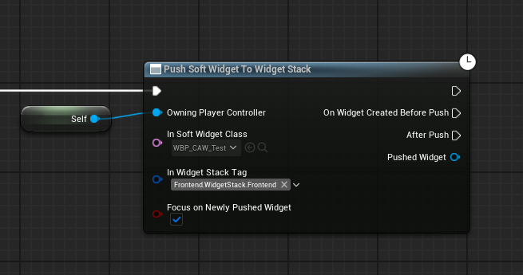
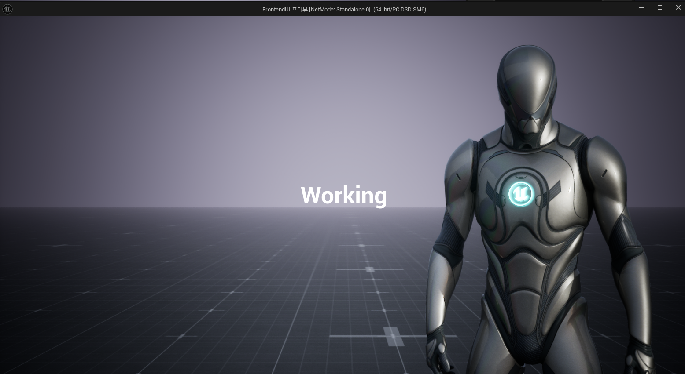

# 비동기 로드

* UI가 복잡해지거나 로드할 에셋이 많을 때 발생할 수 있는 프레임 드랍 및 랙 현상을 줄이기 위해 비동기 로드 사용

## 함수 : PushSoftWidgetToStackAsync

* GameSubsystem에서 호출하는 함수로, RequestAsyncLoad함수로 비동기 함수로 실행

  * 비동기 로드할 클래스는 `TSoftClassPtr`로 사용

* Lambda로 Parameter에 들어갈 함수를 만들고, `EAsyncPushWidgetState`를 이용해서 `TFunction`으로 전달된 `AsyncPushStateCallback` 함수가 <br>`만들기 전에 실행` or `Push 후에 실행`을 결정


```c++

enum class EAsyncPushWidgetState : uint8
{
	OnCreatedBeforePush,
	AfterPush
};

void UFrontendUISubsystem::PushSoftWidgetToStackAsync(const FGameplayTag& InWidgetStackTag, TSoftClassPtr<UWidget_ActivatableBase> InSoftWidgetClass,TFunction<void(EAsyncPushWidgetState,UWidget_ActivatableBase*)> AsyncPushStateCallback)
{
	check(!InSoftWidgetClass.IsNull());

	UAssetManager::Get().GetStreamableManager().RequestAsyncLoad(
		InSoftWidgetClass.ToSoftObjectPath(),
		FStreamableDelegate::CreateLambda(
			[InSoftWidgetClass,this,InWidgetStackTag,AsyncPushStateCallback]()
			{
				UClass* LoadedWidgetClass = InSoftWidgetClass.Get();
				
				check(LoadedWidgetClass && CreatedPrimaryLayout);

                // GameplayTag로 Widget 찾기
				UCommonActivatableWidgetContainerBase* FoundWidgetStack = CreatedPrimaryLayout->FindWidgetStackByTag(InWidgetStackTag);

				UWidget_ActivatableBase* CreatedWidget = FoundWidgetStack->AddWidget<UWidget_ActivatableBase>(
					LoadedWidgetClass,
					[AsyncPushStateCallback](UWidget_ActivatableBase& CreatedWidgetInstance)
					{
						AsyncPushStateCallback(EAsyncPushWidgetState::OnCreatedBeforePush,&CreatedWidgetInstance);
					}
				);

				AsyncPushStateCallback(EAsyncPushWidgetState::AfterPush,CreatedWidget);
			}
		)
	);
}
```

<br>

## 사용 : PushSoftWidget

* Cached 변수는 저장되어 있는 함수와 매개변수

* `PushSoftWidgetToStackAsync` 함수를 호출할 때 `EAsyncPushWidgetState` 변수를 switch에 넣어 언제 사용되는지를 결정

* 그 안에는 Delegate를 호출하여 함수 실행

```c++
// UAsyncAction_PushSoftWidget : public UBlueprintAsyncActionBase

void UAsyncAction_PushSoftWidget::Activate()
{
	UFrontendUISubsystem* FrontendUISubsystem = UFrontendUISubsystem::Get(CachedOwningWorld.Get());

	FrontendUISubsystem->PushSoftWidgetToStackAsync(CachedWidgetStackTag,CachedSoftWidgetClass,
		[this](EAsyncPushWidgetState InPushState, UWidget_ActivatableBase* PushedWidget)
		{
			switch (InPushState)
			{
			case EAsyncPushWidgetState::OnCreatedBeforePush:
				
				PushedWidget->SetOwningPlayer(CachedOwningPC.Get());

                // Member Delegate
				OnWidgetCreatedBeforePush.Broadcast(PushedWidget);

				break;

			case EAsyncPushWidgetState::AfterPush:

                // Member Delegate
				AfterPush.Broadcast(PushedWidget);

				if (bCachedFocusOnNewlyPushedWidget)
				{
					if (UWidget* WidgetToFocus = PushedWidget->GetDesiredFocusTarget())
					{
						WidgetToFocus->SetFocus();
					}
				}

				SetReadyToDestroy();

				break;
			default:
				break;
			}
		}
	);
}
```

<br>

## 실행

### 1. 테스트용 WBP 생성

<center></center>

<br>

### 2. 블루프린트에서 연결 후 SoftPush 실행

<center></center>

<br>

### 3. 결과

<center></center>