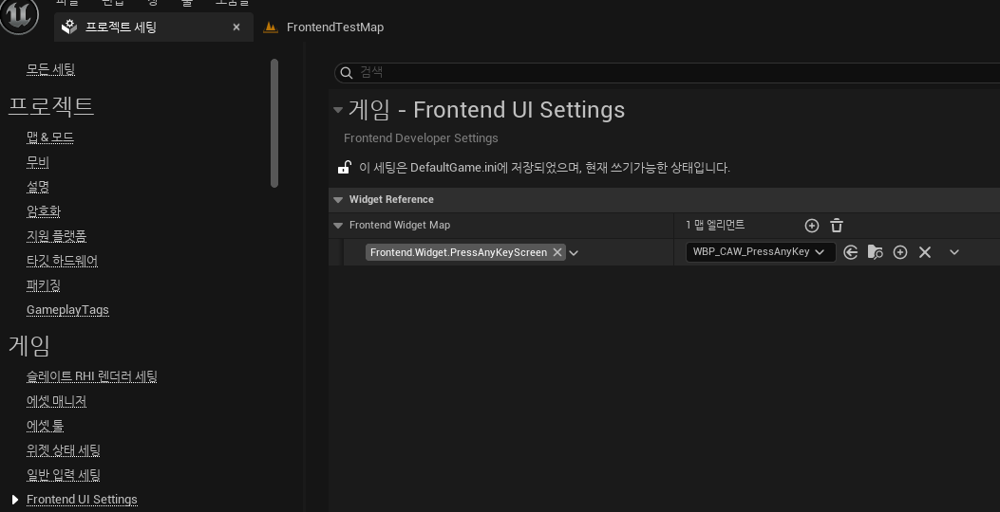
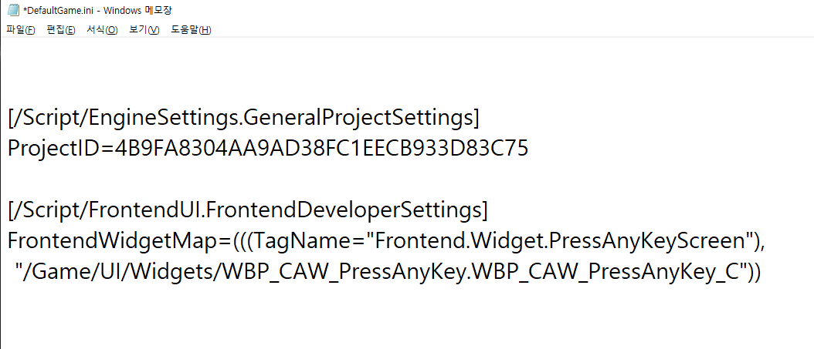

# 문제점

* Push할 때 'Press Any Key' 화면과 같은 UI 위젯을 하드코딩된 클래스 이름으로 푸시하고 있음.

*  이는 나중에 위젯을 변경하거나 관리할 때 여러 파일을 수정해야 하는 번거로움과 오류 발생 가능성을 높힘

* 그래서 해결책으로 `Developer Settings` 클래스를 사용

<br>

# Developer Settings

* `UDeveloperSettings` 클래스는 C++ 클래스로,언리얼 엔진에서 프로젝트별 설정을 저장하고 관리하기 위한 기반 클래스

* 이 클래스를 상속받아 커스텀 설정을 만들면, `에디터의 프로젝트 세팅 (Project Settings) 창에 새로운 항목으로 나타남`

### 목적

* 게임이나 플러그인의 다양한 설정 값들을 중앙에서 관리하고, .ini 설정 파일에 저장하여 영구적으로 유지할 수 있게 함

### 장점

* 하드코딩된 값을 줄여 유연성을 높힘
* 여러 개발자가 동일한 설정 값을 공유하기 용이
* 에디터 UI를 통해 쉽게 값을 변경하고 테스트 가능
* 빌드된 게임에서도 이 설정 값을 읽어와 사용할 수 있음


### 코드

```c++
#include "CoreMinimal.h"
#include "Engine/DeveloperSettings.h"
#include "GameplayTagContainer.h"
#include "FrontendDeveloperSettings.generated.h"

class UWidget_ActivatableBase;

UCLASS(Config = Game, defaultconfig, meta = (DisplayName = "Frontend UI Settings"))
class FRONTENDUI_API UFrontendDeveloperSettings : public UDeveloperSettings
{
	GENERATED_BODY()

public:
	UPROPERTY(Config, EditAnywhere, Category = "Widget Reference", meta = (ForceInlineRow, Categories = "Frontend.Widget"))
	TMap< FGameplayTag,TSoftClassPtr<UWidget_ActivatableBase> > FrontendWidgetMap;
};
	
```

#### UCLASS

* `Config = Game` 
  * 이 클래스의 Config 지정자가 붙은 UPROPERTY들이 Game 카테고리의 설정 파일에 저장됨을 의미
  * 일반적으로 `DefaultGame.ini` 파일에 저장

* `defaultconfig` 
  * Config 지정자와 함께 사용되며, 이 클래스의 설정이 기본 설정 파일에 저장됨을 나타냅
  * 만약 해당 .ini 파일이나 섹션이 존재하지 않으면, 클래스에 정의된 기본값으로 새로 생성
  * 에디터에서 변경된 값은 이 기본 설정 파일에 다시 저장

### UPROPERTY

* `Config`
  * 이 프로퍼티의 값이 `UCLASS`에 지정된 Config 파일(여기서는 `DefaultGame.ini`)에 저장되고 로드됨을 의미
* `ForceInlineRow`
  * 이 메타 지정자는 주로 `TMap`이나 `구조체(Struct)`와 같은 복합적인 데이터 타입을 디테일 패널에 표시할 때 사용
  * `TMap`의 경우, 기본적으로 키(Key)와 값(Value)이 각각 다른 줄에 표시될 수 있음
  * ForceInlineRow를 true로 설정하면, 키와 값(또는 구조체의 여러 멤버)이 에디터의 디테일 패널에서 가로로 한 줄에 함께 표시되도록 강제 

<br>


## 결과

* 프로젝트 세팅에 `Frontend UI Settings`가 추가됨
  * meta = (DisplayName = "Frontend UI Settings"))

<center></center>


### DefaultGame.ini

* UPROPERTY의 `Config` 으로 인해 `DefaultGame.ini`에 자동으로 추가

<center></center>