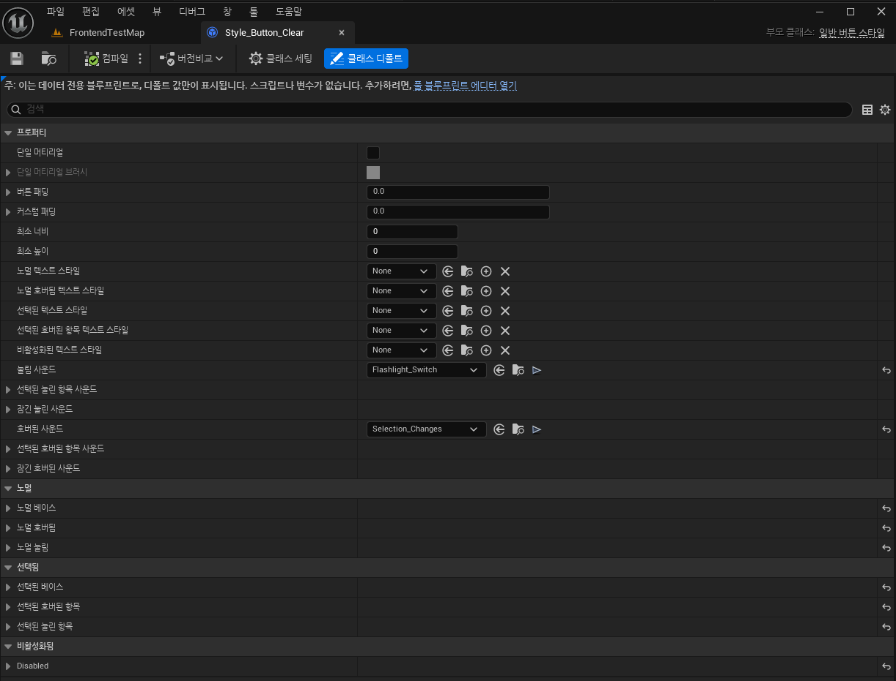

# Common Button Style

* UButton과 달리 CommonButton에 사용할 수 있는 에셋

* 여러 버튼에 동일한 스타일을 적용해야 할 때, 각 버튼마다 개별적으로 스타일 속성을 설정하는 대신, 하나의 UCommonButtonStyle 에셋을 만들고 이를 공유하여 사용

 

## 목록

* 기존 UUserWidget에 적용하는 Style과 거의 흡사함

