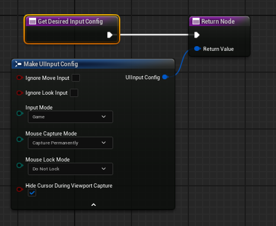
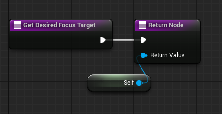
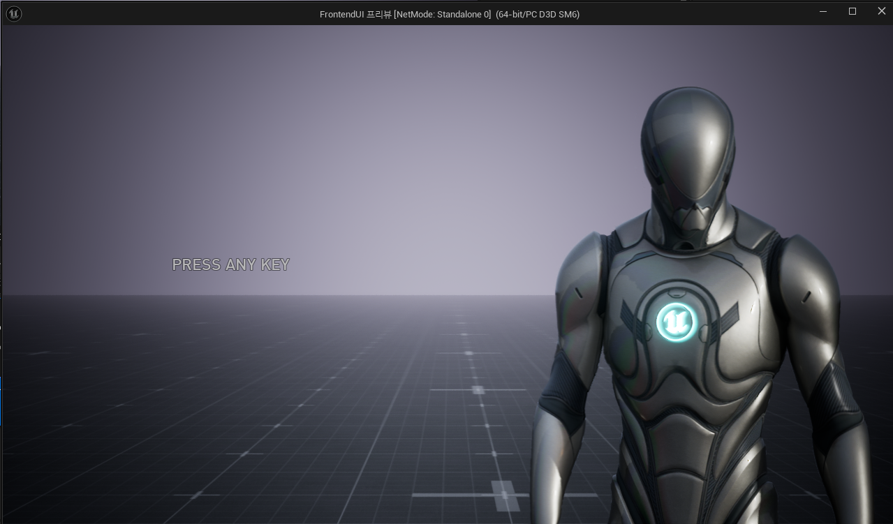
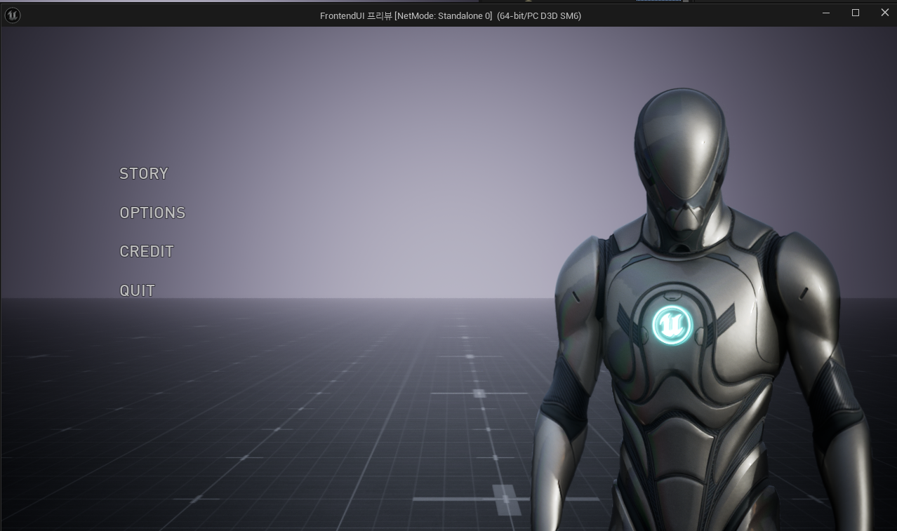

# Press Any key 

* 게임에서 아무 Key를 눌러 다음 화면을 넘어갈 때 사용하는 Widget

* 보통 마우스나 키보드 둘 다 지원하는데 각각 함수를 이용하여 마우스나 키보드의 입력을 감지해서 함수를 호출하는 방식

## UserWidget 함수(마우스, 키보드 감지)

### OnMouseButtonDown

* 마우스의 입력을 받아 `Main Menu`를 여는 함수 호출

### OnKeyDown

* 키보드의 입력을 받아 `Main Menu`를 여는 함수 호출

 

## Common Activatable Widget 함수(설정)

## GetDesiredInputConfig 설명

* `UCommonActivatableWidget`이 활성화될 때 어떤 **입력 환경 설정(Input Configuration)**을 원하는지 시스템에 알려주는 함수

  * `ECommonInputMode::Menu`: UI 요소에만 입력이 집중. 게임플레이 입력은 무시
  * `ECommonInputMode::Game`: 게임플레이에만 입력이 집중. UI는 입력을 받지 않음
  * `ECommonInputMode::All`: UI와 게임플레이 모두 입력을 받을 수 있음.
    * (예: 게임 화면 위에 떠 있는 간단한 알림창, 미니맵 상호작용 등)
  * `ECommonInputMode::GameAndMenu`: All과 유사하지만, UI 입력이 게임 입력보다 우선권을 가질 수 있음을 명시적으로 나타냄

* `MouseCaptureMode` : 마우스 커서의 캡처 방식을 설정
* `bHideCursorDuringViewportCapture` : 뷰포트 캡처 중 마우스 커서를 숨길지 여부를 결정
* `bExecuteInputHandlers` :이 위젯의 입력 핸들러를 실행할지 여부

### 호출

 

## GetDesiredFocusTarget 설명

* `UCommonActivatableWidget`이 활성화될 때 어떤 내부 위젯(UMG 위젯)에 초기 키보드/게임패드 포커스를 설정할지 시스템에 알려주는 함수

### 반환 타입

* `TWeakObjectPtr<UWidget>` (포커스를 받을 UMG 위젯에 대한 약한 포인터)

### 호출 시점
* 해당 Activatable Widget이 활성화되고, 시스템이 초기 포커스를 설정해야 할 때 호출
  * GetDesiredInputConfig() 호출 이후에 적절한 시점에 호출됨

### 호출

 

## 화면

### PressAnyKey

* PressAnyKey에서 활성화된 Visibility를 Visible로 바꾸고 포커스 가능 여부도 true로 바꿔줌

### Main Menu

