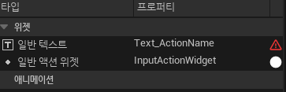

# UCommonBoundActionBar

* `여러 개의 UCommonBoundActionButton (또는 유사한 액션 표시 위젯)들을 담는 컨테이너 또는 "바(bar)" 형태의 위젯`

### 기능

* 다중 액션 표시
  * 화면의 특정 영역(주로 하단이나 측면)에 현재 사용 가능한 여러 입력 액션들의 목록을 아이콘과 함께 표시
  
* 동적 구성
  * 표시할 입력 액션 목록을 동적으로 변경할 수 있다.
  * 예를 들어, 현재 UI 컨텍스트나 게임 상황에 따라 사용 가능한 액션들만 표시하도록 업데이트할 수 있다

* 자동 레이아웃
  * 내부에 포함된 액션 버튼들을 가로나 세로로 정렬

### 설정

* 각 액션을 표시할 때 사용할 템플릿 위젯을 지정

  * 디테일 패널에서 `Action Button Class`를 채우지 않으면 컴파일 오류 발생

* 이 템플릿 위젯은 주로 `UCommonBoundActionButton`이거나 이를 커스터마이징한 위젯 블루프린트. 
  * `UCommonBoundActionBar`는 목록에 있는 각 액션에 대해 이 템플릿 위젯의 인스턴스를 생성하여 내용을 채움

### 사용 예시

* 게임 메뉴 화면의 하단 네비게이션 바 
  * `선택` 
  * `뒤로`
  * `옵션`
* 대화창의 선택지 버튼 모음.
* 컨텍스트에 따라 사용 가능한 액션이 변하는 UI.

# UCommonBoundActionButton

* `단일 입력 액션에 바인딩(연결)된 버튼`

### 기능

* 자동 아이콘 표시
  * 특정 입력 액션과 연결되면, 현재 활성화된 입력 장치(게임패드, 키보드/마우스)에 맞는 아이콘을 데이터 테이블에서 가져와 자동으로 표시
  * 예를 들어 "확인" 액션에 연결된 경우, 게임패드 사용 시에는 "A" 버튼 아이콘을, 키보드 사용 시에는 "Enter" 키 아이콘을 보여줄 수 있다.

* 입력 액션 실행
  * 사용자가 이 버튼을 클릭하거나 연결된 입력 액션에 해당하는 키를 누르면, 해당 입력 액션이 실행되도록 설정할 수 있다.

* 스타일링
  * `UCommonButtonBase`를 기반으로 하거나 유사한 기능을 가지므로, `UCommonButtonStyle`을 통해 시각적 스타일을 일관되게 관리할 수 있다.

### 설정

* 보통 입력 액션 데이터 테이블의 행(Row) 핸들을 지정하여 어떤 입력 액션을 나타낼지 결정한다. 
  * 이 데이터 테이블 행에는 해당 액션의 이름, 아이콘 정보 등이 포함된다.

* 이 클래스를 생성하면 Widget Bind를 필수적으로 해야 한다.

### 사용 예시

* "A 확인", "B 취소" 와 같이 특정 키와 함께 액션 설명을 표시하는 버튼
* 게임 내 상호작용 오브젝트에 대한 프롬프트
  * (예: "X 아이템 줍기")

