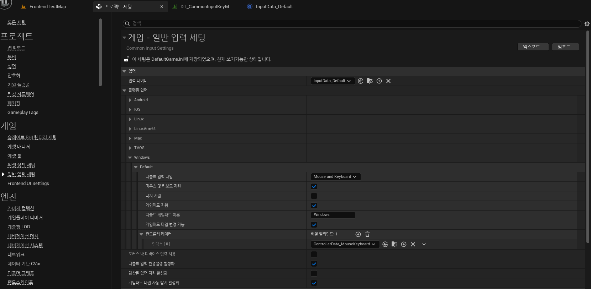
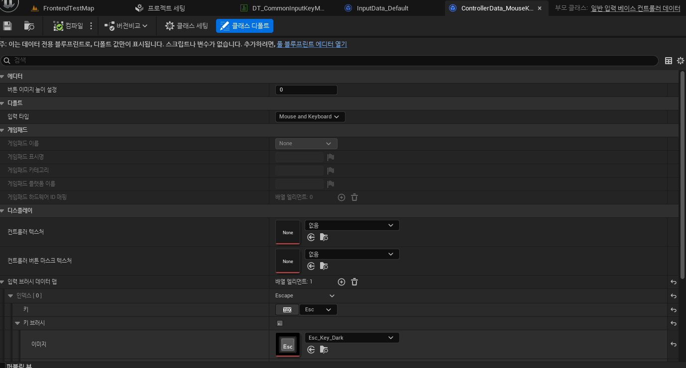
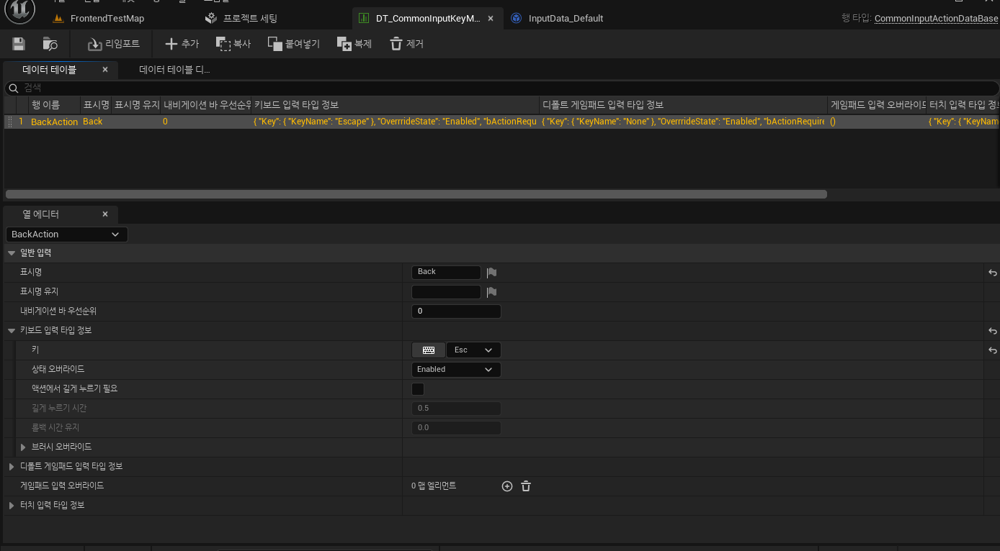
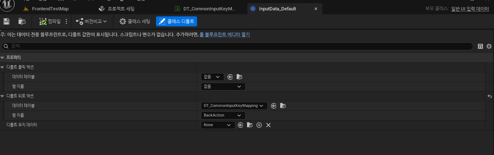
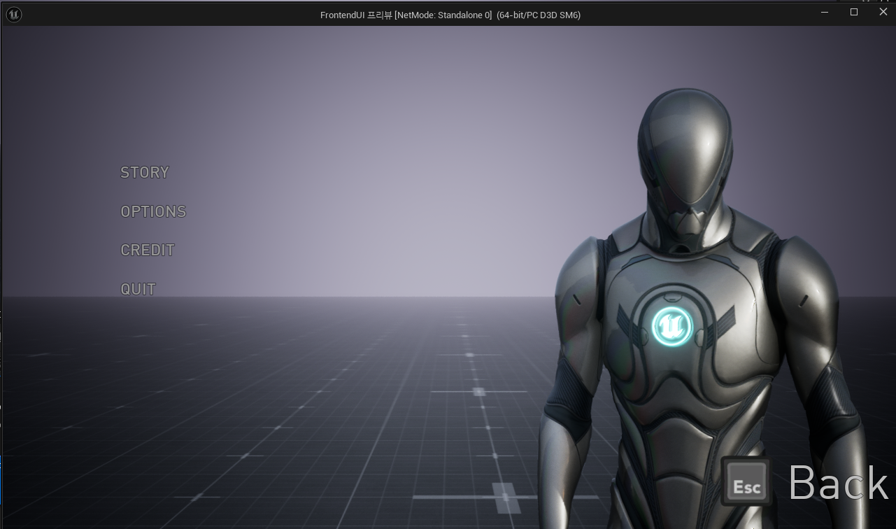

# UCommonInputSettings (공용 입력 세팅)

* 프로젝트 세팅에 있는 클래스

  * 위치는 `프로젝트 세팅 (Project Settings) -> 게임 (Game) -> Common Input Settings`

* 주된 역할은 **Common UI가 입력을 어떻게 처리할지, 특히 어떤 입력 장치에 대해 어떤 아이콘 세트를 사용할지를 전역적으로 설정**

* 중요한 설정 중 하나가 Input Data (입력 데이터) 항목
  * 여기서 키보드/마우스, Xbox 게임패드, PS5 게임패드 같은 각 입력 타입별로 어떤 UCommonUIInputData 에셋을 쓸지 지정
  * 시스템에게 이 입력 장치에는 이 아이콘 모음을 쓰라고 알려주는 핵심 부분

* 결국, `UCommonInputSettings는 각종 입력 방식에 대해 어떤 아이콘 데이터(UCommonUIInputData)를 사용할지 연결해주는 중앙 설정 지점`

### 세팅

* 기존의 `입력데이터`는 None으로, `입력데이터`칸에 사용할 `UCommonUIInputData`를 지정

* 그 밑에는 `플랫폼 입력`칸으로, 여러 플랫폼이 있고 그 중에 사용할 플랫폼에서 사용할 `컨트롤러 데이터(UCommonInputBaseControllerData)`를 설정해줌

 

# UCommonInputBaseControllerData (공용 입력 기본 컨트롤러 데이터)

* UDataAsset에서 파생된 데이터 에셋

* 주 목적은 **특정 게임 컨트롤러 타입 또는 제품군(예: Xbox 컨트롤러, PlayStation DualSense 컨트롤러, 일반적인 XInput 호환 컨트롤러 등)에 대한 구체적인 입력 관련 데이터와 시각적 표현(주로 아이콘 세트 및 컨트롤러 이미지)을 정의**

* UCommonUIInputData가 좀 더 일반적인 입력 장치 타입(예: '게임패드 전체', '키보드/마우스')에 대한 개별 키와 아이콘 매핑을 주로 다룬다면, UCommonInputBaseControllerData는 한 단계 더 나아가 특정 제조사나 모델군의 컨트롤러에 좀 더 특화된 정보 묶음을 제공하는 데 사용

### 세팅

* `입력 타입`은 사용할 컨트롤러 타입을 사용

* `입력 브러시 데이터 맵`에서 사용할 이미지와 Key를 설정
  * 이 값으로 이전 장의 `CommonBoundAction`의 `CommonText`와 `InputActionWidget`으로 사용

 

# FCommonInputActionDataBase (공용 입력 액션 데이터베이스 구조체)

* C++ 구조체(Struct)이면서, 데이터 테이블의 행(Row) 구조를 만들기 위한 **기본 틀(Base)**

* 실제로 사용할 때는 보통 이 `FCommonInputActionDataBase`에서 파생된 다른 구조체(예: FCommonInputActionUIData)를 데이터 테이블 에셋의 행 구조로 선택

* 이 데이터 테이블의 각 행은 하나의 '입력 액션(Input Action)' (프로젝트 세팅 -> 입력(Input)에서 정의한 "점프", "확인" 같은 추상적 동작)을 의미함.
  * 그리고 그 액션에 대한 UI 관련 정보(예: 화면에 표시될 이름)를 담고 있음.

* 주요 속성으로는 보통 해당 액션의 DisplayName (표시 이름) (예: "점프하기", "메뉴 열기") 같은 것이 있음. 
  * 예전엔 아이콘 정보도 있었지만, 요즘은 UCommonUIInputData에서 키별로 아이콘을 더 자세히 관리

* UCommonBoundActionButton 같은 위젯이 자신이 어떤 입력 액션을 대표하는지, 그리고 어떤 이름으로 표시되어야 하는지를 이 데이터 테이블의 특정 행을 참조해서 알 수 있음

# 세팅

* Key Mapping 에 사용할 InputAction을 데이터 테이블로 관리

* `CommonUIInputData`는 이 DataTable을 이용해서 사용할 InputAction을 설정

 

# UCommonUIInputData (공용 UI 입력 데이터)

* 데이터 에셋의 종류로, 지원하려는 각 입력 장치 타입(키보드/마우스, Xbox 컨트롤러 등)마다 별도의 인스턴스를 생성함

* 역할은 **특정 입력 장치 타입에서 각각의 물리적 입력 키(Key)가 UI에 어떻게 보여야 하는지(주로 어떤 아이콘을 쓸지)를 정의**

### 세팅

* `InputType (입력 타입)`: 이 데이터 에셋이 어떤 종류의 입력 장치를 위한 것인지(예: Gamepad, KeyboardAndMouse)를 명시
* KeyBrushes (키 브러시 맵): `TMap<FKey, FSlateBrush>` 형태의 맵
  * 키(Key): FKey 값으로, 특정 물리적 키를 나타냄
  * 값(Value): FSlateBrush 값으로, 해당 물리적 키에 대해 UI에 표시할 아이콘 이미지를 지정함

#### DefaultClickAction

* UCommonUIInputData 에셋이 정의하는 입력 장치 타입에서, 사용자가 일반적으로 **'확인', '선택', '실행', 또는 '주요 상호작용'**의 의미로 받아들이는 기본 입력 액션

#### DefaultBackAction 

* DefaultClickAction과 비슷하게, 해당 입력 장치 타입에서 사용자가 일반적으로 **'취소', '뒤로 가기', '이전 화면', 또는 '메뉴 닫기'**의 의미로 받아들이는 기본 입력 액션을 지정

 

# 결과

