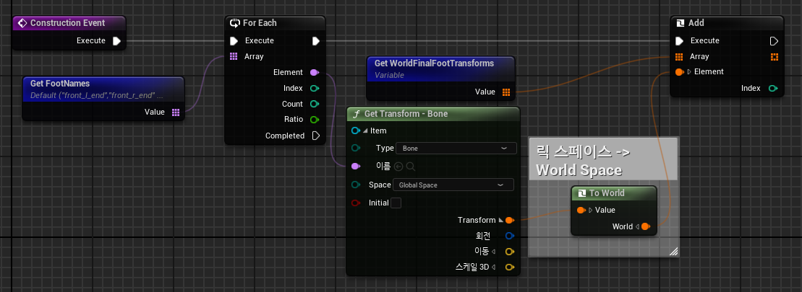
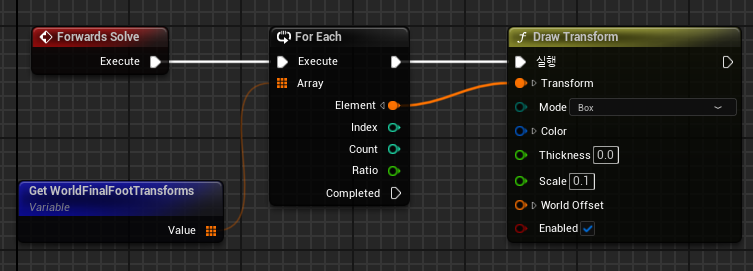
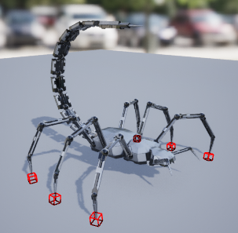

# **컨트롤 릭(Control Rig)**

* `컨트롤 릭(Control Rig)`은 애니메이션이나 리깅 작업에 사용되는 것으로, 캐릭터의 뼈대, 관절등을 움직여서 세밀하게 조절할 수 있다.

 

# **테스트**

### 1. 컨트롤릭 생성

* 스켈레톤 메시에 우클릭으로 컨트롤릭을 생성할 수 있다.

 

### 2. 애니메이션 블루프린트에 컨트롤릭 연결

* 우클릭으로 Control Rig Node를 생성해서 사용하려는 State Machine 같은 다른 노드들과 연결할 수 있다.

 

### WorldFinalFootTransform 저장

* 사용하려는 Mesh는 전갈 모양으로 총 6개의 다리를 가지고 있는데 그 다리들의 위치를 저장한다.

  * GetFoontNames는 다리 뼈의 이름들을 저장한 배열

* 이 때 `컨트롤 릭에서 사용하는 Transform은 Rig Space를 기준`으로 하기 때문에 `To World` 노드를 사용해서 `World Space로 변경` 해줘야 한다.

  * GetWorldFinalFootTransforms는 다리 뼈들의 WorldSpace 위치를 저장하는 배열

* `Construction Event(생성자)`에서 진행한다

  * ex)블루프린트의 Event Begin

### WorldFinalFootTransform 저장

* 위에서 저장한 World Space에서의 다리 뼈 위치에 `Draw Transform`을 이용하여 박스를 생성한다.

* `Forwards Solve`에서 진행한다

  * ex)블루프린트의 Event Tick

 

# **결과**

