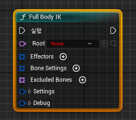
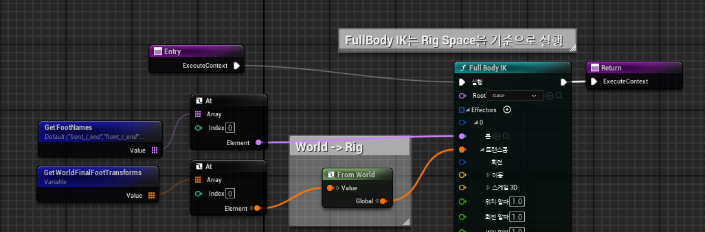

# **FullBodyIK**

* FullBodyIK는 언리얼에서 제공하는 자동으로 뼈대의 관절을 자동으로 조절해주는 시스템이다.

### Root

* Root Bone은 가장 최상단에 있는 Bone으로, 도형의 원점같은 역할을 한다.

* 이 Root 아래에 있는 Bone들이 영향을 받아서 움직이게 되고, Root 위에 있는 Bone은 무시된다.

### Effectors

* Effectors는 `Root에 연결된 뼈대들을 조절하기 위해 기준점이 되는 뼈`이다.

* 뼈의 이름, 트랜스폼 등을 저장한다

* 이전 장을 기준으로 하면 전갈의 다리가 움직이면 나머지 몸도 따라오는 구조로 만들어야 하므로 다리의 끝부분 Bone을 저장한다.

### 나머지

* 사용할 기회가 있으면 적을 예정

 

# **Setting**

* 위 사진은 저장했던 Foot들의 Name과 WorldPosition 배열을 이용해서 Effector에 연결하는 함수다.

* 단, `FullBodyIK는 RigSpace 기준으로 실행`되기 때문에 WorldSpace로 저장했던 Position을 다시 Rig Space로 되돌리는 함수인 `From World`함수를 호출해서 저장해줘야 한다.

  * 그냥 사용한다면 From World를 호출하지 않아도 됨