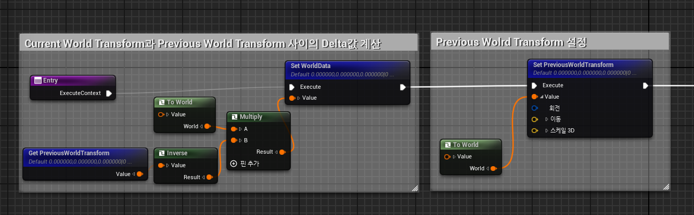
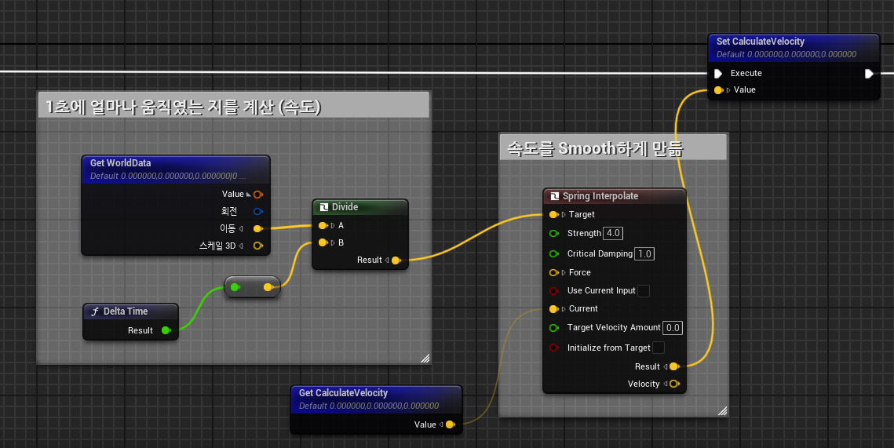
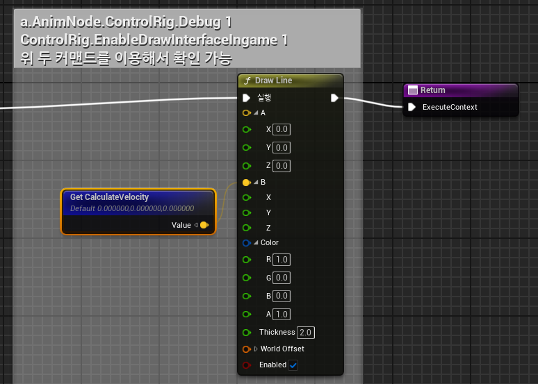

# **Calculate Velocity**

* ControlRig을 이용하여 Bone을 움직이려면 Velocity를 알아야 한다.

* 그래서 DeltaTime마다 움직이는 값을 구하기 위해서는 현재와 과거 위치를 비교하여 얼마나 움직였는지, 그리고 그 시간이 얼마 걸렸는지를 계산해서 구하면 된다.

  * `속력 = 거리/시간`

 

## 1. WorldDelat && Previous World Transform

* `갱신하기 이전의 PreviousWolrdTransform의 역행렬`과 `현재 World에서의 위치`를 곱해서 World에서의 1초에 얼마나 움직였는지를 계산한다.

* 그 다음에 PreviousWorldTransform은 Rig Space안에서의 (0,0,0) 위치에 존재하므로 `To World` 함수를 이용하여 갱신하면 된다.

## 2. Set CalculateVelocity

* 그렇게 구한 WorldDelta를 DeltaTime으로 나눠서 1프레임당 얼마나 움직였는지를 계산한다.

* 그리고 `Spring Interpolate` 함수를 이용하여 `현재의 Calculate Velocity`를 `갱신된 Delat 속력으로 보간`하여 저장한다.

 

## 3. DrawLine

* Level에서 확인하려면 Comment에 있는 두 명령어를 콘솔에 입력하고 시뮬레이트 상태에서 해당 캐릭터를 움직이면 CalculateVelocity가 Draw된다.