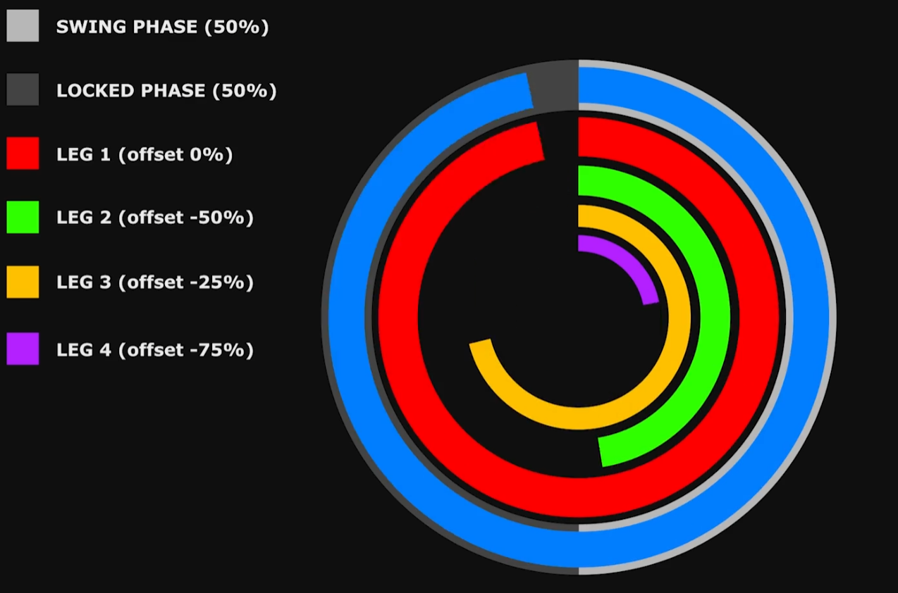
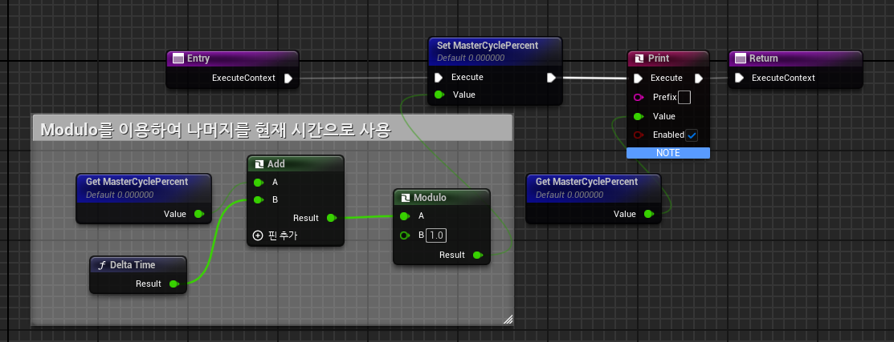
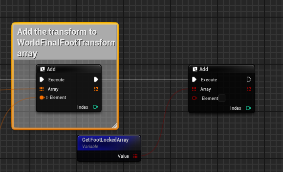
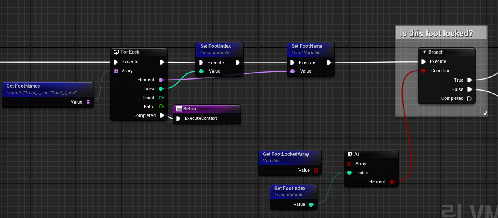
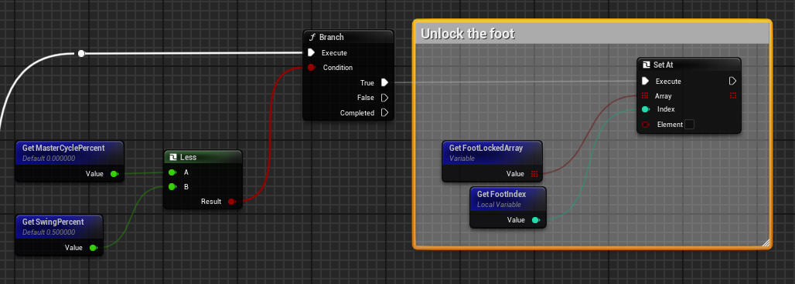
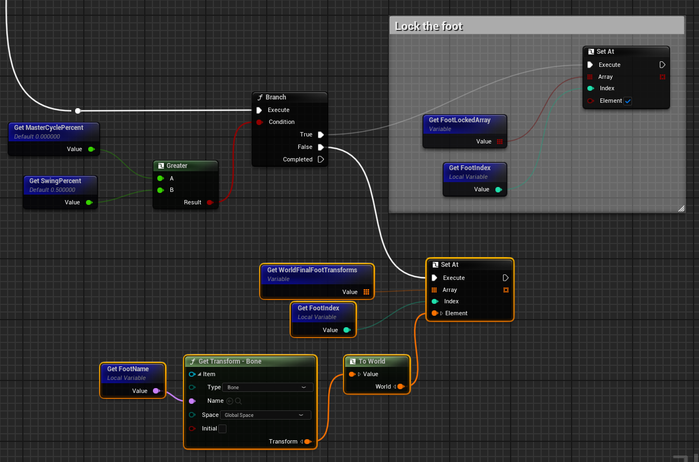

# **Cycle**

* 여기서 설명하는 Cycle은 `일정 시간을 주기적으로 도는 타이머`라고 생각하면 된다.

* 위 사진에서 가장 바깥 원인 `Swing Phase`를 기준으로 각각의 발(Leg)는 Offset을 가져 모든 leg가 비율값을 가지게 된다.

* 그 비율값을 가지고 발을 움직일 때 다른 발이 얼마나 움직이도록 조절한다.

* 예를 들어 가장 바깥쪽 Cycle을 담당하는 Leg가 이전 위치에서 새로운 위치로 움직이면서 해당 Wolrd Space에 고정(Lock)이 되었다고 한다면 나머지 Leg도 이전 위치에서 다음 위치까지로 움직이는 값을 비율값으로 조절한다.

* 지금 이 ControlRig에서 사용하는 Mesh는 전갈이기 때문에 이 전갈의 발을 자연스럽게 움직이게 하기 위해서는 하나씩 간격을 두고 움직이는 것이 좋기 때문에 Cycle을 사용하는 것이다

 

## Calculate Cycle

* `Modulo`를 이용해서 B를 넘어가면 초과된 양은 Set으로 저장하고 다시 시작하는 방식이다.

* `MasterCyclePercent`는 0초 ~ 1초(Modulo의 B) 사이의 시간을 도는 시간이다.

  

# **Lock && UnLock** (Construction)

* 발을 Lock상태와 Unlock상태로 적용할 것인데 Lock상태는 `발이 멈춰있는 상태`이고 Unlock상태는 `발을 움직일 수 있는 상태`로 취급하면 된다.

### 1. 배열 생성

* 먼저 발 개수만큼의 크기를 가진 bool 배열을 만든다.

 

### **2. 각 발마다 Lock**

* 함수를 만들어서 반복문으로 각 발마다 Lock상태인지 체크한다.

 

### **Lock상태라면**

* GetSwingPercent는 Lock이나 Unlock을 조절하는 값으로, 0.5로 설정했다.

* MasterCyclePercent가 이 값보다 작으면 Unlock하는 방식이다

 

### **Unlock상태라면**

* MasterCyclePercent가 이 값보다 크면 lock하는 방식이다

 

# 결론

* 전갈의 발을 움직이게 하기 전에 Cycle을 만들어 여러 발을 한 번에 움직이지 않고 다르게 움직여 자연스럽게 움직이게 하기 위함이다.

* 그 와중 발이 움직이는 상태는 Unlock이고 움직이지 않는 상태는 Lock이다.

* SwingPercent는 Lock과 Unlock 의 비율을 조절해주는 값이다