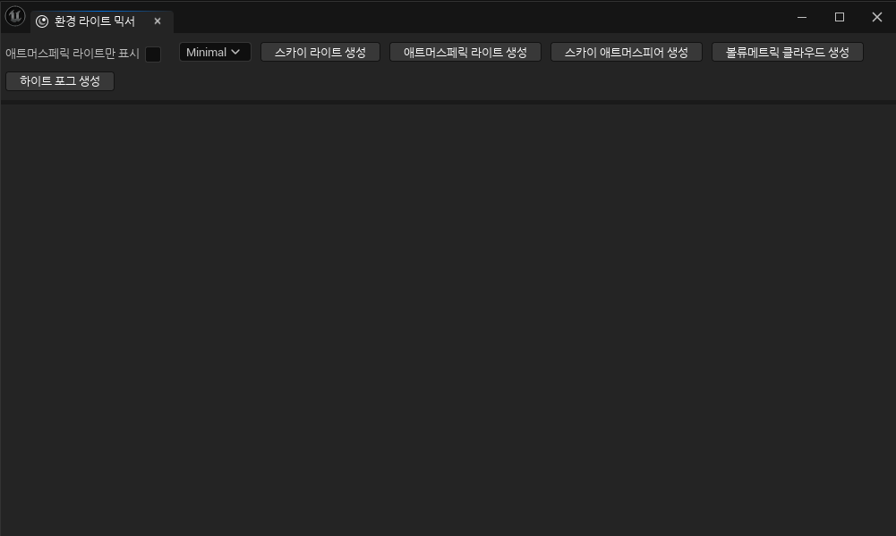
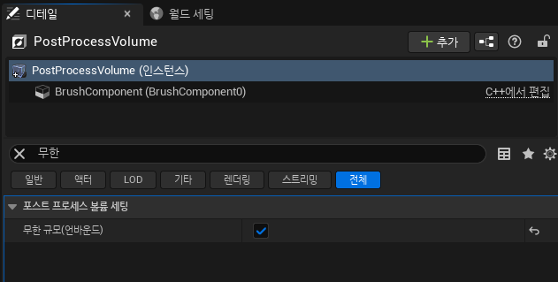
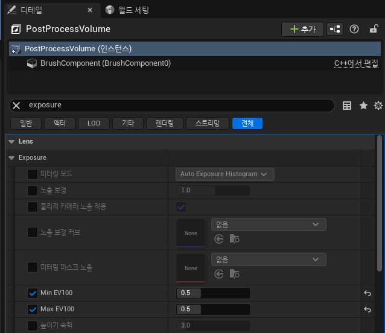

# **Env Light Mixer(환경 라이트 믹서)**

* Scene의 조명을 제대로 작동시키기 위해서 `Directional Light`, `Height Fog`, `Sky Atmosphere`, `Sky Light`, `Volumetic Cloud`이 필요하다.

* 일일이 찾아서 넣어주지 않아도 `창->환경 라이트 믹서`를 키고 들어가면 다음과 같이 창이 나온다.

* 위쪽의 생성 버튼들을 눌러주면 Scene에 필요한 조명들을 알아서 생성해준다.

 

## PostProcessVolume

* 그리고 그 외에 하나 더 추가해줘야 하는데 `PostProcessVolume`을 추가해준 다음 다음과 같이 `Infinite`와, `Exposure`를 켜주고 세팅해준다.

#### Infinite

#### Exposure

* 이 DynamicSky 카테고리에서는 조명 관련 설정을 할텐데 `Max EV100`과 `Min EV100`의 값을 동일하게 맞춰줘서 `자동 노출`을 꺼줘야 야간 조명같은 것들이 제대로 작동한다.

