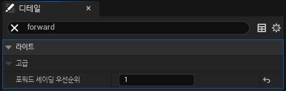
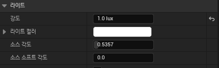
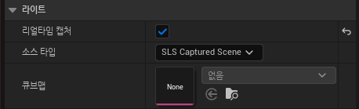
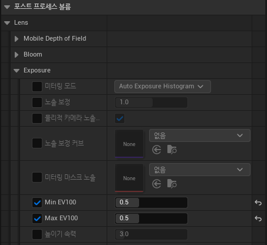
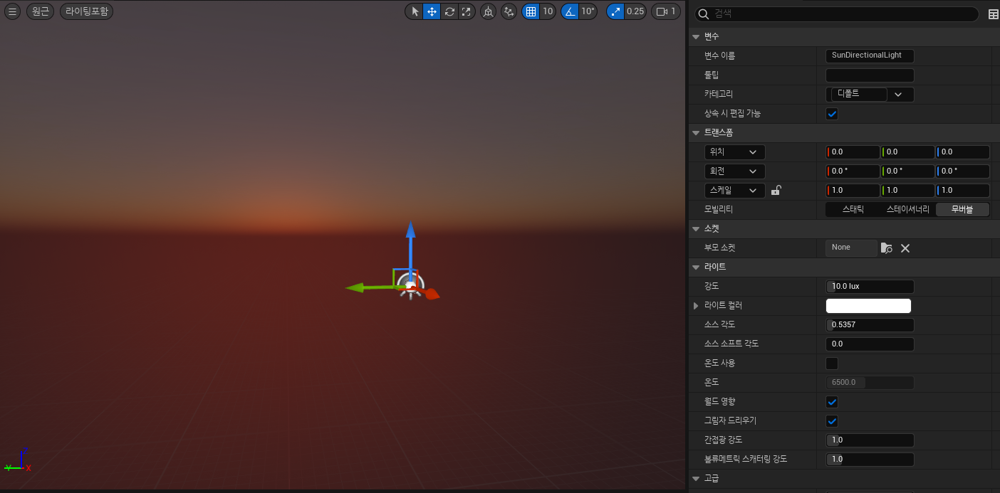
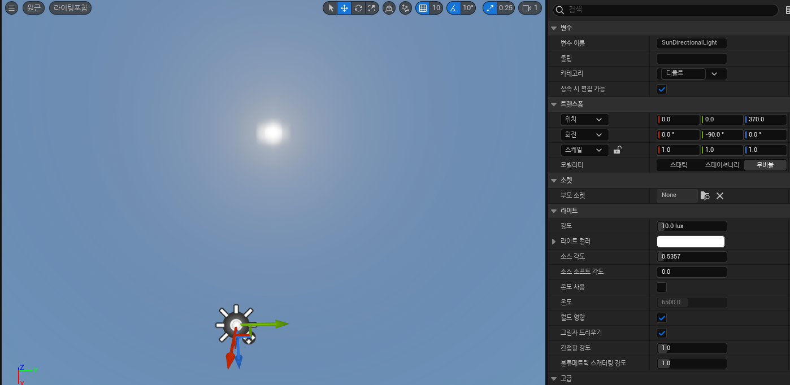
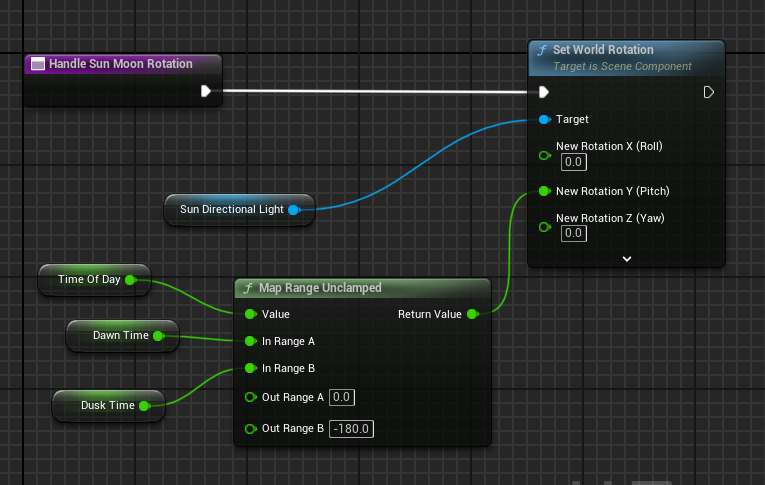
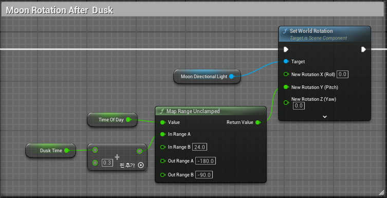

# **Blueprint DynamicSky**

* 이전 장에서 `환경 라이트 믹서`로 Scene에 필요한 조명들을 추가했는데 이번에는 조명들을 블루프린트의 Actor에 추가해서 Actor하나로 관리할 수도 있다.

* Blueprint Actor를 생성한 다음, VolumeticSky를 제외한 나머지들을 전부 컴포넌트로 넣어주면 된다.

* 이전장과 다르게 태양의 빛을 조절하는 Directional Light와 달의 빛을 조절하는 DirectionalLight 총 두 개를 추가한다.

 

## 설정

### DirectionalLight

* 맨 처음 컴포넌트로, SunDirectionalLight를 넣어주면 뷰포트에 에러메세지가 뜨는데 다음과 같이 `포워드 셰이딩 우선순위를 1로 설정`해야 한다.

#### MoonDirectionalLight

* 기본적으로 강도가 10으로 되어있지만 달은 빛이 태양보다 약하기 때문에 1로 수정한다.

### SkyLight

* SkyLight에서는 `RealTimeCapture를 True`로 변경해야 정상적으로 작동한다.

 

### PostProcess

* 이전장처럼 `Infinite(무한)`을 키고 `Min EV100, Max EV100을 같은 값으로 변경`해줘야 한다.

 

# **Directional Light 각도**

* Directional Light의 Yaw값을 바꿀 때마다 위치가 변한다.

### 일출(0도),일몰(-180도)

### 정오(-90도)

 

# **SunRotation**

* HandleSunMoonRotation은 시간에 따라 태양과 달의 회전을 조절하는 함수

* `TimeOfDay`는 0~24 의 값을 가지고, `DawnTime(해가뜨는시간)`은 기본값으로 6, `DuskTime(해가지는시간)`은 기본값으로 18이 설정되어 있다.

### Sun

### AfterDusk

### BeforeDawn

