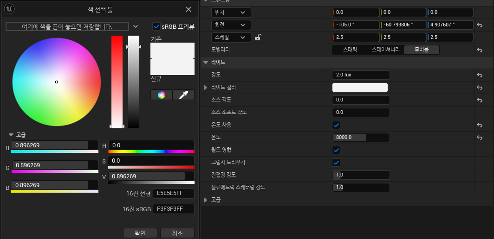
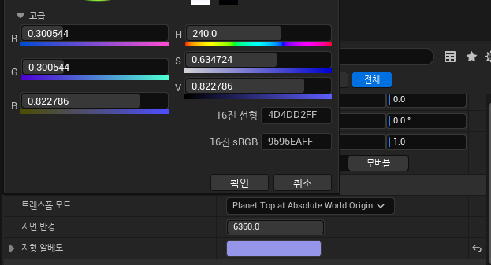
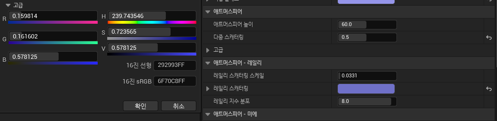
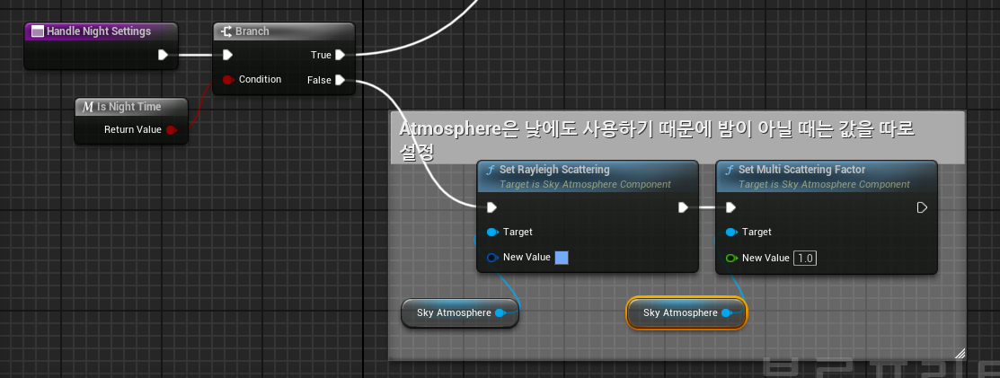
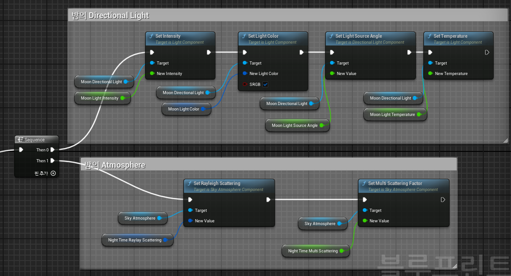

# **밤하늘 만들기**

* 밤 하늘의 색깔을 만들기 위해서는 `Directional Light`와 `Sky Atmosphere`의 값을 조절해서 만든다.

 

# **Dir Light**

* 아래 목록은 기본 설정값에서 바꾼 값들

### Intensity(빛의 강도)

* 기존 빛의 강도는 태양을 기준으로 10으로 되어 있으므로 1.5 ~ 2 로 조절

### LightColor

* Alpha값을 약간 낮춤

### Source Angle(소스 각도)

* 태양,달의 선명도?라고 보면 될듯 하다 0이면 보이지 않고 10이면 보름달이나 태양처럼 하늘에 보인다.
* 여기서는 0으로 설정

### 온도

* 온도를 true로 변경하고 8000으로 변경

 

# `Sky Atmosphere`

## Ground 

### Ground Albedo(지형 알베도)

* 빛의 지면 반사 이후 Atmosphere(대기)를 물들이는 색깔을 의미한다.

* MultiScattering의 값이 0 보다 커야 적용이 된다.

* 이 값은 위 사진에 있다.

 

## Atmosphere

## Multi Scattering(다중 스캐터링)

* 레벨 안의 빛의 산란 강도값을 의미

* 1에서 0.5로 변경함

## 레일리 스캐터링 

* Atmosphere(대기)의 기본 색깔을 결정하는 값이다

* 값은 사진에 있다

 

# **Bp에도 적용하기**

* 아래에는 BP_DynamicSky 버전에서 적용할 함수

### False

* 밤일 때만 적용시키게 해야 한다.

* Atmosphere은 밤,낮 둘 다 사용하기 때문에 낮이면 따로 설정해줘야 한다.

### True

* 아까 위에서 만들었던 밤 하늘을 만들기 위한 설정들에서 관련된 함수들을 호출하면 된다.

* 거기에 필요한 인수들은 전부 변수화 시켜서 값을 변경시키게 하여 Level에서 조절할 수 있도록 만든다.