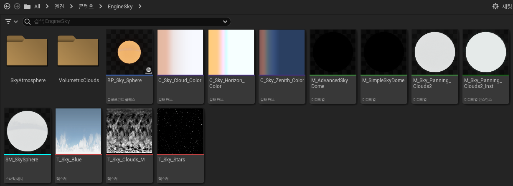
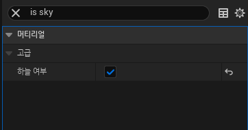
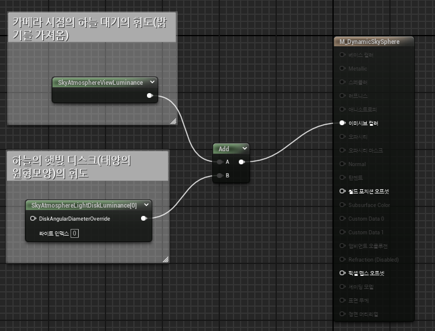

* 이제 별과 달을 추가할 텐데 그 전에 하늘에 사용할 Mesh를 찾아야 한다.

* 그 Mesh는 엔진에 `SM_SkySphere`이라는 언리얼4에서 사용하던 Mesh가 있다.

  * 언리얼5에서는 대신 Volumetic Cloud와 SkySphere를 사용하고 있음

### 엔진 콘텐츠안에 있는 SM_SkySphere Mesh

 

# Sky Sphere

* 구체의 법선 벡터가 반전되어 있어 빛이 구체 안쪽으로 통과할 수 있다.

* 이 Mesh의 Material을 없애고, 이전에 만들었던 BP_DynamicSky에 붙여준다음,  
크기는 World를 전부 덮기 위해서 X,Y,Z축 전부 100000(엄청 큰 값)로 맞춰준다

* 이렇게 하고나면 Material이 없어서 구체가 보이기 때문에 Sky Material을 만들어줘야 한다.

* 설정하지 않으면 구체의 안쪽이 하늘에 보이게 된다.

 

# SkyMaterial

* 새로운 Material을 만들고 나서 Detail에서 `셰이딩 모델을 Unlit`으로 만들고 `IsSky를 True`로 켜준다.

 

* 그 다음에는 다음과 같이 노드들을 생성해서 설정해주면 된다.

* 그러고 나서 Instance를 만든 다음 BP_DynamicSky에 있는 Sky Mesh의 Material로 사용하면 된다

* 적용하고 나면 하늘에 보이던 선이 사라지게 된다.