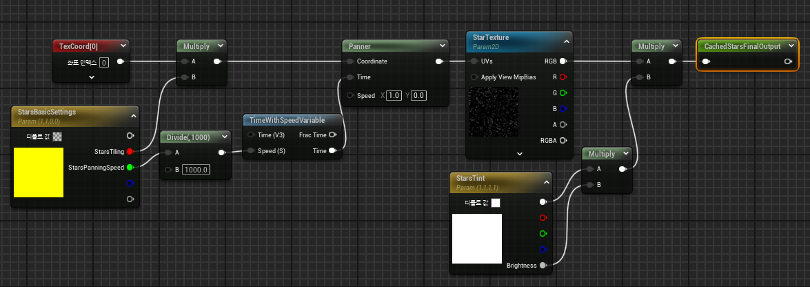
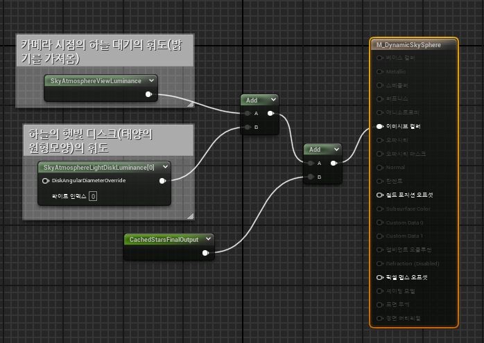
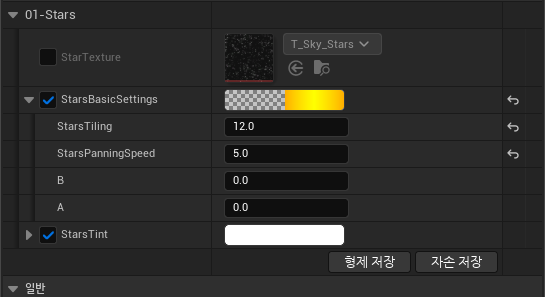
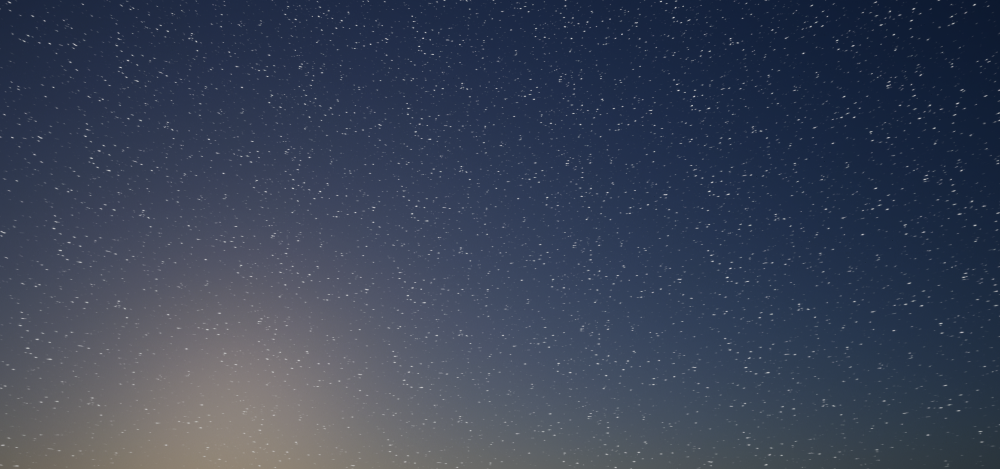
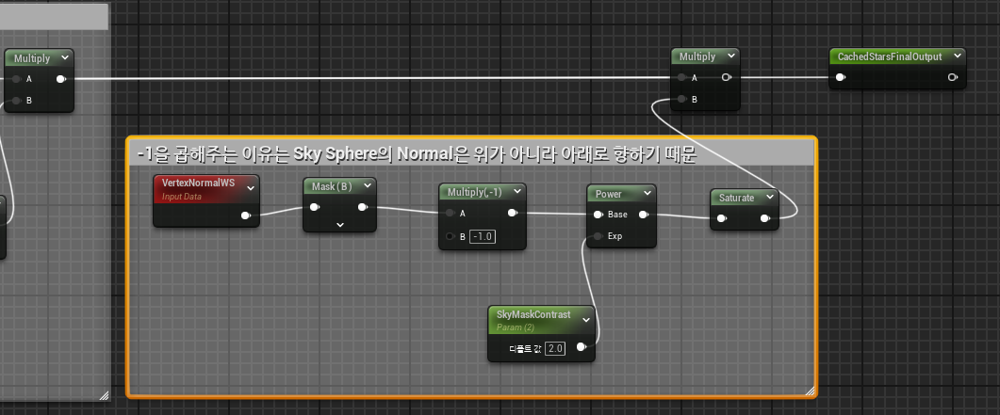
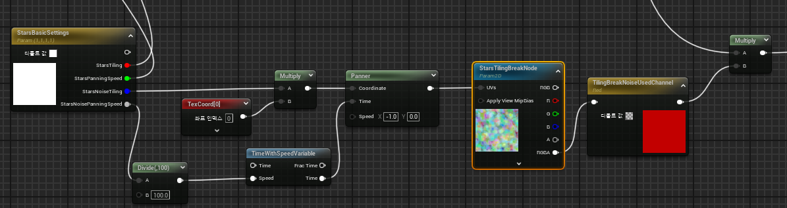

* 이제 별을 추가하기 위해서는 Material에 별을 추가해줘야 한다.

# 1. Material 수정

* 먼저 별 Texture을 추가한 다음, Tiling과 Pannel을 적용시킨다. 
  * `Add Named Reroute Declaration Node`을 이용하여 마지막에 저장해서 변수처럼 사용 가능

 

* 그 다음 기존 휘도와 값을 합쳐서 이미시브 컬러에 적용한다.

 

* 그러고 나서 BP에 적용된 Material Instance의 값을 설정한다.

 

### 결과

* 그러면 다음과 같이 하늘에 별이 생성된다.

 

# 2. VertexNormal을 이용하여 별 Texture 조절하기

* VertexNormal 노드를 이용하여 원치 않는 부분의 Star을 조절할 수 있다.

* 이러면 SkyMaskContrast 값를 이용하면 지평선부터 가까운 별쪽을 없애거나 등 할 수 있다

 

# 3. Noise Texture와 Channel Mask Component를 이용해서 별 Tiling 조절하기

* Noise Texture를 이용해서 별 Texture가 패턴적인 모습이 보이는데 이 부분을 깨기 위해 Noise Texture를 엔진에서 제공하는 `T_TilingNoisePack`이라는 텍스쳐를 이용한다.

* 그리고 Noise Texture에도 적용할 Tiling과 Panner의 변수 값을 기존 텍스쳐에서 받아서 연결한다

  * Multiply는 VertexNormal을 적용하기 전에 연결

* `Channel Mask Component(TilingBreakNoisedUsedChannel)`을 이용해서 Noise Texture에서 사용하고 싶은 R,G,B,A 채널 중 하나를 선택해서 다양한 패턴으로 사용할 수 있다