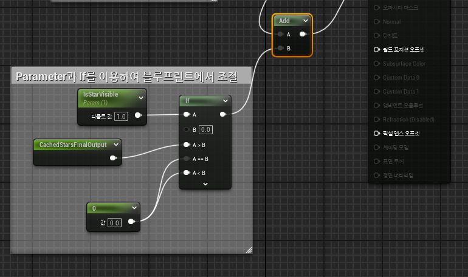
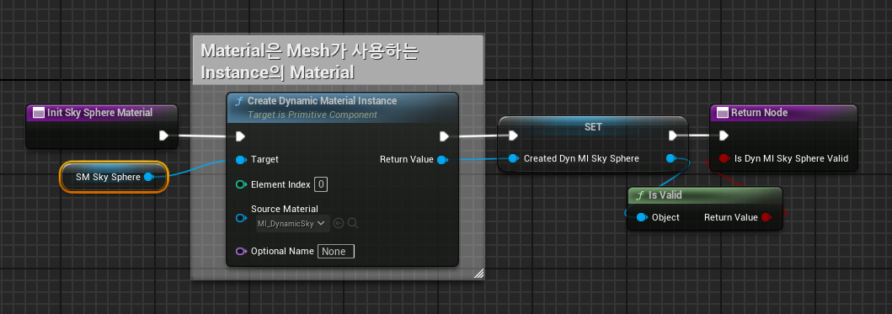
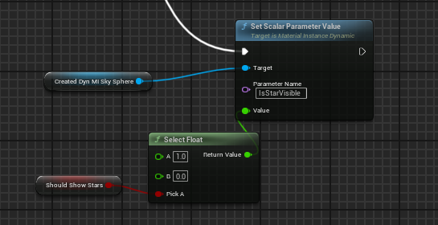

* 별을 추가했지만, 낮에도 보이기 때문에 밤에만 보이게 설정해야 한다.

* 여기서 시간을 관리하는 변수는 BP에 있지만 별은 Material를 이용해서 띄우기 때문에 블루프린트와 머티리얼 사이에 통신하는 방법을 사용해야 한다.

* 방법으로는 `Dynamic Material Instance`를 이용하는 방법과 `Material Parameter Collection`을 이용하는 방법 총 두 가지가 있다

* 이 장에서는 `Dynamic Material Instance`를 이용하는 방법을 사용한다.

 

# Dynamic Material Instance

* 여기서 블루프린트와 머티리얼 사이에서는 단방향 통신만 가능하다.

* 블루프린트에서 머티리얼 파라미터를 읽고 쓰는건 가능하지만 그 반대는 불가능하기 때문에 머티리얼 그래프에서 블루프린트 변수를 사용할 수 없다.

* 머티리얼에서 Static bool Parameter이나 Switch Parameter를 이용하여 bool 변수처럼 True 혹은 False로 설정하여 끄고 키는 것이 가능하지만 블루프린트에서는 이 두 종류의 변수값을 조절할 수 없다.

* 그 대신에 블루프린트에서 Scalar 값은 머티리얼에 적용할 수 있기 때문에 If문과 같이 사용하면 브,블루프린트를 이용해서 머티리얼에서 bool 변수처럼 사용할 수 있다.

## 1. Material 수정

* 아래와 같이 블루프린트에서 조절할 Param과 그 값으로 설정할 If문을 설정한다.

## 2. Blueprint 수정

* 그 다음 Dynamic Sky Material을 만들어서 변수로 설정하고

* 아래와 같이 밤일 때 `SetScalarParameterValue`를 통해 1로 설정하여 별 텍스쳐들이 보이게 설정하고 만약 낮이라면 0으로 설정해서 별 텍스쳐가 보이지 않게 설정하면 된다.

