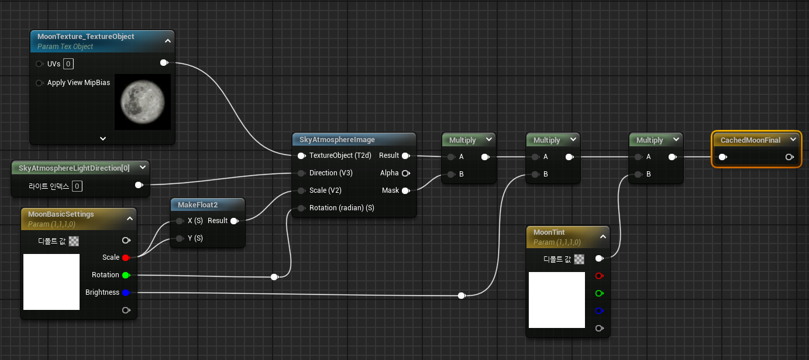
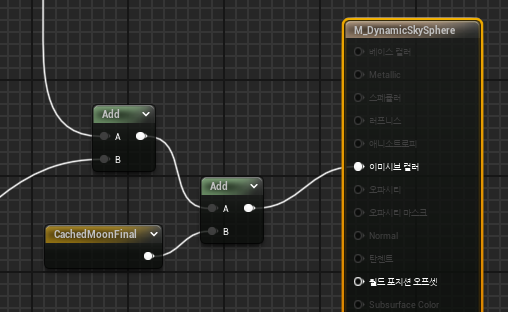
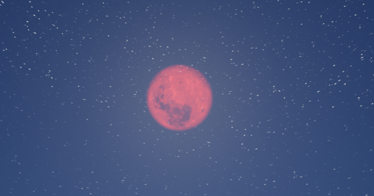

* 다음에는 달을 추가하려고 한다.

* 달 텍스쳐와 같이 아래와 같이 설정하면 된다.

# Moon (in Material)

* 달 텍스쳐를 추가하고 `SkyAtmosphereImage`와 `SkyAtmosphereDirectional` 노드를 이용하여 설정한다.

* Result와 Mask를 곱한 이유는 전체 적용이 아닌 일부 적용만 하기 위해서이다

 

* 그러고 나서 저장한 값을 마지막에 더 해준다

# 결과

* 그 다음 Instance에서 값을 조절하면 아래와 같이 빨간 달도 생성 가능하다.

* 달도 별처럼 밤에 보이게만 하기 위해서는 이전 장처럼 Parameter,If문과 Scalar Value를 이용하면 된다.