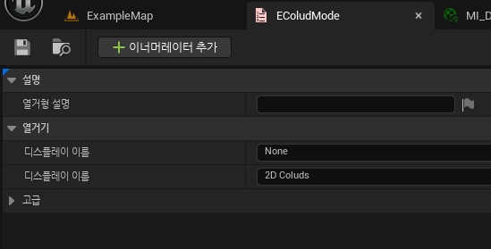
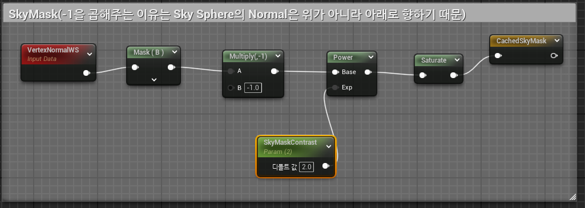
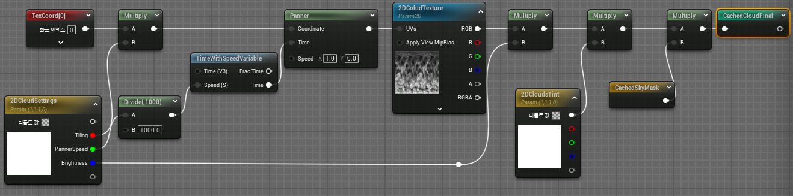
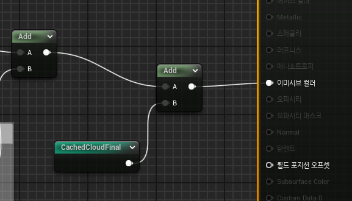
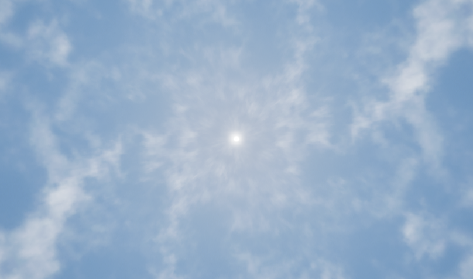
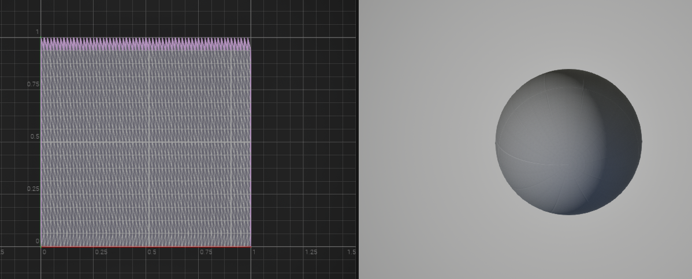
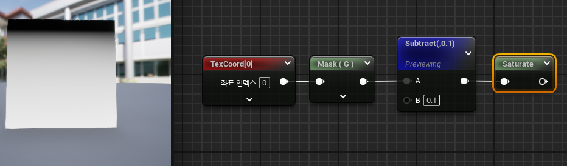
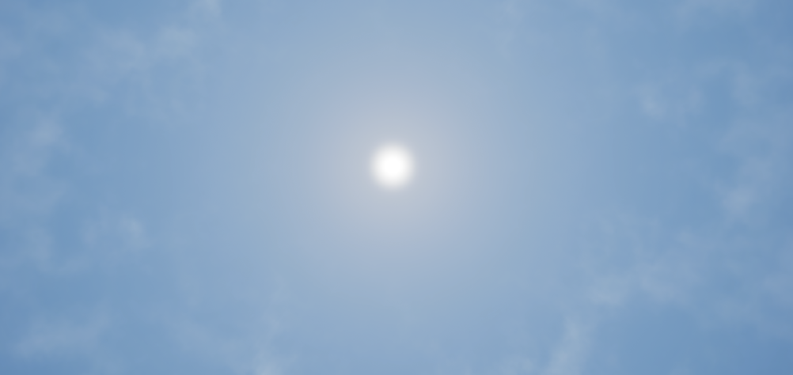

* 이제 구름을 추가하려는데 구름의 종류를 구분하기 위해 Enum을 사용한다.

 

# Material

* 그 다음 블루프린트에서 위 Enum 변수를 추가한다.

* 그리고 머티리얼에 가서 이전의 달처럼 구름을 추가하기 위해 세팅하면 된다.

* 세팅하기전에 Star에서 VertexNormal을 통해 Mask를 조절하던 부분을 Cloud에도 적용해야 하기 위해 해당 부분을 Named를 해야 한다.

 

* 달에서 했던 것처럼 구름도 똑같이 설정하고 SkyMask 노드를 마지막 부분에 추가하면 된다.

* 그리고 그 CloudFinal값을 추가해주면 된다

 

# 결과

* 그런데 위 사진을 보면 텍스쳐끼리 이어진듯한 모습이 보여 어색한 모습이 보인다.

* 이 문제를 해결하기 위해서 SkySphere Mesh를 우클릭해서 UVEditor를 열어보면 다음과 같이 보이는데 왼쪽 위에 분홍색 부분 Mask를 없애야 한다.

* 여기서 위에 분홍색으로 칠해져 있는 부분을 지워야 자연스러워지기 때문에 이 부분을 없애면 된다.

 

* 다음과 같이 만들면 왼쪽처럼 나오는데 검은색 부분은 0, 흰색 부분을 1의 값이기 때문에 이 값을 Cached2DCloudFinal 부분에 곱해주면 위쪽 부분은 나오지 않고 아래쪽 부분만 나오게 된다.

# 결과2

