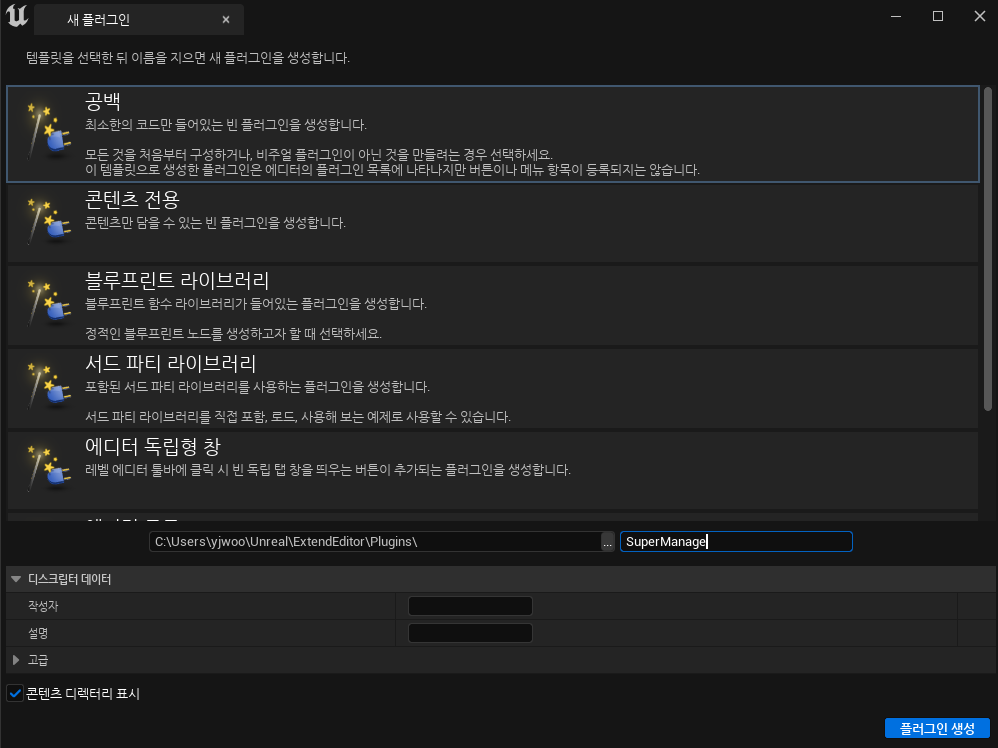
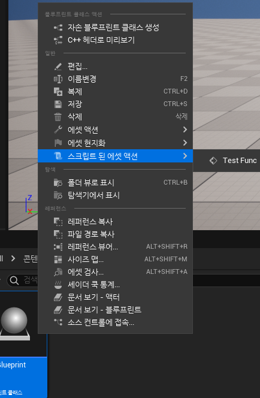

**.uplugin**
===========

* 현재 만들고 있는 툴을 플러그인으로 제작하기 위해 <br>
  편집->플러그인->추가->공백을 누르고 이름을 작성한다.


<center></center>

<br>

* 그다음 IDE에서 해당 플러그인에 들어가 `이름.uplugin`에 들어가 다음과 같이 바꿔준다.

```c++
"Modules": [
    {
        "Name": "SuperManager",
        "Type": "Editor",
        "LoadingPhase": "PreDefault"
    }
]
```

* Type은 모듈의 유형으로  이 플러그인의 모듈을 로드하기에 적합한 어플리케이션 유형을 결정한다.
  * 에디터상에서만 작동시키기 위해 Editor로 작성

  * 종류에는 https://docs.unrealengine.com/5.2/en-US/API/Runtime/Projects/EHostType__Type/ 에서 확인할 수 있다.

* LoadingPhase는 모듈이 언제 로딩되는지를 결정한다.
  * 엔진이 초기화되기 이전에 로딩되기 위해 PreDefault를 사용한다.

  * 종류는 https://docs.unrealengine.com/5.2/en-US/API/Runtime/Projects/ELoadingPhase__Type/ 에서 확인할 수 있다.


<br>

**AssetActionUtility**
===============

* 커스텀 에디터에서 Asset관련은 `AssetActionUtility`, Actor관련은 `ActorActionUtility` 클래스를 사용한다

* 지금은 에셋 커스텀 에디터를 위해 AssetActionUtility 클래스의 파생 클래스를 제작한다.

* 그런데 AssetActionUtility 클래스를 사용하기 위해선 모듈을 추가해야 한다.

* 플러그인의 .cs파일에 들어가 다음과 같이 추가한다.

```c++
// System.IO.Path.GetFullPath(Target.RelativeEnginePath)는 엔진 경로를 의미
PrivateIncludePaths.AddRange(
    new string[] {
        System.IO.Path.GetFullPath(Target.RelativeEnginePath) + "/Source/Editor/Blutility/Private"
    }
);
```

<br>

* 그 다음 다음과 같이 추가하면 에디터에서 해당 옵션이 뜬다.

```c++
// h
UCLASS()
class SUPERMANAGER_API UQuickAssetAction : public UAssetActionUtility
{
	GENERATED_BODY()

public:
	UFUNCTION(CallInEditor) // CallInEditor 속성을 사용해서 에디터에서 해당 함수를 사용
	void TestFunc();
};


// cpp
void UQuickAssetAction::TestFunc()
{
	if(GEngine)
	{
		GEngine->AddOnScreenDebugMessage(-1, 8.f,FColor::Cyan, TEXT("Working"));
	}
}
```


* 에디터에 TestFunc를 추가

<center></center>