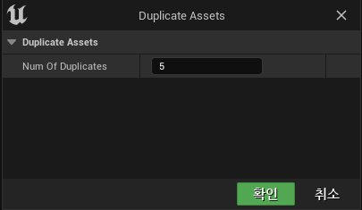

**Scripting Libraries**
===============

* Scripting Library인 두 라이브러리를 사용해서 다음 함수를 사용하려 한다.

  * UEditorUtilityLibrary
  * UEditorAssetLibrary

<br>

## UEditorUtilityLibrary

```c++
// Gets the set of currently selected assets
UFUNCTION(BlueprintCallable, Category = "Development|Editor")
static TArray<UObject*> GetSelectedAssets();

// Gets the set of currently selected assets data
UFUNCTION(BlueprintCallable, Category = "Development|Editor")
static TArray<FAssetData> GetSelectedAssetData();
```

* AssetData와 Asset의 차이점은 AssetData가 Asset보다 좀 더 많은 정보를 담고 있다.


<br>

## UEditorAssetLibrary

```c++
UFUNCTION(BlueprintCallable, Category = "Development|Editor")
static TArray<FString> ListAssets(const FString& DirectoryPath, bool)
```

* `EditorAssetLibrary`를 이용하기 위해선 `EditorScriptingUtilities`모듈을 넣어야 한다.

<br>

**에디터**
===========

* 에디터에서 위 라이브러리를 이용하여 다음과 같은 함수를 만들어 한번에 여러개 복사하는 함수를 만들 수 있다.

```c++
// 헤더파일
UCLASS()
class SUPERMANAGER_API UQuickAssetAction : public UAssetActionUtility
{
	GENERATED_BODY()

public:
	UFUNCTION(CallInEditor)
	void DuplicateAssets(int32 NumOfDuplicates);
};


// 소스파일
void UQuickAssetAction::DuplicateAssets(int32 NumOfDuplicates)
{
	if(NumOfDuplicates <= 0)
	{
		return;
	}

	TArray<FAssetData> SelectedAssetsData = UEditorUtilityLibrary::GetSelectedAssetData();
	uint32 Counter = 0; // 복사되는 에셋 수
	
	for(const FAssetData& SelectedAssetData : SelectedAssetsData)
	{
		for(int32 i = 0; i < NumOfDuplicates; i++)
		{
			const FString SourceAssetPath = 
				SelectedAssetData.ObjectPath.ToString();	// 해당 에셋 경로


			const FString NewDuplicatedAssetName = 
				SelectedAssetData.AssetName.ToString() + TEXT("_") + FString::FromInt(i); // 복사한 에셋 이름 설정


			const FString NewPathName = 
				FPaths::Combine(SelectedAssetData.PackagePath.ToString(),NewDuplicatedAssetName); // 새로운 경로


			if(UEditorAssetLibrary::DuplicateAsset(SourceAssetPath,NewPathName)) // 복사
			{
				UEditorAssetLibrary::SaveAsset(NewPathName, false);	// 저장
				++Counter;
			}
		}
	}
}

```

<br>

* 에디터에서 다음과 같이 창이 뜨면 매개변수값을 넣어주고 확인을 누르면

<center></center>

<br>

* 다음과 같이 5개의 복사된 에셋이 생성된다.

<center></center>