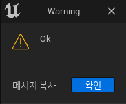
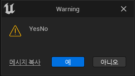

**알림 메세지**
==============

* 언리얼에서 특정 행동을 하면 메세지가 나타내는데 다음과 같은 함수로 원하는 알림 메세지를 보낼 수 있다.

```c++
#include "Framework/Notifications/NotificationManager.h"

void ShowNotifyInfo(const FString& Message)
{
	FNotificationInfo NotifyInfo(FText::FromString(Message));
	NotifyInfo.bUseLargeFont = true;
	NotifyInfo.FadeOutDuration = 7.f;

	FSlateNotificationManager::Get().AddNotification(NotifyInfo);
}

// 사용
ShowNotifyInfo(TEXT("Successfully duplicated " + 
                        FString::FromInt(Counter) + "files"));
```

* 그러면 다음과 같은 특정 메세지를 생성할 수 있다.

<center></center>


<br>

**창 메세지**
===========

* 아니면 다음과 같이 에디터에서 특정 행동에 따라 창을 띄워서 내용을 전달할 수 있다.


```c++
static EAppReturnType::Type ShowMsgDialog(EAppMsgType::Type MsgType, const FString& Message,bool bShowMsgAsWarning = true)
{
	if(bShowMsgAsWarning)
	{
		FText MessageTitle = FText::FromString(TEXT("Warning"));
		return FMessageDialog::Open(MsgType,FText::FromString(Message),&MessageTitle);
	}
	else
	{
		return FMessageDialog::Open(MsgType,FText::FromString(Message));
	}
}
```

<br>

## **단일 메세지를 띄울 때**

```c++
// 헤더
UFUNCTION(CallInEditor)
void ShowMsgOk();

// 소스
void UQuickAssetAction::ShowMsgOk()
{
	ShowMsgDialog(EAppMsgType::Ok,TEXT("Ok"));
}
```

<center></center>


<br>

## **선택 메세지를 띄울 때**

```c++
// 헤더
UFUNCTION(CallInEditor)
void ShowMsgYesNo();

// 소스
void UQuickAssetAction::ShowMsgYesNo()
{
	EAppReturnType::Type ReturnType =
	DebugHeader::ShowMsgDialog(EAppMsgType::YesNo,TEXT("YesNo"));

	if(ReturnType == EAppReturnType::Yes)
	{
		DebugHeader::ShowMsgDialog(EAppMsgType::Ok,TEXT("Yes"));
	}
	else if(ReturnType == EAppReturnType::No)
	{
		DebugHeader::ShowMsgDialog(EAppMsgType::Ok,TEXT("No"));
	}
}
```

<center></center>


* Yes나 No를 누르면 ShowMsgOk함수처럼 창이 뜨고 안에 내용이 누른 것에 따라 바뀐다.