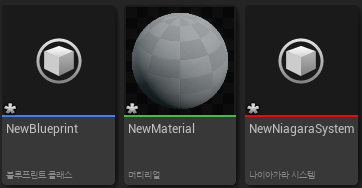
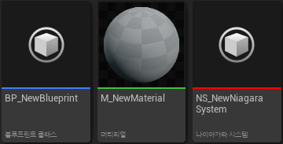

**Prefix to assets**
===========

* TMap을 이용해서 해당 블루프린트의 클래스를 알아내고, 그 클래스는 지정한 FString으로 시작하게 만드는 함수

```c++
// 헤더파일
private:
    TMap<UClass*, FString> PrefixMap =
    {
            {UBlueprint::StaticClass(), TEXT("BP_")},
            {UMaterial::StaticClass(),TEXT("M_")},
            {UNiagaraSystem::StaticClass(), TEXT("NS_")},
            //... 원하는 클래스들 추가
    }


public:
    UFUNCTION(CallInEditor)
    void AddPrefixes();
```
<br>

```c++
// 함수
void UQuickAssetAction::AddPrefixes()
{
    // 선택한 에셋들을 담은 배열
	TArray<UObject*> SelectedObjects = UEditorUtilityLibrary::GetSelectedAssets();

	uint32 Counter = 0;
	
	for(UObject* SelectedObject : SelectedObjects)
	{
		if(!SelectedObject) continue;

        // 해당 클래스가 TMap에 있다면 Value에 해당하는 FString을 가져온다
		FString* PrefixFound = PrefixMap.Find(SelectedObject->GetClass());
		
		if(!PrefixFound || PrefixFound->IsEmpty())
		{
			Print(TEXT("Failed to find prefix for class") +
					SelectedObject->GetClass()->GetName(),
					FColor::Red);

			continue;
		}

		FString OldName = SelectedObject->GetName();

		// StartsWith는 특정 문자열로 시작하는지 확인하는 함수, 이미 수정된 에셋은 변경X
		if(OldName.StartsWith(*PrefixFound))
		{
			Print(OldName + TEXT(" already has prefix added"), FColor::Red);
			continue;
		}

        // IsA는 템플릿인지 확인하는 함수, MaterialInstance라면 변경사항 추가
        if(SelectedObject->IsA<UMaterialInstanceConstant>())
		{
			OldName.RemoveFromStart(TEXT("M_"));
			OldName.RemoveFromEnd(TEXT("_Inst"));
		}

		const FString NewNameWithPrefix = *PrefixFound + OldName;

        // 선택된 에셋을 해당 이름으로 변경
		UEditorUtilityLibrary::RenameAsset(SelectedObject, NewNameWithPrefix);

		++Counter;
	}
    
	if(Counter > 0)
	{
		ShowNotifyInfo(TEXT("Successfully rename " + FString::FromInt(Counter)));
	}
}
```

* 에디터에서 해당 함수 호출전


<center></center>


<br>

* 호출후

<center></center>