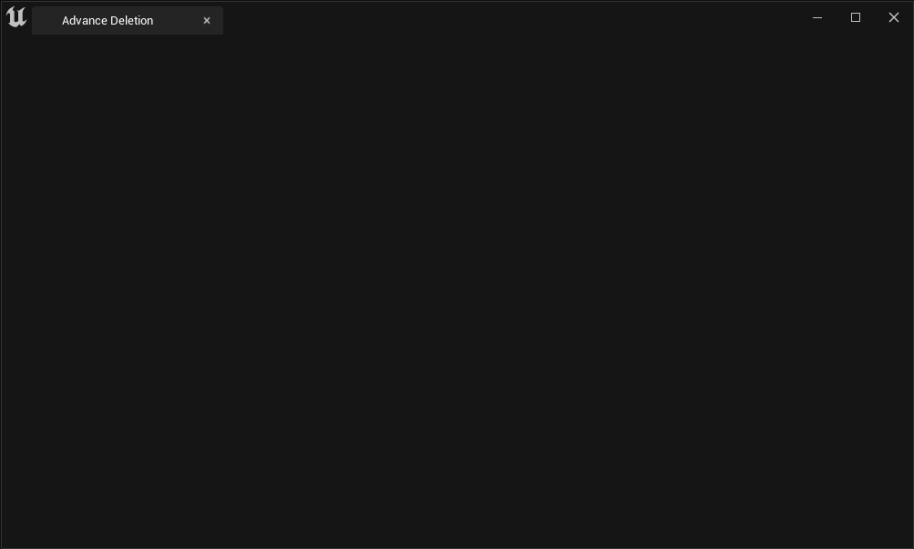

**메뉴 생성**
=========

* 커스텀 에디터를 생성하려면 다음과 같이 `SDockTab`이라는 클래스를 생성해서 등록해야 한다.


```c++
// h
void RegisterAdvanceDeletionTab();
TSharedRef<SDockTab> OnSpawnAdvanceDeletionTab(const FSpawnTabArgs&);


// cpp
void FSuperManagerModule::StartupModule()
{
	InitCBMenuExtention();
	RegisterAdvanceDeletionTab(); // 등록
}

void FSuperManagerModule::RegisterAdvanceDeletionTab()
{
    // 등록하는 함수
	FGlobalTabmanager::Get()->RegisterNomadTabSpawner(FName("AdvanceDeletion"),
		FOnSpawnTab::CreateRaw(this, &OnSpawnAdvanceDeletionTab))
	.SetDisplayName(FText::FromString(TEXT("Advance Deletion"))); // SetDisplayName은 이름 설정
}

```

* FOnSpawnTab를 F12 눌러보면 TabManager.h 파일이 열리고 아래에 있는 델리게이트가 선언되어 있는데 이 델리게이트를 이용해서 생성해야 한다.

```c++
// TabManager.h
DECLARE_DELEGATE_RetVal_OneParam( TSharedRef<SDockTab>, FOnSpawnTab, const FSpawnTabArgs& );
```

* 위 델리게이트를 이용해서 아래 함수 선언

```c++
TSharedRef<SDockTab> FSuperManagerModule::OnSpawnAdvanceDeletionTab(const FSpawnTabArgs&)
{
	return SNew(SDockTab).TabRole(ETabRole::NomadTab);
}
```

<br>

**델리게이트**
==========


* 그리고 나서 커스텀 에디터 탭을 열기 위한 메뉴 엔트리를 하나 추가하고 TryInvokeTab 함수에서 `RegisterNomadTabSpawner` 함수에서 등록한 이름 `FName("AdvanceDeletion")`을 이용하여 해당 에디터를 열 수 있다.

```c++
// 메뉴 엔트리 추가
void FSuperManagerModule::AddCBMenuEntry(FMenuBuilder& MenuBuilder)
{
    ...
    MenuBuilder.AddMenuEntry
	(
	FText::FromString(TEXT("Advance Deletion")),
	FText::FromString(TEXT("List assets by specific condition in a tab for deleting")),
	FSlateIcon(),	
	FExecuteAction::CreateRaw(this,&FSuperManagerModule::OnAdvanceDeletionButtonClicked)
	);
}


void FSuperManagerModule::OnAdvanceDeletionButtonClicked()
{
	//RegisterNomadTabSpawner 함수에서 인자 FName으로 등록한 에디터를 연다
	FGlobalTabmanager::Get()->TryInvokeTab(FName("AdvanceDeletion"));
}
```

<br>

사진
-------

* 생성한 에디터 탭

<center></center>
