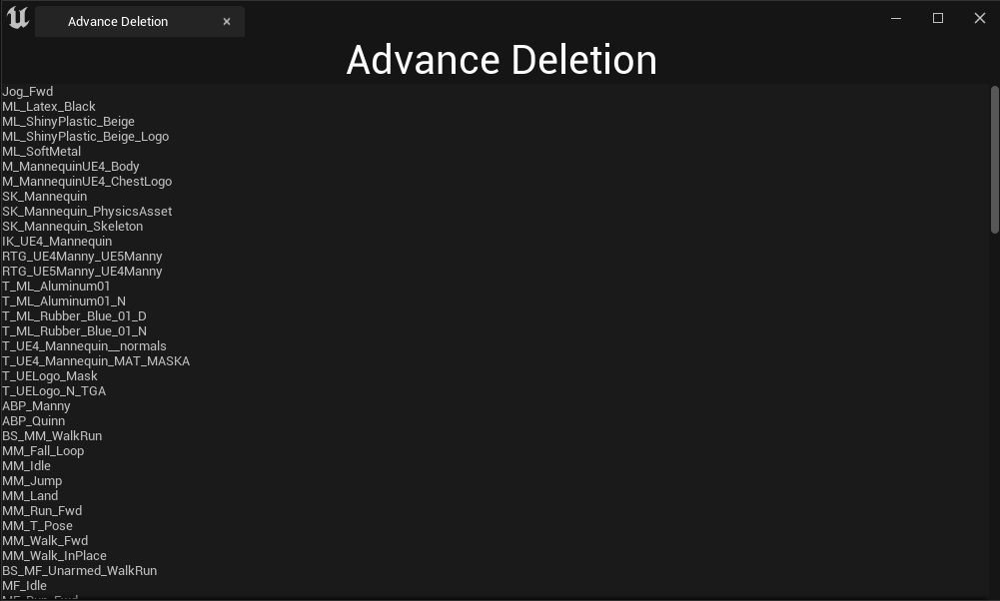

**SListView**
==========

* Slate에서 List를 만들기 위해 사용하는 것이 `SListView`이다.

* SListView는 아이템 데이터 배열을 찾고 이 아이템들에 대해 시각적으로 표현한다.

* SListView는 타입이 `TSharedPtr` 아니면 `UObject*`이여야만 작동한다.

* 그래서 SListView에 사용할 TSharedPtr 배열과 필요한 델리게이트 함수를 생성한다

```c++
class SAdvanceDeletionTab : public SCompoundWidget
{
	SLATE_BEGIN_ARGS(SAdvanceDeletionTab) {}

    // TArray<TSharedPtr <FAssetData> > 타입을 받기 위한 선언
	SLATE_ARGUMENT(TArray<TSharedPtr <FAssetData> > ,AssetsDataToStore)
	
	SLATE_END_ARGS()

    ... 

private:
	TArray<TSharedPtr<FAssetData>> StoredAssetsData;

    // SListView에 필요한 함수
    TSharedRef<ITableRow> OnGenerateRowForList(TSharedPtr<FAssetData> AssetDataToDisplay,
	const TSharedRef<STableViewBase>& OnwerTable);
};
```

<br>

**에셋 데이터 배열 받아오는 함수**
============

* 그러고 나서 모듈 파일에서 에셋 데이터 배열을 받아오는 함수를 작성해서 받아온다. 

```c++
// OnSpawnAdvanceDeletionTab은 버튼에 등록한 델리게이트 함수
TSharedRef<SDockTab> FSuperManagerModule::OnSpawnAdvanceDeletionTab(const FSpawnTabArgs& SpawnTabArgs)
{
	return SNew(SDockTab).TabRole(ETabRole::NomadTab)
	[
        // SAdvanceDeletionTab 클래스에 전달
    	SNew(SAdvanceDeletionTab)
		.AssetsDataToStore(GetAllAssetDataUnderSelectedFolder())
	];
}

// 에셋 데이터를 TSharedPtr에 담아서 배열로 반환하는 함수
TArray<TSharedPtr<FAssetData>> FSuperManagerModule::GetAllAssetDataUnderSelectedFolder()
{
	TArray<TSharedPtr<FAssetData>> AvailableAssetsData;

	TArray<FString> AssetsPathNames = UEditorAssetLibrary::ListAssets(FolderPathSelected[0]);

    for(const FString& AssetPathName : AssetsPathNames)
    {
        // 지우면 안되는 최상위 폴더는 삭제 X
        if(AssetPathName.Contains(TEXT("Developers")) ||
            AssetPathName.Contains(TEXT("Collections")) ||
            AssetPathName.Contains(TEXT("__ExternalActors__")) ||
            AssetPathName.Contains(TEXT("__ExternalObjects__")))
        {
            continue;
        }
        
        if(!UEditorAssetLibrary::DoesAssetExist(AssetPathName)) continue;
        
        const FAssetData Data = UEditorAssetLibrary::FindAssetData(AssetPathName);

        AvailableAssetsData.Add(MakeShared<FAssetData>(Data));
    }

	return StoredAssetsData;
}
```

<br>

**에셋 데이터를 목록(행)으로 등록**
============

* 그다음 받아온 에셋 데이터를 Construct 함수에서 Slot으로 추가한다.

* 기존에 있는 부분은 코드가 길어져서 삭제하고 이 장에 관련된 코드 함수만 추가함

* FKey와 관련된 Input Event에 대해 컴파일 오류가 난다면 build.cs파일에서 `InputCore`를 넣어주면 된다

```c++
void SAdvanceDeletionTab::Construct(const FArguments& InArgs)
{
	bCanSupportFocus = true;
	
    // SLATE_ARGUMENT으로 받아온 에셋 데이터 배열
	StoredAssetsData = InArgs._AssetsDataToStore;
	
    +SVerticalBox::Slot()
    .AutoHeight()
    [
        SNew(SScrollBox) // 스크롤 Widget 사용

        +SScrollBox::Slot()
        [
            SNew(SListView<TSharedPtr<FAssetData>>)
            .ItemHeight(24.f)						// 세로 길이
            .ListItemsSource(&StoredAssetsData)		// 에셋 데이터(에셋) 배열
            .OnGenerateRow(this,&SAdvanceDeletionTab::OnGenerateRowForList) // 델리게이트 함수
        ]
    ]
}

// 행으로 추가하면서 각 행에 대해 텍스트 같은 디테일적인 부분을 변경하는 함수
TSharedRef<ITableRow> SAdvanceDeletionTab::OnGenerateRowForList(TSharedPtr<FAssetData> AssetDataToDisplay,
	const TSharedRef<STableViewBase>& OwnerTable)
{
	const FString DisplayAssetName = AssetDataToDisplay->AssetName.ToString();

	TSharedRef<STableRow<TSharedPtr<FAssetData>>> ListViewRowWidget =
	SNew(STableRow<TSharedPtr<FAssetData>>, OwnerTable)
	[
		SNew(STextBlock)
		.Text(FText::FromString(DisplayAssetName))
	];
	
	return ListViewRowWidget;
}
```

사진
-------

* Blueprint Folder 안에 있는 에셋 목록

<center></center>

<br>

* Blueprint Folder를 우클릭하고 에디터를 열면 다음과 같이 뜬다.

<center></center>