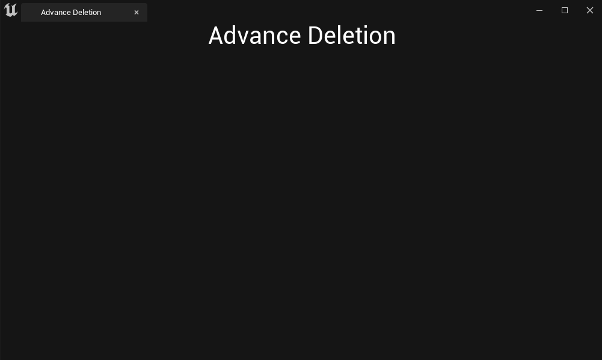

**Title Text**
=========

* Slate Widget을 처음 만들면 기본적으로 슬롯이 하나밖에 없어 하나의 텍스트밖에 넣지 못한다.

  * 블루프린터 에디터에서 계층구조에서 루트에 있는 노드에게 텍스트 블럭을 두 개 이상 넣지 못하는 것과 동일

* 그래서 다음과 같이 다른 위젯을 추가해서 더 부를 수 있다.


```c++
void SAdvanceDeletionTab::Construct(const FArguments& InArgs)
{
	bCanSupportFocus = true;

    // FontStyle
	FSlateFontInfo TitleTextFont = FCoreStyle::Get().GetFontStyle(FName("EmbossedText"));
	TitleTextFont.Size = 30; // 크기
	
	
	// 기존에는 한 슬롯밖에 없어 하나의 텍스트블럭만 넣을 수 있기 때문에
    // 다른 위젯인 VerticalBox를 통해 여러 개의 슬롯으로 여러 개의 Text Block을 넣을 수 있다.
	ChildSlot
	[
		// 메인 Vertical Box
		SNew(SVerticalBox)

		// 제목 텍스트를 위한 첫 번째 Vertical Box 추가
		+SVerticalBox::Slot()
		.AutoHeight()
		[
            // SNew의 함수들은 참조로 반환하기 때문에 도트 연산자로 함수를 계속 호출이 가능
			SNew(STextBlock)
			.Text(FText::FromString(TEXT("Advance Deletion")))
			.Font(TitleTextFont)
			.Justification(ETextJustify::Center)
			.ColorAndOpacity(FColor::White)
		]
	];
}
```

* Text 함수는 Text값을 의미

* Font는 위에서 선언한 FontStyle을 의미

* Jusstification은 위치를 의미 (Left,Center,Right)

* ColorAndOpacity는 색깔을 의미

<br>

사진
-------

* Advance Deletion 이 중앙에 생긴 모습

<center></center>
