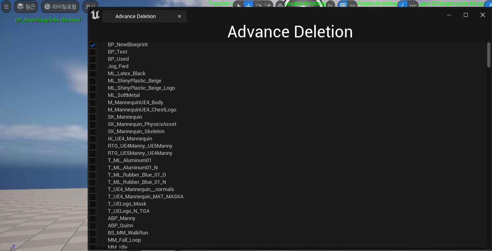
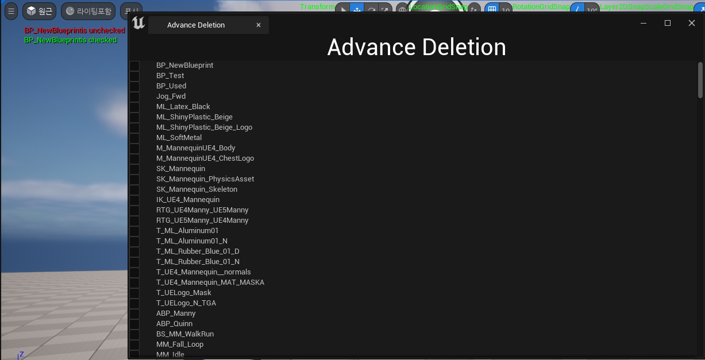

**SCheckBox**
============

* Slate 위젯에 CheckBox를 사용할 수 있는데 `OnCheckStateChanged()` 이벤트를 사용한다.

  * 이벤트는 델리게이트와 같은 기능을 하지만, 델리게이트와 달리 이벤트는 전역으로 선언할 수 없어 외부말고 클래스 내부에 선언해야 하는 키워드.

```c++
// SCheckBox.h
/** Called when the checked state has changed */
SLATE_EVENT( FOnCheckStateChanged, OnCheckStateChanged )
```

* 아래는 체크박스 관련 함수들

```c++
TSharedRef<SCheckBox> SAdvanceDeletionTab::ConstructCheckBox(const TSharedPtr<FAssetData>& AssetDataToDisplay)
{
	TSharedRef<SCheckBox> ConstructedCheckBox =
	SNew(SCheckBox)                     // 체크박스 생성
	.Type(ESlateCheckBoxType::CheckBox) // 체크박스 타입
	.OnCheckStateChanged(this,&SAdvanceDeletionTab::OnCheckBoxStateChanged,AssetDataToDisplay) 		// 체크할 때 델리게이트
	.Visibility(EVisibility::Visible);  // 가시성

	return ConstructedCheckBox;
}

// 체크박스 상태가 변할 때 호출되는 함수
void SAdvanceDeletionTab::OnCheckBoxStateChanged(ECheckBoxState NewState, TSharedPtr<FAssetData> AssetData)
{
	switch (NewState)
	{
		case ECheckBoxState::Unchecked: // 체크 해제
			DebugHeader::Print(AssetData->AssetName.ToString() + TEXT("is unchecked"), FColor::Red);
			break;
		case ECheckBoxState::Checked:   // 체크
			DebugHeader::Print(AssetData->AssetName.ToString() + TEXT("is checked"), FColor::Green);
			break;
	}
}
```
* ECheckBoxState로 체크 박스에 대한 상태를 확인 후, switch에서 값에 맞게 처리

<br>

**사진**
========


* 체크

<center></center>

<br>

* 체크 후 해제

<center></center>