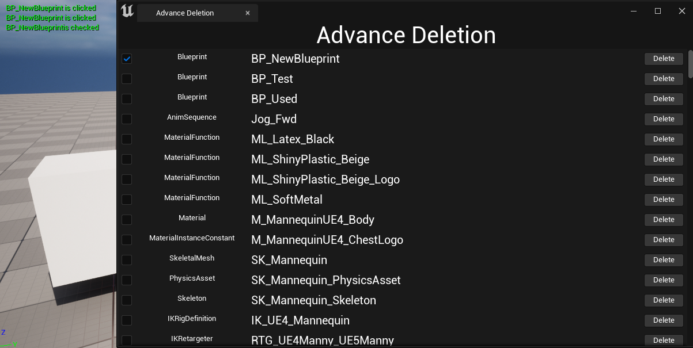

* Slate에서 Button을 만드려면 `SButton`으로 만들어야 한다.

* SButton에서는 `OnClicked`라는 델리게이트를 사용해서 버튼을 클릭했을 때 호출되는 함수를 지정할 수 있다.

```c++
// SButton.h

/** Called when the button is clicked */
SLATE_EVENT( FOnClicked, OnClicked )
```

* 버튼 관련 함수

```c++
TSharedRef<SButton> SAdvanceDeletionTab::ConstructButtonForRowWidget(const TSharedPtr<FAssetData>& AssetDataToDisplay)
{
	TSharedRef<SButton> ConstructedButton = SNew(SButton)
	.Text(FText::FromString(TEXT("Delete")))
	.OnClicked(this,&SAdvanceDeletionTab::OnDeleteButtonClicked, AssetDataToDisplay);

	return ConstructedButton;
}

FReply SAdvanceDeletionTab::OnDeleteButtonClicked(TSharedPtr<FAssetData> ClickedAssetData)
{
	DebugHeader::Print(ClickedAssetData->AssetName.ToString() + TEXT(" is clicked"),  FColor::Green);
	return FReply::Handled();	
}
```

* `Delete 버튼`이 생기고 눌렀을 때 `AssetName + is clicked` 문구가 뜸

* 체크박스 - 에셋 클래스 이름 - 에셋 이름 - 버튼

<center></center>