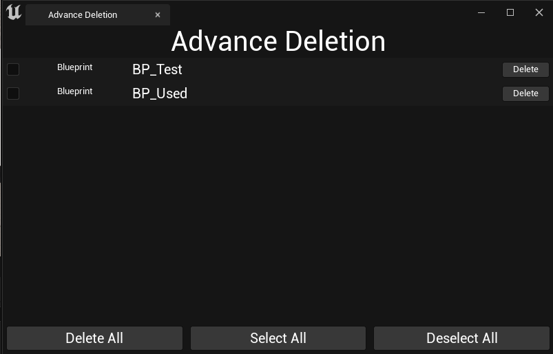
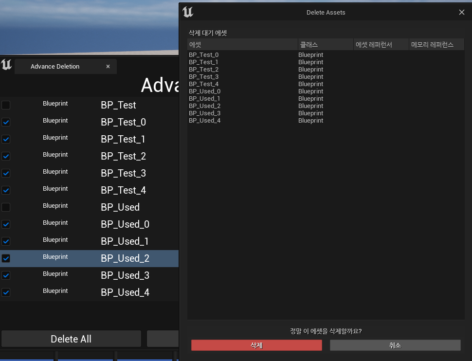

**Create button**
============

* `Construct` 함수에서 만들어서 ChildSlot에 추가한다.

```c++
void SAdvanceDeletionTab::Construct(const FArguments& InArgs)
{
    // ...

	ChildSlot
	[
		+SVerticalBox::Slot()
		.AutoHeight()
		[
			SNew(SHorizontalBox)

            // DeleteAllbutton 추가
			+SHorizontalBox::Slot()
			.FillWidth(10.f)
			.Padding(5.f)
			[
				ConstructDeleteAllButton()
			]

            // SelectAllButton 추가
			+SHorizontalBox::Slot()
			.FillWidth(10.f)
			.Padding(5.f)
			[
				ConstructSelectAllButton()
			]

            // DeselectAllButton 추가
			+SHorizontalBox::Slot()
			.FillWidth(10.f)
			.Padding(5.f)
			[
				ConstructDeselectAllButton()
			]
		]
	];
}

// 나머지 버튼도 다음과 같이 작성, OnClicked에 바인딩된 함수와 TEXT만 다르다.
TSharedRef<SButton> SAdvanceDeletionTab::ConstructDeleteAllButton()
{
	TSharedRef<SButton> DeleteButton = SNew(SButton)
	.ContentPadding(FMargin(5.f))
	.OnClicked(this,&SAdvanceDeletionTab::OnDeleteAllButtonClicked);

    // SetContent는 TSharedRef<SWidget>을 받아 자식 슬롯으로 넣는 함수
	DeleteButton->SetContent(ConstructTextForTabButtons(TEXT("Delete All")));

	return DeleteButton;
}

TSharedRef<STextBlock> SAdvanceDeletionTab::ConstructTextForTabButtons(const FString& TextContent)
{
	FSlateFontInfo ButtonTextFont = GetEmbossedTextFont();
	ButtonTextFont.Size = 15;
	
	TSharedRef<STextBlock> ConstructedTextBlock = SNew(STextBlock)
	.Text(FText::FromString(TextContent))
	.Font(ButtonTextFont)
	.Justification(ETextJustify::Center);

	return ConstructedTextBlock;
}
```

* 하단에 3개의 버튼 생성

<center></center>


<br>

**DeleteAllButtonClicked**
==============

* 에셋들을 따로 선택하기 위해 체크박스 함수에서 선택된 에셋들을 배열에 따로 저장한다.

```c++
void SAdvanceDeletionTab::OnCheckBoxStateChanged(ECheckBoxState NewState, TSharedPtr<FAssetData> AssetData)
{
	switch (NewState)
	{
	case ECheckBoxState::Unchecked:
		if(AssetsDataToDeleteArray.Contains(AssetData))
		{
			AssetsDataToDeleteArray.Remove(AssetData);
		}
		break;
	case ECheckBoxState::Checked:
		AssetsDataToDeleteArray.AddUnique(AssetData);
		break;
	}
}
```

<br>

------


* Delete All 버튼에 바인딩된 함수

* CheckBox 함수에서 선택된 에셋들을 `AssetsDataToDeleteArray` 변수에 저장했는데 이 변수를 모듈에게 보내서 삭제 함수를 호출한다.

```c++
FReply SAdvanceDeletionTab::OnDeleteAllButtonClicked()
{
    // 따로 지역변수로 저장
	TArray<FAssetData> AssetDataToDelete;

	for(const TSharedPtr<FAssetData>& Data : AssetsDataToDeleteArray)
	{
		AssetDataToDelete.Add(*Data.Get());
	}

	FSuperManagerModule& SuperManagerModule = 
    FModuleManager::LoadModuleChecked<FSuperManagerModule>(TEXT("SuperManager"));

    // 모듈에게 데이터를 전송하고 모듈에서 삭제 함수 호출
	const bool bAssetsDeleted = SuperManagerModule.DeleteMultipleAssetsForAssetList(AssetDataToDelete);

	if(bAssetsDeleted)
	{
		for(const TSharedPtr<FAssetData>& DeletedData : AssetsDataToDeleteArray)
		{
            // 이전에 저장했던 에셋 배열에서 삭제한 에셋을 삭제
			if(StoredAssetsData.Contains(DeletedData))
			{
				StoredAssetsData.Remove(DeletedData);
			}
		}

		RefreshAssetListView();
	}
	
	return FReply::Handled();
}
```

* 모듈 삭제함수

```c++
bool FSuperManagerModule::DeleteMultipleAssetsForAssetList(const TArray<FAssetData>& AssetsToDelete)
{
	if(ObjectTools::DeleteAssets(AssetsToDelete) > 0)
	{
		return true;
	}
	return false;
}
```

<br>

* 선택된 에셋들에 대해서 `ObjectTools::DeleteAssets`가 호출됨

<center></center>

<br>

**Select All Button And Deselect Button**
==============

* 모든 체크박스에 대해 check 상태로 만들어야 하기 때문에 CheckBox들을 저장한 배열을 만들어서 저장한다.

```c++
// TArray<TSharedRef<SCheckBox>> CheckBoxesArray;

TSharedRef<SCheckBox> SAdvanceDeletionTab::ConstructCheckBox(const TSharedPtr<FAssetData>& AssetDataToDisplay)
{
    TSharedRef<SCheckBox> ConstructedCheckBox = // ... (SCheckBox 생성)

    // 생성한 체크박스들을 저장
	CheckBoxesArray.Add(ConstructedCheckBox);

	return ConstructedCheckBox;
}
```

* 그런 다음, CheckBox 배열을 반복문으로 순회해서 Check이나 Uncheck로 만든다.

  * DeselectButtonClicked 함수는 아래 함수에서 `!CheckBox->IsChecked()` 에서 `CheckBox->IsChecked()`로 변경하면 된다.

```c++
FReply SAdvanceDeletionTab::OnSelectAllButtonClicked()
{
	if(CheckBoxesArray.Num() == 0) return FReply::Handled();

	for(const TSharedRef<SCheckBox>& CheckBox : CheckBoxesArray)
	{
		if(!CheckBox->IsChecked())
		{
			// 체크박스의 상태를 반대로 만드는 함수
			CheckBox->ToggleCheckedState();				
		}
	}
	
	return FReply::Handled();
}
```

<br>

**Refresh**
==========

* `DeleteAll` 에서 체크된 에셋데이터 배열인 `AssetsDataToDeleteArray` 이나 <br>
  `Select && Deselect` 에서 모든 체크박스의 배열인 `CheckBoxesArray` 변수들도 Refresh할 때 같이 Empty()를 호출해서 초기화해야 한다.

```c++
void SAdvanceDeletionTab::RefreshAssetListView()
{
	CheckBoxesArray.Empty();
	AssetsDataToDeleteArray.Empty();
	
	if(ConstructedAssetListView.IsValid())
	{
		ConstructedAssetListView->RebuildList();
	}
}
```