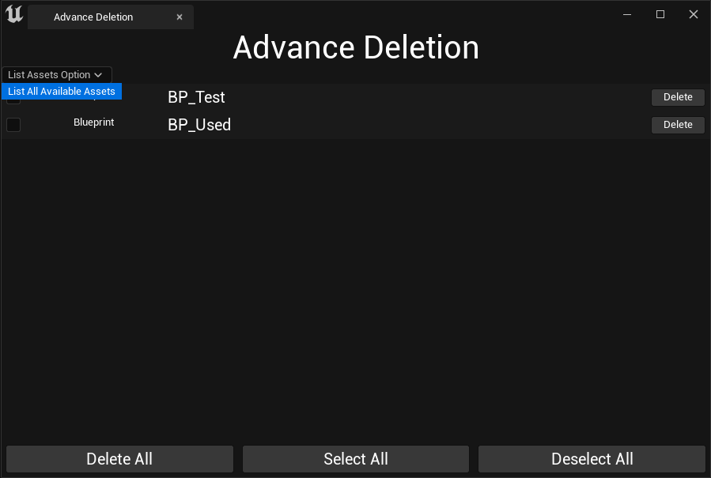

**SComboBox**
=====

* SComboBox는 SListView와 마찬가지로 타입이 `TSharedPtr` 아니면 `UObject*`이여야만 작동한다.

* 함수들은 아래 코드 주석에 작성.

### 헤더파일

```c++
// ComboBox 생성 함수
TSharedRef<SComboBox<TSharedPtr<FString>>> ConstructComboBox();

// ComboBox에서 Combo로 사용될 리소스
TArray<TSharedPtr<FString>> ComboBoxSourceItems;

// SourceItem을 Combo로 추가하는 함수
TSharedRef<SWidget> OnGenerateComboContent(TSharedPtr<FString> SourceItem);

// 다른 Combo를 선택할 때 호출되는 함수
void OnComboSelectionChanged(TSharedPtr<FString> SelectedOption, ESelectInfo::Type InSelectInfo);

// 현재 선택되고 있는 Combo를 보여줄 TextBlock
TSharedPtr<STextBlock> ComboDisplayTextBlock;
```


### 소스파일

```c++
void SAdvanceDeletionTab::Construct(const FArguments& InArgs)
{
	ComboBoxSourceItems.Add(MakeShared<FString>(TEXT("List All Available Assets")));

    // ...

    ChildSlot
	[
        // ComboBox 추가
		+SVerticalBox::Slot()
		.AutoHeight()
		[
			SNew(SHorizontalBox)

			+SHorizontalBox::Slot()
			.AutoWidth()
			[
				ConstructComboBox()
			]
		]
    ]
}

TSharedRef<SComboBox<TSharedPtr<FString>>> SAdvanceDeletionTab::ConstructComboBox()
{
	TSharedRef<SComboBox<TSharedPtr<FString>>> ConstructedComboBox
	=SNew(SComboBox<TSharedPtr<FString>>)   // ComboBox 생성
	.OptionsSource(&ComboBoxSourceItems)    // ComboBox에 사용될 리소스를 받는 함수
	.OnGenerateWidget(this, &SAdvanceDeletionTab::OnGenerateComboContent) // Combo 추가
	.OnSelectionChanged(this,&SAdvanceDeletionTab::OnComboSelectionChanged) // 다른 Combo 선택할 때 함수호출
	[
		SAssignNew(ComboDisplayTextBlock,STextBlock) // 현재 Combo를 보여주기 위한 코드
		.Text(FText::FromString(TEXT("List Assets Option")))
	];

	return ConstructedComboBox;
}


TSharedRef<SWidget> SAdvanceDeletionTab::OnGenerateComboContent(TSharedPtr<FString> SourceItem)
{
	TSharedRef<STextBlock> ConstructedComboText = SNew(STextBlock).
	Text(FText::FromString(*SourceItem.Get()));

	return ConstructedComboText;
}


void SAdvanceDeletionTab::OnComboSelectionChanged(TSharedPtr<FString> SelectedOption, ESelectInfo::Type InSelectInfo)
{
	ComboDisplayTextBlock->SetText(FText::FromString(*SelectedOption.Get()));
}
```

<br>


**사진**
==========

* 좌측 상단에 Combox 생성

<center></center>