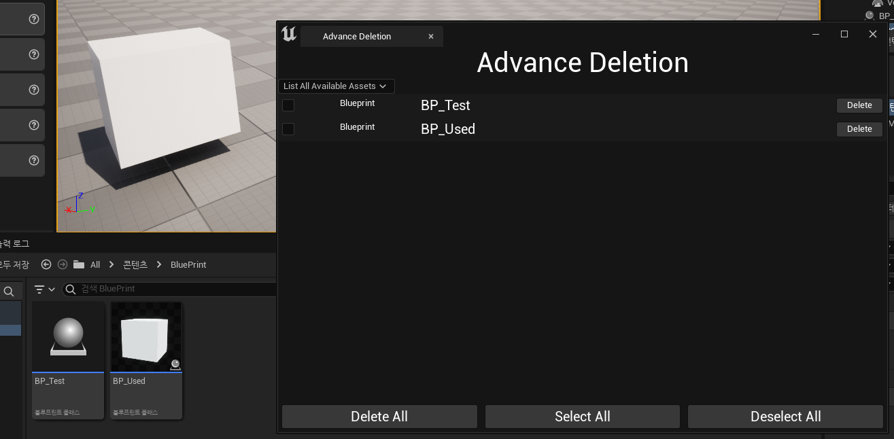
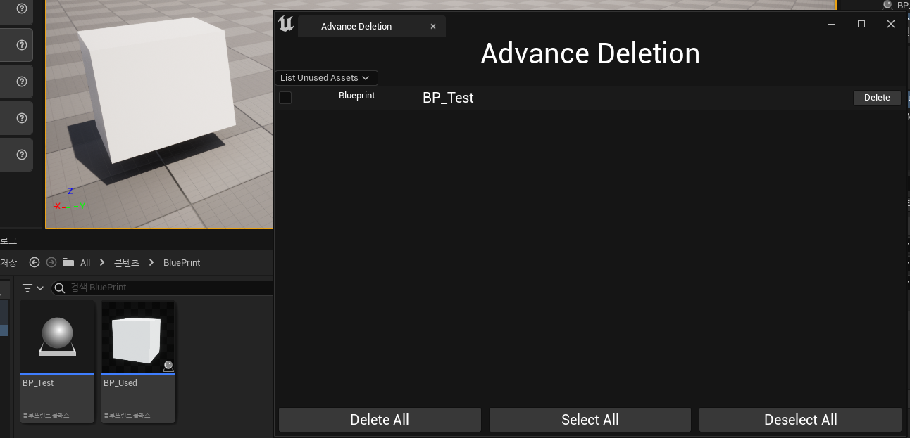

**Listing Unused Assets**
==========

* 이전 장에 만들었던 `SComboBox`로 선택하는 Combo에 맞게 필터링을 하는 작업을 하려고 한다.

* 먼저, 사용하지 않는 에셋들을 필터로 추려내기 위해 저장할 배열을 선언한다.

```c++
// Slate 클래스 헤더파일에 선언
TArray<TSharedPtr<FAssetData>> DisplayedAssetsData;
```

* `SListView`는 이 배열을 사용해야 하므로 `ListItemsSource`에 `DisplayedAssetsData`를 전달한다

```c++
ConstructedAssetListView = SNew(SListView<TSharedPtr<FAssetData>>)
.ItemHeight(24.f)	
.ListItemsSource(&DisplayedAssetsData)
.OnGenerateRow(this,&SAdvanceDeletionTab::OnGenerateRowForList);
```

* `Construct` 함수에서는 `DisplayedAssetsData`에 `StoredAssetsData`를 그대로 저장하고 ComboBox에 추가할 Combo도 넣어준다.


```c++
#define ListALL TEXT("List All Available Assets")
#define ListUnused TEXT("List Unused Assets")

void SAdvanceDeletionTab::Construct(const FArguments& InArgs)
{
	// ...

    StoredAssetsData = InArgs._AssetsDataToStore;
    DisplayedAssetsData = StoredAssetsData;

	ComboBoxSourceItems.Add(MakeShared<FString>(ListALL));
	ComboBoxSourceItems.Add(MakeShared<FString>(ListUnused));

	// ...
}
```

<br>


* 그리고 Combo를 선택할 때 호출되는 함수인 `OnComboSelectedChanged` 함수에서 선택되는 Combo(FString)에 따라 작업한다

```c++
void SAdvanceDeletionTab::OnComboSelectionChanged(TSharedPtr<FString> SelectedOption, ESelectInfo::Type InSelectInfo)
{
	DebugHeader::Print(*SelectedOption.Get(),FColor::Cyan);

	ComboDisplayTextBlock->SetText(FText::FromString(*SelectedOption.Get()));

	FSuperManagerModule& SuperManagerModule = FModuleManager::LoadModuleChecked<FSuperManagerModule>(TEXT("SuperManager"));

	// Pass data for our module to filter based on the selected option
	if(*SelectedOption.Get() == ListALL)
	{
		// List all stored asset data
		DisplayedAssetsData = StoredAssetsData;
		RefreshAssetListView();
		
	}
	else if(*SelectedOption.Get() == ListUnused)
	{
		// List all unused assets
		SuperManagerModule.ListUnusedAssetsForAssetList(StoredAssetsData,DisplayedAssetsData);
		RefreshAssetListView();
	}
}
```

<br>

* AssetList를 필터링하는 함수는 모듈에서 작성할 것이므로 모듈에서 함수를 만든다.

```c++
void FSuperManagerModule::ListUnusedAssetsForAssetList(const TArray<TSharedPtr<FAssetData>>& AssetsDataToFilter,
	TArray<TSharedPtr<FAssetData>>& OutUnusedAssetsData)
{
    // 초기화
	OutUnusedAssetsData.Empty();

	// 선택된 폴더의 에셋들을 저장하는 배열인 StoredAssetData에서 
    // 사용하지 않는 에셋을 저장하는 배열인 DisplayedAssetData에게 넘겨준다.
	for(const TSharedPtr<FAssetData>& DataSharedPtr : AssetsDataToFilter)
	{
		TArray<FString> AssetReferencers = 
		UEditorAssetLibrary::FindPackageReferencersForAsset(DataSharedPtr->ObjectPath.ToString());

		if(AssetReferencers.Num() == 0)
		{
			OutUnusedAssetsData.Add(DataSharedPtr);
		}
	}
}
```

<br>

* 그리고 UnusedAsset Combo를 선택하게 되면 그에 맞는 List를 보여주는데 여기서도 Delete 작업을 할 수 있게 해야하므로 Delete버튼을 클릭하면 호출되는 함수에 가서 그에 맞게 작업해야 한다.


```c++
FReply SAdvanceDeletionTab::OnDeleteAllButtonClicked()
{
    // ...

    for(const TSharedPtr<FAssetData>& DeletedData : AssetsDataToDeleteArray)
    {
        // Updating the stored assets data
        if(StoredAssetsData.Contains(DeletedData))
        {
            StoredAssetsData.Remove(DeletedData);
        }

        if(DisplayedAssetsData.Contains(DeletedData))
        {
            DisplayedAssetsData.Remove(DeletedData);
        }
    }

    // ...
}
```

<Br>

* Delete 작업을 진행했다면, Redirector도 고쳐야 하는데 `OnDeleteAllButtonClicked` 에서 호출해도 되지만, 메뉴 엔트리에서 버튼을 클릭할 때 호출되도록 이 함수에서 호출한다.

```c++
void FSuperManagerModule::OnAdvanceDeletionButtonClicked()
{
	FixupRedirectors();
	
	FGlobalTabmanager::Get()->TryInvokeTab(FName("AdvanceDeletion"));
}
```

<br>

**사진**
=========

* List All Available Assets를 선택했을 때

<center></center>


<br>

* List Unused Assets를 선택했을 때

* BP_Used는 사용되고 있어 리스트에 뜨지 않지만, BP_Test는 사용되고 있지 않아 List에 뜬다.

<center></center>