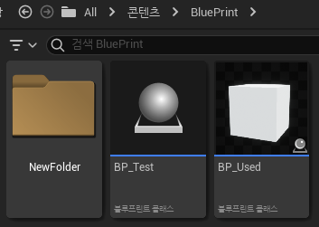
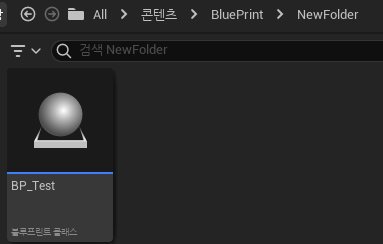
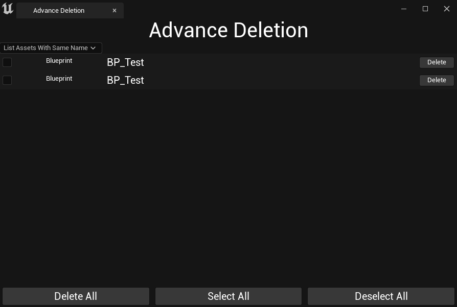

**Listing Assets With Same Name**
=============

* 커스텀 에디터를 열면 경로가 다르면서 같은 이름을 가진 에셋이 있을 수 있다.

* 이러한 에셋들을 처리하기 위해 ComboBox에 추가한다.

```c++
#define ListSameName TEXT("List Assets With Same Name")

void SAdvanceDeletionTab::Construct(const FArguments& InArgs)
{
    ...
   	ComboBoxSourceItems.Add(MakeShared<FString>(ListSameName));
    ...
}
```

* 그리고 Combo를 선택할 때 호출되는 함수에서 ListSameName 콤보를 선택하면 같은 이름의 에셋들을 목록으로 가져와야 하므로 따로 List에 담는 함수를 호출한다.

* List에 담을 때 `TMultiMap`을 사용한다.

* `TMultiMap`은 `MultiMap`과 다르게 다수의 동일한 키 저장을 지원한다.

  * MultiMap에 이미 존재하는 키를 추가하면 기존의 것이 새로운 것으로 대체되지만,<br>
    TMultiMap은 이미 존재하는 키가 있다고 하더라도 같은 키로 새롭게 추가한다.

  * 아래에서 사용된 `MultiFind 함수`는 매개변수의 Key값에 맞는 모든 Value를 TArray에 저장하는 함수

```c++
void SAdvanceDeletionTab::OnComboSelectionChanged(TSharedPtr<FString> SelectedOption, ESelectInfo::Type InSelectInfo)
{
    FSuperManagerModule& SuperManagerModule = 
        FModuleManager::LoadModuleChecked<FSuperManagerModule>(TEXT("SuperManager"));

    if(*SelectedOption.Get() == ListALL) { ... }
    else if(*SelectedOption.Get() == ListUnused) { ... }
	else if(*SelectedOption.Get() == ListSameName)
	{
		// List out all assets with same name
		SuperManagerModule.ListSameNameAssetsForAssetList(StoredAssetsData,DisplayedAssetsData);
		RefreshAssetListView();
	}
}

void FSuperManagerModule::ListSameNameAssetsForAssetList(const TArray<TSharedPtr<FAssetData>>& AssetsDataToFilter,
	TArray<TSharedPtr<FAssetData>>& OutSameNameAssetsData)
{
	OutSameNameAssetsData.Empty();

	//Multimap for supporing finding assets with same name
	TMultiMap<FString,TSharedPtr<FAssetData>> AssetsInfoMultiMap;

	for(const TSharedPtr<FAssetData>& DataSharedPtr : AssetsDataToFilter)
	{
        // 선택한 폴더에 있는 모든 에셋을 AssetsInfoMultiMap에 저장
		AssetsInfoMultiMap.Emplace(DataSharedPtr->AssetName.ToString(),DataSharedPtr);
	}

	for(const TSharedPtr<FAssetData>& DataSharedPtr : AssetsDataToFilter)
	{
        // 지역 변수를 생성해서 AssetsInfoMultiMap에 저장했던 에셋들 중
        // 같은 이름의 에셋들을 MultiFind로 찾아내고 TArray에 저장한다.
		TArray<TSharedPtr<FAssetData>> OutAssetsData;
		AssetsInfoMultiMap.MultiFind(DataSharedPtr->AssetName.ToString(),OutAssetsData);

		if(OutAssetsData.Num() <= 1) continue; // 다수의 Key,Value가 아니라면 continue

		for(const TSharedPtr<FAssetData>& SameNameData : OutAssetsData)
		{
			if(SameNameData.IsValid())
			{
                // OutAssetsData에는 하나의 Key에 여러 Value가 존재할텐데
                // 여러번 호출되는 Key값에 대해 하나만 들어가도록 AddUnique함수 호출
				OutSameNameAssetsData.AddUnique(SameNameData);
			}
		}
	}
}
```

<br>

**사진**
=========

* 기존 폴더 (`/Content/Blueprint`)

<center></center>

<br>

* 새 폴더 (`/Content/Blueprint/NewFolder`) 에 같은 이름(`BP_Test`) 블루프린트를 추가

<center></center>

<br>

* Listing Asset With Same Name Combo 열기

<center></center>


<br>

**삭제**
==========

* 위 작업들은 커스텀 에디터에 중복된 이름 에셋들을 모아놓는 작업이고 이제는 Delete 버튼을 누르면 삭제되도록 만들어야 한다.

```c++
FReply SAdvanceDeletionTab::OnDeleteButtonClicked(TSharedPtr<FAssetData> ClickedAssetData)
{
    // ...

	if(BAssetDeleted)
	{
        // ...

        if(DisplayedAssetsData.Contains(ClickedAssetData))
        {
            DisplayedAssetsData.Remove(ClickedAssetData);
        }
    }
```