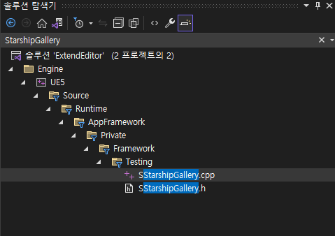
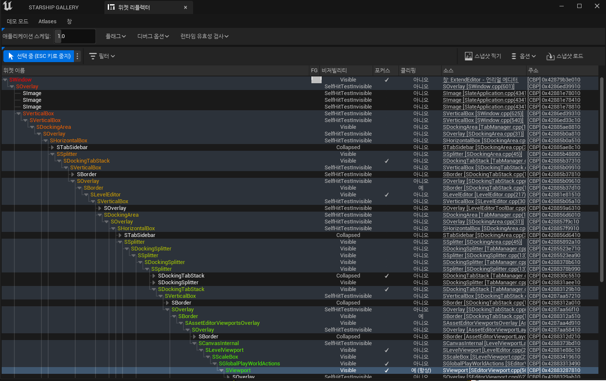

* 에디터로 만들 수 있는 종류를 확인하고 싶으면 `툴 -> 디버그 -> 디버그툴`로 들어간 다음 디버그 툴에서 `테스트 스위트` 버튼을 클릭하면 다음과 같이 `StarshipGallery`라는 위젯이 뜬다.

### Debug Tool

<center></center>


### StarShip Gallery

<center></center>


<br>

* Starship Gallery에 있는 기능들을 커스텀 에디터에서 구현할 수 있는데 Starship Gallery에 있는 기능을 C++ 코드로 보려면 다음과 같이 `SStarShipGallery.cpp` 코드를 찾아가면 된다.


<center></center>


<br>

**Widget Reflector**
==========

* 이번에도 `툴 -> 디버그`에 가서 `위젯 리플렉터`를 클릭하면 다음과 같이 화면이 뜬다.


<center></center>


* 여기서 왼쪽 중간에 있는 `히트 테스트 가능 위젯 선택`을 클릭하면 언리얼 에디터에 마우스를 올린 위젯을 경로를 찾아준다.


* Viewport에 마우스를 올리면 다음과 같이 Viewport에 사용된 `SViewport`의 경로를 찾아감

<center></center>


<br>

**UnRegister**
===========

* 처음 커스텀 에디터를 열 때 StartupModule에서 해당 커스텀 에디터를 등록했던 것처럼 마지막엔 해당 커스텀 에디터를 등록해제 해야한다.

```c++
void FSuperManagerModule::ShutdownModule()
{
	FGlobalTabmanager::Get()->UnregisterNomadTabSpawner(FName("AdvanceDeletion"));
}
```