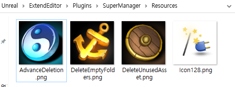

**아이콘 생성 및 등록**
==========

* 먼저 아이콘을 사용하려면 FSlateStyleSet 타입을 사용해야 한다 
* 그래서 이 타입을 사용할 클래스를 처음에 내가 만든 플러그인에 클래스를 추가하고 다음과 같이 작성한다.

```c++
#pragma once

#include "Styling/SlateStyle.h"

class FSuperManagerStyle
{
public:
	static void InitializeIcons();
	static void ShutDown();

private:
	static FName StyleSetName;

	static TSharedRef<FSlateStyleSet> CreateSlateStyleSet();    // 생성
	static TSharedPtr<FSlateStyleSet> CreatedSlateStyleSet;     // 저장

public:
	static FName GetStyleSetName() {return StyleSetName;}
};
```


* 그 다음 플러그인의 Resources에 사용할 아이콘을 넣어준다.

<center></center>

<br>

* 그리고 나서 cpp 파일은 다음과 같다.

```c++
#include "CustomStyle/SuperManagerStyle.h"
#include "Interfaces/IPluginManager.h"
#include "Styling/SlateStyleRegistry.h"

FName FSuperManagerStyle::StyleSetName = FName("SuperManagerStyle");
TSharedPtr<FSlateStyleSet> FSuperManagerStyle::CreatedSlateStyleSet = nullptr;

void FSuperManagerStyle::InitializeIcons()
{
	if(!CreatedSlateStyleSet.IsValid())
	{
		CreatedSlateStyleSet = CreateSlateStyleSet();
		FSlateStyleRegistry::RegisterSlateStyle(*CreatedSlateStyleSet);
	}
}

TSharedRef<FSlateStyleSet> FSuperManagerStyle::CreateSlateStyleSet()
{
	TSharedRef<FSlateStyleSet> CustomStyleSet = MakeShareable(new FSlateStyleSet(StyleSetName)); // Slate Style 생성

	// 플러그인 경로를 찾고 그다음 Icon이 있는 경로 찾기
	const FString IconDirectory = IPluginManager::Get().FindPlugin(TEXT("SuperManager"))->GetBaseDir() / "Resources";

	CustomStyleSet->SetContentRoot(IconDirectory); // 루트 설정

	const FVector2D Icon16x16 (16.f,16.f);
	CustomStyleSet->Set("ContentBrowser.DeleteUnusedAsset", // 아이콘과 맵핑할 이름 설정
	new FSlateImageBrush(IconDirectory/"DeleteUnusedAsset.png",Icon16x16)); // 이미지 설정(경로,크기)
	
	return CustomStyleSet;
}

void FSuperManagerStyle::ShutDown()
{
	
}
```

* 먼저 위 코드를 작성하기 전에 `build.cs파일에서 "Projects" 모듈이 있어야 IPluginManager가 작동`한다.

* 일단 `CreateSlateStyleSet 함수`는 `FSlateStyleSet 타입을 생성하는 함수`이므로 변수를 생성한다.

* 플러그인의 Resources 폴더에 있을 경로를 찾기 위해 `플러그인 경로를 FindPlugin 함수로 찾고 SetContentRoot 함수로 루트를 설정한다`

* `Set 함수`로는 `아이콘의 이름과 아이콘 경로,크기를 설정`한다

* 마지막으로 함수의 반환값을 static 멤버 변수로 저장하고 `RegisterSlateStyle 함수로 등록`한다

<br>

**아이콘 사용**
========

* 그 다음 위에서 만든 FSuperManagerStyle 클래스를 Menu Entry에 사용하기 위해 다음과 같이 추가한다.

```c++
// SuperManager.cpp
#include "CustomStyle/SuperManagerStyle.h"

void FSuperManagerModule::StartupModule()
{
	FSuperManagerStyle::InitializeIcons();
    InitCBMenuExtention();
    
    RegisterAdvanceDeletionTab();
}
```

* 그리고 InitCBMenuExtention() 함수안에 있는 Menu Entry를 추가하는 함수로 가서 아이콘을 설정하는 매개변수를 바꿔주면 된다.

```c++
void FSuperManagerModule::AddCBMenuEntry(FMenuBuilder& MenuBuilder)
{
	MenuBuilder.AddMenuEntry
	(
		FText::FromString(TEXT("Delete UnUsed Assets")),		// 타이틀
		FText::FromString(TEXT("Safely delete all unused assets under folder")),	// 툴팁
		FSlateIcon(),	// 아이콘
		FExecuteAction::CreateRaw(this,&FSuperManagerModule::OnDeleteUnusedAssetbuttonClicked) // 호출할 함수
	);

    ...
}
```

* 아이콘 생성

<center></center>


* 그리고 StartupModule에 있는 커스텀 에디터를 여는 함수 `RegisterAdvanceDeletionTab`에서 SetIcon을 추가하면 마찬가지로 아이콘이 뜬다.

```c++
void FSuperManagerModule::RegisterAdvanceDeletionTab()
{
	FGlobalTabmanager::Get()->RegisterNomadTabSpawner(FName("AdvanceDeletion"),
		FOnSpawnTab::CreateRaw(this, &FSuperManagerModule::OnSpawnAdvanceDeletionTab))
	.SetDisplayName(FText::FromString(TEXT("Advance Deletion")))
	.SetIcon(FSlateIcon(FSuperManagerStyle::GetStyleSetName(),"ContentBrowser.AdvanceDeletion"));
}
```

* 좌측 상단에 아이콘이 뜸.

<center></center>


