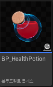
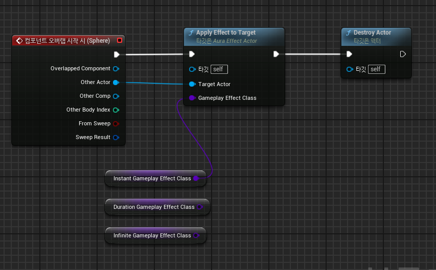
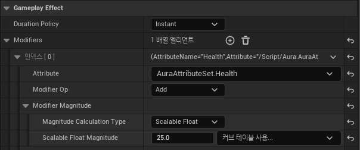

# Potion(ApplyEffectActor) 생성

* 이전 장에서의 클래스 `ApplyEffectActor`로 만든 Blueprint를 만든다

* 그 다음에 Blueprint로 `ApplyEffectToTarget` 함수를 호출하여 충돌할 때 발생할 GameplayEffect 종류를 설정하면 된다

* 여기서 만들 포션은 한번 회복하고 끝인 형태이므로 `Instant` 버전으로 만들고 만약 몇초동안 조금씩 차는 형태라면 Duration 형태로 만들면 된다.

 

# GameplayEffect 클래스 생성

* 이제 위에서 `Instant Gameplay Effect Class`에 적용할 Blueprint를 만들면 된다. 
* 이 Blueprint에서는 실제 포션의 회복량, 적용할 Attribute를 설정한다

* 아래와 같이 
  * `Duration Policy`에는 `Instant` 적용
   
  * 포션은 HP를 회복하는 아이템이므로 `Attribute`에는 따로 생성해준 `Health`변수 적용
   
  * Modifier OP는 단순히 값을 더하는 형태이므로 `Add`
   
  * `Modifier Magnitude`에서는 HP를 회복하기 위한 방법들이 여러가지 있는데 단순하게 사용하기 위해서
    `Scalable Float`를 설정하고 그 밑에는 값(HP 회복량)을 설정해주면 된다.

