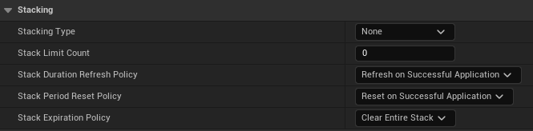

# Stacking

* `어떤 버프 또는 디버프(,이 경우 게임플레이 이펙트)를 가진 대상에게 다시 적용하는 것은 물론 어떤 상황을 처리하는 정책`

* 이전 장에서 만든 포션처럼 GameplayEffect Actor를 만들어서 사용하면 되는데 만약 여러 개를 동시에 먹으면 그 효과가 중첩되어 포션의 회복량이 그만큼 늘어나게 된다.

* 이렇게 중첩되는 효과보단 하나씩 처리하기 위해 사용하는 옵션이 `Stacking`이다

 

# Stacking Detail

 

## Stacking Type

* 기본적으로 `None`이며 다른 옵션은 `Aggregate by Source` , `Aggregate by Target`이 있다.

* 포션같이 영향을 주는 `SourceActor`와 포션을 먹으면 피가 차는 것 같이 영향을 받는 `TargetActor`가 있다고 가정한다.

  * 이 때 `Aggregate by Source`는 이 `SourceTarget`이 주는 영향을 의미한다.
  * `Aggregate by Target`는 `TargetActor`가 받는 영향을 의미한다.

 

## Stack Limit Count

* 한 번에 적용할 수 있는 Effect의 개수를 의미한다.

* 만약 Type이 `Aggregate by Source`이라면, 각각의 SourceTarget이 하나의 TargetActor에게 Stack Limit Count만큼 줄 수 있다.

  * SourceTarget이 2개,Stack Limit Count가 2라면  총 4번의 영향을 줄 수 있음

* 만약 Type이 `Aggregate by Target`이라면, 하나의 TargetActor가 받을 수 있는 영향을 의미한다

  * SourceTarget이 2개,Stack Limit Count가 2여도, Target기준이므로 2번의 영향만 받음

  
 

## Stack Duration Refresh Policy

* `같은 GameplayEffect를 Stack에 추가할 때, 현재 처리되고 있는 GameplayEffect의 Duration을 처리하는 정책(Policy)`

### 종류

* Refresh on Successful Apllication

* Never Refresh

 

## Stack Period Reset Policy

* `다른 GameplayEffect으로 Stack이 들어올 때, 현재 처리되고 있는 GameplayEffect의 Period를 Reset할지를 결정하는 정책(Policy)`

### 종류

* Refresh on Successful Apllication

* Never Refresh
 

## Stack Expiration Policy

* `모든 Stack이 끝날 때 처리하는 정책`

### 종류

* Clear Entire Stack

* Remove Single Stack and Refresh Duration

* Refresh Duration