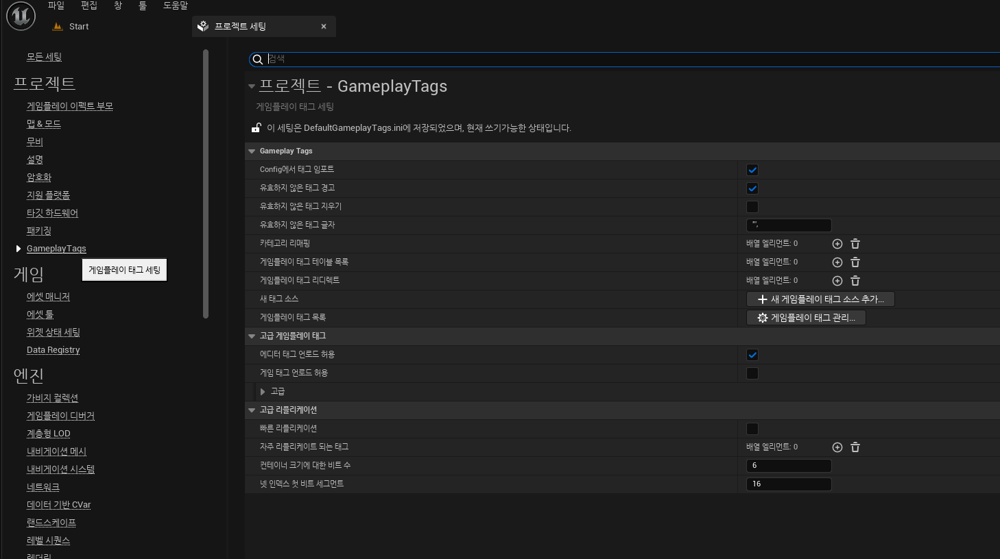
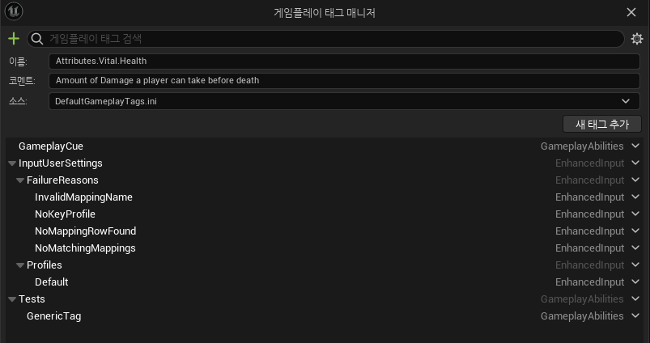
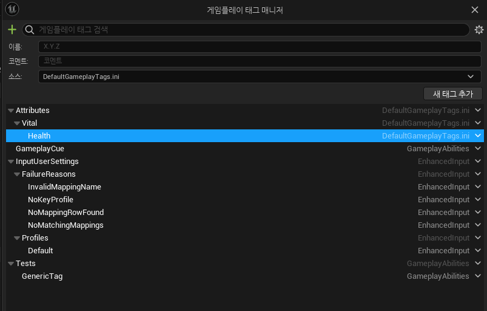
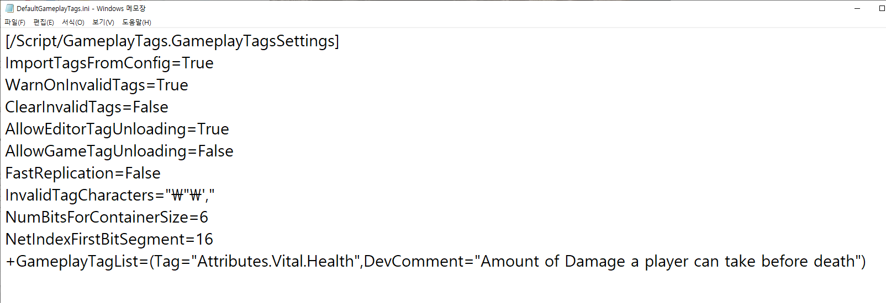

# GameplayTag

* AbilitySystem에서 사용하는 Tag로, `GameplayTagManager`에서 관리한다

* Tag는 `온점(.)`으로 child와 parent를 구분해서 종속관계처럼 만들 수 있다

  * `Ability.Fire`과 `Ability.Ice`처럼 Ability가 parent이고 그 아래에 Fire과 Ice가 child인 형태

* `GameplayTagContainer`에 저장되며 

* GameplayTag를 이용하면 특정 Tag를 가지고 있는 Effect나 Actor에게만 어떤 행위든 적용시키거나 제외할 수 있다.

  * Input, Abilities, Attriubtes, Damage Types, Buffs/Debuffs, Messages, Data등 이 외에도 다른 것들도 가능

 

# 에디터에서의 게임플레이태그

* GAS를 사용하면 에디터의 프로젝트 세팅를 보면 `프로젝트` 카테고리에 `GameplayTags`가 추가되어 있다.

* 들어가면 `게임플레이 태그 관리`에 현재 있는 Tag들을 볼 수 있다.

### 프로젝트세팅->GameplayTags

* 에디터에서 추가하기 위해선 `게임 플래이 태그 관리`를 누르고 `검색창 옆의 + 버튼`을 누른 다음 원하는 태그를 작성하면 된다.

### 추가전

### 추가후

 

## 프로젝트 폴더/Config/DefaultGameplayTags.ini

* 그리고 나서 프로젝트 폴더에 들어가서 `Config`에 있는 `DefaultGameplayTags.ini`를 메모장으로 열면 다음과 같이 추가된 걸 볼 수 있다.

* 여기서 코멘트(DevComment)를 바꾸고 나서 에디터를 재실행하면 코멘트가 바뀌는 것도 볼 수 있다.

* 가장 아래에 에디터에서 추가했던 Attriubtes.Vital.Health이 있다.

 

## 데이터 테이블

* 에디터에서 `우클릭->기타->데이터테이블`하고 다음과 같이 `GameplayTagTableRow`로 만들어주면 Tag전용 데이터 테이블을 생성할 수 있고 만든 테이블로 프로젝트 세팅에 있는 `게임 플레이 태그 테이블 목록`에 추가시켜주면 데이터 테이블안에 있는 태그들이 자동으로 게임플레이 태그목록에 들어간다.