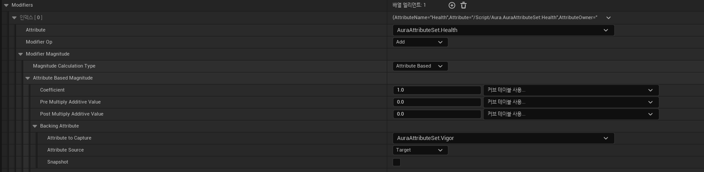

# Modifier AttributeBased

<center></center>

* `가장 위에 있는 Attribute는 적용받는 Attribute`를 지정하는 것이고 `Modifier Op는 어떻게 계산할지에 대한 연산(Opeartion)`이 있다.

* Modifier Magnitude에서 Type을 지정해줄 수 있는데 이 장에서는 `Attribute Based`라는 것으로 `다른 Attribute의 값을 사용하는 타입`이다.

* Coefficient부터 Pre,Post Multiply Addtive Value는 다음과 같이 계산된다.

```
Coe * (Value + Pre) + Post
```

* Attribute to Capture는 `다른 Attribute`를 지정한다

* Attribute Source는 `Target`과 `Self`가 있는데 어떤 캐릭터에게 적용시킬지에 대한 것으로, 이 GameplayEffect를 가진 Actor가 Player에게 Overlap되면 적용시키는 것이므로 Actor->Player의 뜻으로 Target을 지정한다.

<br>

## 결과전

<center></center>


* 왼쪽이 GameplayEffect를 가진 Actor, 오른쪽이 Player Character.

## 결과후

<center></center>


* Vigor의 값 9가 Health 50에 더해져서 Health가 59가 되었다.