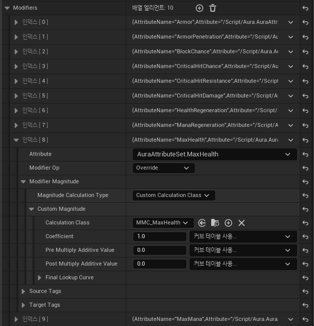

# Modifier - CustomCalculationClass

* `CustomCalculationClass`를 사용하기 위해선 `GameplayModMagnitudeCalculate` 줄여서 MMC라고 부르는 클래스를 정의해야 한다.

* 그 안에서 `CalculateBaseMagnitude`라는 함수를 재정의하여 그 안에서 원하는 대로 계산하는 방식이다.

## 헤더파일

```c++
UCLASS()
class AURA_API UMMC_MaxHealth : public UGameplayModMagnitudeCalculation
{
	GENERATED_BODY()
public:
	UMMC_MaxHealth();

	virtual float CalculateBaseMagnitude_Implementation(const FGameplayEffectSpec& Spec) const override;

private:

	FGameplayEffectAttributeCaptureDefinition VigorDef;
};
```

* 매개변수에는 `FGameplayEffectSpec`를 받아 해당 변수를 이용하여 계산에 필요한 값을 이용한다.

* 그리고 `Gameplay effects가 적용된 Gameplay attribute를 캡쳐하여 저장`하는`FGameplayEffectAttributeCaptureDefinition`라는 변수도 선언해야 한다.

## 소스파일

```c++
// 생성자
UMMC_MaxHealth::UMMC_MaxHealth()
{
	VigorDef.AttributeToCapture = UAuraAttributeSet::GetVigorAttribute();
	VigorDef.AttributeSource = EGameplayEffectAttributeCaptureSource::Target;
	VigorDef.bSnapshot = false;

	RelevantAttributesToCapture.Add(VigorDef);
}
```
* 그리고 생성자에서는 캡처할 Attribute와 CaptureSource를 정해주고 배열에다가 저장해준다.

* bSnapShot은 바로 Capture하는지에 대한 변수

  * Default값으론 Effect가 적용될 때 Capture됨

```c++
// 함수
float UMMC_MaxHealth::CalculateBaseMagnitude_Implementation(
    const FGameplayEffectSpec& Spec) const
{
	// Gather tags from source and target
	const FGameplayTagContainer* SourceTags = Spec.CapturedSourceTags.GetAggregatedTags();
	const FGameplayTagContainer* TargetTags = Spec.CapturedTargetTags.GetAggregatedTags();

	FAggregatorEvaluateParameters EvaluationParameters;
	EvaluationParameters.SourceTags = SourceTags;
	EvaluationParameters.TargetTags = TargetTags;

	float Vigor = 0.f;
	GetCapturedAttributeMagnitude(VigorDef, Spec, EvaluationParameters, Vigor);
	Vigor = FMath::Max<float>(Vigor, 0.f);

	int32 PlayerLevel = 1;
	if (Spec.GetContext().GetSourceObject()->Implements<UCombatInterface>())
	{
		PlayerLevel = ICombatInterface::Execute_GetPlayerLevel(
                        Spec.GetContext().GetSourceObject());
	}

	return 80.f + 2.5f * Vigor + 10.f * PlayerLevel;
}
```

* 매개변수의 Spec으로 Source와 Target의 Tag를 가져온다

* Capture하기 위해 필요한 `FAggregatorEvaluateParameters` 변수를 선언하고 Tag들을 저장한다.

* `GetCapturedAttributeMagnitude`함수로 Capture한 값을 Vigor 로컬 변수에 참조로 값을 받아온다.

* 그 다음 Level을 가져와서 Level을 적용하고 곱한다.

## Blueprint

<center></center>

<br>

* 다음과 같이 `Magnitude Calculation Type`을 Custom Calculation Class로 바꾸고 그 안에 적용할 클래스를 넣으면 적용된다.