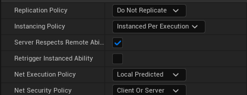

# Gameplay Ability

* 스킬이나 능력을 정의하기 위한 클래스

* 서버에 승인(Grant)되어야 하며 승인되고 나면 해당 정보가 담겨있는 Spec 변수는 클라이언트로 복제(Replicate)된다.

* `Activate/DeActivate`로 조절이 가능하며 사용하기 위해선 Activate 상태가 되어야 한다.

* 비용(Cost)와 쿨타임이 존재한다.

* Ability들은 비동기적으로 실행되며 여러 Ability가 있다면 한 번에 사용할 수도 있다.

* Ability는 각자 특별한 무언가를 하기 위해 Ability Task를 사용한다.

# Policy

