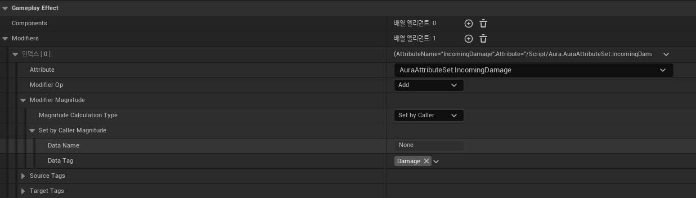

# Set By Caller

* Key와 Value로 한 쌍으로 이루어진 Gameplay Tag를 이용하는 방식

* 사용하기 위해서 `UGameplayTagsManager`의 `AddNativeGameplayTag`함수를 이용해서 Tag를 추가

* 그 다음 `UAbilitySystemBlueprintLibrary` 라이브러리의 `AssignTagSetByCallerMagnitude`를 사용해서 

```c++
// Avatar Actor의 ASC를 가져옴
const UAbilitySystemComponent* SourceASC = 
    UAbilitySystemBlueprintLibrary::GetAbilitySystemComponent(GetAvatarActorFromActorInfo());

// GameplayEffect 클래스인 DamageEffectClass를 받아와서 SpecHandle를 생성
const FGameplayEffectSpecHandle SpecHandle = 
    SourceASC->MakeOutgoingSpec(DamageEffectClass, GetAbilityLevel(),SourceASC->MakeEffectContext());

// 
Projectile->DamageEffectSpecHandle = SpecHandle;

// 싱글톤 클래스에 저장해둔 태그를 가져와서 해당 SpecHandle에 GameplayTags.Damage(Key)와 50.f(Value)를 전달
FAuraGameplayTags GameplayTags = FAuraGameplayTags::Get();
UAbilitySystemBlueprintLibrary::AssignTagSetByCallerMagnitude(SpecHandle,GameplayTags.Damage,50.f);
```

<br>

# DamageEffectClass 설정

* 그 후 DamageEffectClass의 블루프린트를 열어서 Modifier에서 적용시킬 Attribute를 설정하고, Type을 Set by Caller로 적용한 다음 위에서 전달한 Tag를 선택해주면 Tag가 매칭되어 Value(50.f)값을 가져와서 Attribute에게 적용한다.

<center></center>