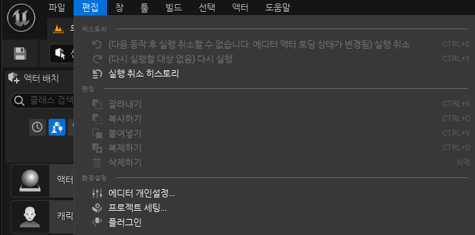
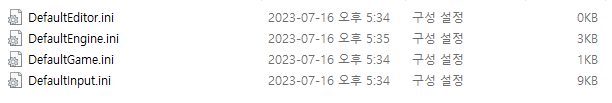
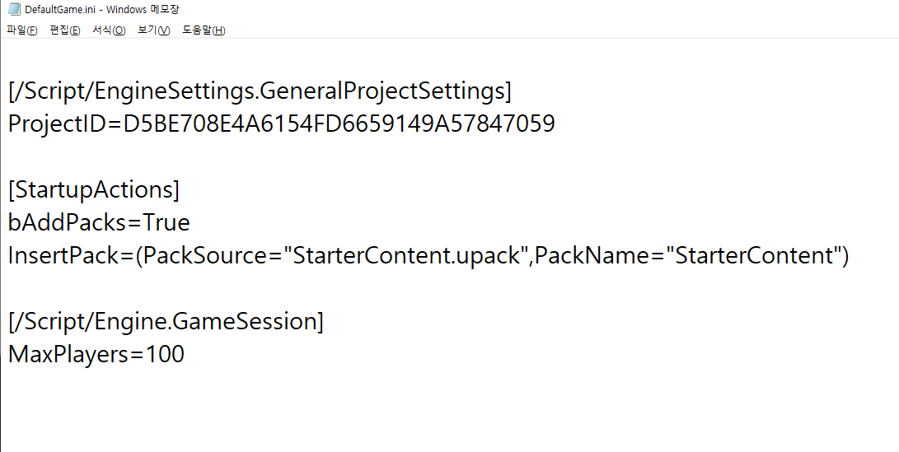

**프로젝트 생성 후 플러그인 세팅**
===========

## 에디터 세팅

* 프로젝트 생성 후 사용할 플러그인을 프로젝트 폴더 안에 넣는다.


<p align="center"></p>

<Br>

* 그다음 에디터에서 `편집->플러그인`을 클릭한다


<p align="center"></p>

<br>

* 그 후 멀티가 되는 프로젝트를 만들 예정이므로 OnlineSession을 찾는다.

  * 각 버전에 맞게 설치해야됨. 여기서는 스팀

<p align="center"></p>


<br>

## 폴더 세팅

* 그 후 폴더에 가서 `Config 폴더`를 연다.


<p align="center"></p>

<br>

* 코드를 추가해야 하는데 `OnlineSubsystem Steam버전`으로 추가해야 하기 때문에 `언리얼 공식문서`에 가서 해당 코드를 복사해야 한다.

  * https://docs.unrealengine.com/5.1/ko/online-subsystem-steam-interface-in-unreal-engine/

<br>

### DefaultEngine\.ini
--------------------------


* 처음에는 `DefaultEngine.ini`를 열어 밑의 코드를 복사하여 붙여넣기를 한다.

<p align="center"></p>

<br>

### DefaultGame\.ini
----------------------

* 그리고 `DefaultGame.ini`를 열어 맨 아래의 코드를 추가해야 한다

<br>

<p align="center"></p>


* 아래 부분을 추가해야 하는데 추가하지 않으면 자동적으로 최대 플레이어수가 16으로 고정된다.

```
[/Script/Engine.GameSession]
MaxPlayers=100
```

<br>

-------

* 그 후 프로젝트의 Binaries와 Intermediate 폴더와 Plugins안에 있는 Binaries와 Intermediate 폴더를 지운 후 Visual Studio를 rebuild한다.


* 플러그인의 코드를 보기 위해선 `콘텐츠 브라우저->세팅`에서 `플러그인 콘텐츠 표시`를 클릭해야 한다.
